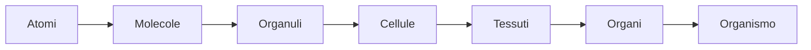
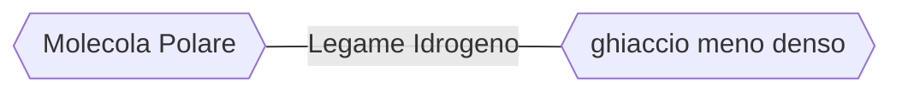
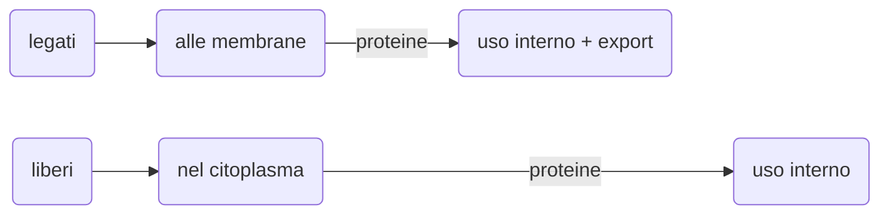
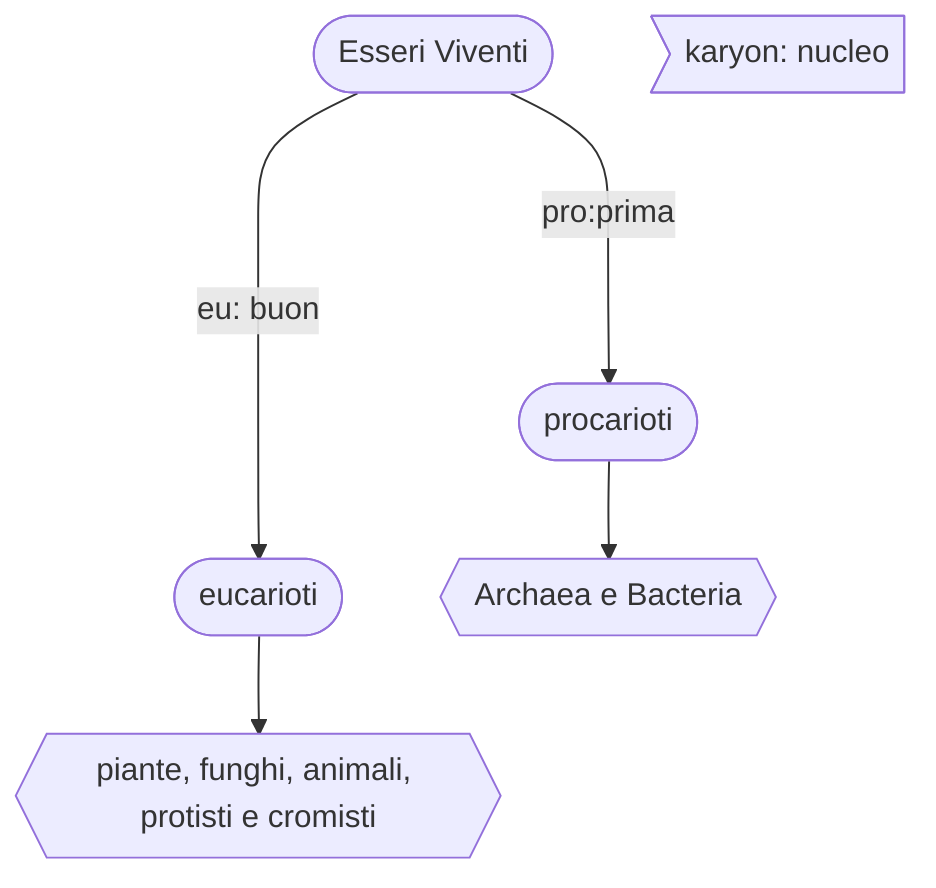

EBN: **Elementi di Biologia e Neuroscienze**
CdL Filosofia, a.a 2020/21
Prof. *Mario Pirchio*

---

[toc]

---

# Introduzione

L'obiettivo del corso è fornire le conoscenze di  biologia e di neuroscienze necessarie per una moderna indagine  filosofica su importanti tematiche legate soprattutto alla Vita e alla filosofia della mente, quali *origine della Vita, embrione, mente, coscienza, percezioni, libero arbitrio*.

Lasciamo decidere totalmente agli scienziati questioni legate agli stili di vita, modelli sociali e ambiente? 

> Sentiamo crescere intorno a noi e dentro di noi l'esigenza di un mondo  nuovo consapevole e solidale, l'urgenza di un nuovo modello di vita  capace di orientare un progresso che, privo di regole e di scopi,  risulta sempre più insensato. Ma a chi tocca l'onere di elaborare questo nuovo modello?
>
> -Domenico De Masi, Mappa Mundi, 2014 Rizzoli

Probabilmente sono proprio i filosofi gli unici in grado di poter governare saggiamente (come ci insegna Platone nel libro VI della Repubblica).

> Socrate adimanto, metafora capitano-nave

Nelle ultime lezioni del corso, inoltre, verranno discussi alcuni *recenti  tentativi compiuti da parte delle neuroscienze* per affrontare  sperimentalmente problematiche come coscienza e libero arbitrio.

Le parole d'ordine del corso sono *interdisciplinareità* e *nuove idee*.

*Qual è il livello di complessità oltre il quale si manifestano coscienza e libero arbitrio?*

*Inizialmente verranno introdotti alcuni concetti basilari in biologia, come l'organizzazione gerarchica delle strutture biologiche e  la correlazione tra forma e funzione.*

## Concetti basilari in biologia

La biologia è una scienza multidisciplinare, che richiede conoscenze di chimica, fisica e matematica. Ma è anche la disciplina scientifica che presenta maggiori connessioni con le realtà umane e le scienze sociali. Nuove conoscenze innescano rivoluzioni in campi come medicina, agraria, ecologia, sociologia, ...

### I 10 temi fondamentali

- **A ogni livello di indagine le strutture biologiche mostrano caratteristiche peculiari. Proprietà emergenti**

L'organizzazione biologica si basa su una gerarchia di livelli strutturali, ognuno dei quali poggia su un gradino sottostante:

In questa nuova gerarchia passando da un livello al superiore, *si palesano nuove proprietà* che non erano presenti ai livelli più semplici, le **proprietà emergenti**.

Su queste osservazioni poggia le basi la teoria dell'**Emergentismo**, secondo la quale *la mente nasce come proprietà emergente del cervello.*

*? Si deve privilegiare l'analisi o la sintesi ?*
La biologia cerca di bilanciare per tentare di comprendere come i singoli componenti siano integrati funzionalmente, integrando riduzionismo e comprensione delle proprietà emergenti.
Senza ridurre, a causa della complessità dei componenti, non potrei comprenderli. Applicando solo la riduzione ignorerei il loro funzionamento emergente.

Un singolo neurone non sa parlare italiano. *Le capacità di un essere umano vanno oltre le singole capacità dei pezzi di cui è composto*.

- **Le cellule rappresentano le unità strtutturali e funzionali degli organismi. La teoria cellulare**

Tutti gli esseri viventi sono composti da cellule o sono cellule (organismi *unicellulari*).

- Il perpetuarsi della vita è possibile grazie alla trasmissione dei geni
- **La forma e la funzione delle strutture biologiche sono correlate a tutti i livelli**

Anche a livello molecolare. L'ala di un uccello, un neurone, un mitocondrio. *Forma e funzione sono sempre correlate*.
Se l'ala di un uccello fosse diversa esso rischierebbe di non volare, 
i neuroni senza ramificazioni non potrebbero lavorare così come i
mitocondri senza striature.

*Cambiando la forma la funzione si modificherà di conseguenza.*

- Gli organismi sono sistemi aperti che interagiscono continuamente con l'ambiente
- Meccanismi di regolazione ed *omeostasi*

- **Diversità e unità: le 2 facce della vita sulla Terra**

La biodiversità ci destabilizza, da 5 a 30 milioni di specie. In passato si parlava di *somiglianze morfologiche* per distinguere le specie, oggi la **tassonomia** (*la disciplina che si occupa della classificazione di esseri che siano viventi o anche inanimati*)  si occupa della somiglianza di **DNA**, che ha portato a una revisione dei vecchi sistemi di classificazione.

Se scendiamo ai livelli bassi siamo più simili di quanto pensiamo agli altri esseri viventi, così come si somigliano tutti gli organismi.

> es: ciglio di *paramecium* e ciglia di una cellula epiteliale delle vie aeree degli esseri umani presentano la stessa sezione trasversale. *Più scendiamo più siamo simili*.

-  L'evoluzione rappresenta il tema centrale ed unificante della biologia

Darwin, nel 1859, partì da 2 osservazioni: la variabilità individuale e la competizione per la sopravvivenza. Da qui dedusse che *gli individui con caratteristiche più correlate con le condizioni di quell'ambiente lasciano un maggior numero di figli in grado di sopravvivere e riprodursi: **la selezione naturale***

- L'indagine scientifica

# Dall'atomo alla cellula

*Si parla della cellula partendo dai  singoli atomi. Un breve viaggio per introdurre alcuni concetti di  chimica necessari per comprendere meglio gli argomenti che verranno  trattati in seguito, come ad esempio la comunicazione neuronale.*

>cap. 2,3,4 atomi molecole, acqua, carbonio - Campbell
>cap. 2 EBG

## Elementi e composti

*Empedocle, Anassimene: aria, acqua, terra, fuoco*
*Leucippo, Democrito, Epicuro: atomi*

**Atomo**: è la più piccola quantità di materia che mantiene le proprietà di un elemento (es. ferro). Consiste di un nucleo e 1 o più elettroni.

**Massa**: misura della quantità di materia presente. Più massa => maggior quantità di materia

Tutta la materia è costituita da 94 elementi chimici in natura (tralasciando quelli non stabili, altri 24 sono stati creati in laboratorio).
In forma pura parliamo di *elemento*, ovvero una sostanza pura che contiene solo un tipo di atomo. In combinazione sono *composti*. 

4 sono i più importanti: **carbonio, ossigeno, azoto, idrogeno** (C, O, N, H), sono il 96% di un organismo. Aggiungendo anche fosforo e zolfo si ha la maggior parte della materia di cui sono composti gli organismi viventi (98%).

*La struttura di un atomo determina le sue proprietà.*
Il numero di protoni nel nucleo di un atomo determina il suo elemento, in altre parole *ogni elemento ha un numero unico di protoni*, che definisce il suo **numero atomico**.
Ogni elemento, tranne l'idrogeno, ha uno o più neutroni nel nucleo.

Un atomo ha un nucleo composto da neutroni e protoni circondato da una *nube di elettroni in rapido movimento*. 
Sebbene il *nucleo raprresenti quasi tutto il peso* dell'atomo esso occupa solo $\frac{1}{10000}$ del volume dell'atomo.

Un singolo protone o neutrone ha una massa di 1 dalton (Da), ovvero
$1.7×10^{-24}$ grammi (0.0000000000000000000000017 g), ed un elettrone è ancora più leggero: $9×10^{-28}$ g (0.0005 Da).
1 Dalton è l'unità della massa atomica.

**Isotopi:** dato un elemento essi hanno lo stesso numero di protoni ma differiscono nel numero di neutroni.
La maggior parte di essi sono stabili, mentre altri, **radioisotopi** non lo sono e rilasciano spontaneamente energia sottoforma di $\alpha, \beta, \gamma$  radiazioni dal loro nucleo atomico. *Decadenza radioattiva*.

Se un radioisotopo è incorporato all'interno di una molecola può agire come un'etichetta permettendo di tracciare tale molecola nel corpo o in un esprerimento.

**Molecola:** sostanca chimica composta da 2 o piú atomi uniti da legami covalenti o attrazione ionica.

Le reazioni solitamente coinvolgono cambiamenti nella distribuzione di elettroni fra atomi.

> La locazione di un certo elettrone in un atomo in un qualsiasi momento è impossibile da determinare. Possiamo solo descrivere un volume di spazio all'interno dell'atomo entro il quale l'elettrone è possibile si trovi.

**orbitale**: non è un orbita in senso stretto, è più simile a una nube/sfera. È una regione di spazio intorno al nucleo nella quale è probabile trovare un elettrone (vi si trova circa il 90% del tempo).

Un orbitale può essere occupato al massimo da 2 elettroni. 
**electron shell** (guscio orbitale): la regione circostante il nucleo ad un livello di energia fisso nel quale gli elettroni orbitano.

Nel primo guscio: vi è 1 solo orbitale => posso mettere al massimo 2 elettroni
Il 2° guscio contiene 4 orbitali, da cui 8 elettroni max
Vengono prima inseriti elettroni negli orbitali a più bassa energia (quelli più vicini al nucleo). Piú un elettrone è lontano dal nucleo più è alto il suo livello di energia per rimanere in quel guscio

**Elettroni di valenza**: elettroni più esterni. Determinano il comportamento chimico di un atomo. Si parla di *valence shell*.

Quando un guscio di valenza con 4 orbitali contiene 8 elettroni non vi sono elettroni liberi => l'atomo è **stabile**, ovvero è meno probabile che reagisca con altri atomi (es: elio, neon, argon).
Mentre quando un atomo ha elettroni liberi nel guscio più esterno può reagire (ovvero si può legare) con altri atomi.

Atomi *inerti* e *reattivi*, metafora di coppie e single in cerca di comapgno. Gli atomi inerti sono quelli che hanno il guscio più esterno (strato di valenza) completo (*elio, neon, argon*)
**Regola dell'ottetto**: tendenza degli atomi a formare molecole stabili così da avere 8 elettroni nel guscio più esterno.
La stabilità può essere ottenuta sia condividendo elettroni con altri atomi sia guadagnando o perdendo uno o più elettroni. Si formano così dei legami chimici che mantengono gli atomi vicini.

## Legami fra atomi

I legami chimici sono (in ordine di forza): il *legame covalente*, il *legame ionico* e il legame *idrogeno*.

### Legame covalente

Un legame *covalente* prevede la compartecipazione di 2 elettroni di valenza fra più atomi ed è il tipo di legame più forte. La notazione col trattino indica una coppia di elettroni in compartecipazione. (es: H-H)

*Due o più atomi tenuti insieme da legami covalenti formano una molecola*. 

- **Idrogeno**: quando si incontrano, due atomi di idrogeno liberi formano un singolo legame covalente
- **Ossigeno**: due atomi di ossigeno formano una molecola mettendo ognuno in compartecipazione una coppia di elettroni di valenza: si forma così un legamo covalente doppio
- **Acqua**: due atomi di idrogeno possono legarsi con legami covalenti a un atomo di ossigeno per produrre una molecola d'acqua

- **Metano**: quattro atomi di idrogeno possono soddisfare la valenza di un atomo di carobonio formando una molecola di metano
  

**Elettronegatività**

La molecola dell'acqua è *polare*. Ciò vuol dire che l'atomo di ossigeno attrae molto verso di sè le due coppie di elettroni dei legami covalenti con l'idrogeno, pertanto si trovano più vicino al nucleo dell'ossigeno che a quello dell'idrogeno. 
Di conseguenza l'atomo di ossigeno si trova ad essere un po' più carico *negativamente* e i 2 atomi di idrogeni sono un po' carichi *positivamente*.

Nella figura si può notare come $\delta-$ indichi un accumulo di negatività in percentuale. Le 2 frecce indicano che l'ossigeno attira verso di sè le 2 coppie di elettroni. Non attrae per intero la carica dell'elettrone dell'idrogeno, solo *parzialmente*. 
Il protone resta nell'atomo di idrogeno ma l'elettrone si sposta verso l'atomo di ossigeno.

Il metano è invece una molecola *apolare*. Il carbonio è un atomo più *democratico*, le coppie di elettroni sono distribuite più equamente con gli atomi di idrogeno.

### Legame ionico

*L'atomo più elettronegativo strappa completamente un elettrone al suo compagno.*

Prendiamo il cloruro di sodio: l'atomo di sodio ha 1 elettrone nel suo strato di valenza mente l'atomo di cloro ne ha 7. Per *completarsi* a vicenda l'atomo di cloro strappa l'elettrone all'atomo di sodio e si trovano così bilanciati (nello sbilanciamento individuale). L'atomo di sodio assume così una carica prevalentemente positiva (*catione*) mentre quello di cloro negativa (*anione*).

*Per la presenza delle cariche di segno opposto anioni e cationi si attraggono con una forza detta **legame ionico.***

È importante notare che il sodio e il cloro sono abbondanti al di fuori dei neuroni, sono alla base del funzionamento di essi.

<u>?? Composti ionici o sali, forza dei legami ionici in aria e in acqua ??</u> 

### Legame idrogeno

Un legame *idrogeno* si verifica quando un atomo di idrogeno si trova fra due atomi elettronegativi vicini.

Nell'acqua gli atomi di idrogeno si trovano fra due atomi di ossigeno, che sono elettronegativamente negativi, pertanto l'idrogeno si *stabilizza* fra i 2 atomi di ossigeno.

L'allineamento delle molecole d'acqua non è casuale quindi, i legami a idrogeno tendono a dare una struttura. 

### Interazioni di van der Waals

Nelle molecole d'acqua lo sbilanciamento dovuto alla polarità è sempre presente, dato che sono molecole *polari*.
Nelle molecole *apolari* (es. metano) si possono accumulare casualmente in modo asimmetrico gli elettroni, *formando regioni momentaneamente polari*, in particolare fra molecole (o gruppi di atomi di una stessa molecola) che si trovano a breve distanza.
Queste regioni polari possono far sì che le molecole si stabilizzino temporaneamente, come accade per le molecole d'acqua.

### Conclusioni sui legami

Per la vita i legami importanti sono tutti, abbiamo bisogno sia di legami rigidi e forti che di quelli più deboli.
Abbiamo bisogno di legami covalenti per strutture rigide (ossa, capelli) con legami robusti. Molti neurotrasmettitori invece formano legami ionici e sono la base del funzionamento dei neuroni.

**Funzione e forma delle molecole**
La funzione chimica di una molecola è in relazione con la sua forma. Molecole biologiche si riconoscono l'una con l'altra se una complementarietà di forma che permetto loro la formazione di legami (ormoni, neurotrasmettitori, ...).

**Reazioni chimiche**
La formazione e la rottura dei legami chimici (che portano a modifiche della composizione della materia) vengono chiamate *reazioni chimiche*.
La materia in una reazione chimica non viene nè creata nè distrutta, ma ridistribuita.

Possiamo immaginare un *Demiurgo* trasformatore che trasforma continuamente la materia, piuttosto che un Demiurgo creatore. 

> Il demiurgo, figura filosofica e al tempo stesso mitologica, è un essere divino, dotato di capacità creatrice e generatrice, descritto la prima volta da Platone nel Timeo.
>
> La figura del Demiurgo, senza il quale «è impossibile che ogni cosa abbia nascimento», non è propriamente un dio generatore come quello cristiano, ma piuttosto ordinatore: egli dà il soffio vitale a una materia informe e ingenerata che preesiste a lui.
>
> Fu descritto all'inizio da Platone soltanto come ipotesi cosmologica che ha carattere verosimile, cioè in forma di mito, di cui egli si serviva come in altri casi per descrivere in modo intuitivo e narrativo, anzichè con una rigorosa argomentazione dimostrativa, un aspetto del suo pensiero particolarmente difficile da illustrare e comprendere.
>
> «Artefice e padre dell'universo», il Demiurgo è nel mito platonico una forza ordinatrice, imitatrice, plasmatrice, che vivifica la materia, dandole una forma, un ordine, e soprattutto un'Anima Mundi. 

*A stati macroscopicamente diversi* come il passaggio dalla vita alla morte, dal sonno alla veglia, *si accompagna una situazione microscopica diversa.*

In situazioni svantaggiose l'uomo non può resistere, ma vi sono batteri, ad esempio le *spore* che anche in situazioni sfavorevoli sono in grado di sopravvivere trasformando la materia, sono forme di resistenza nei confronti delle situazioni sfavorevoli.

---

## Acqua

L'acqua è per ovvie ragioni fondamentale per la vita, si sa che sulla Terra la vita ha avuto origine proprio nell'acqua per spostarsi successivamente sulla terraferma.
Sappiamo anche che le cellule sono formate per il 70-95 % di acqua.

*?Qual è la caratteristica chimica che l'ha resa così importante?* 
Il fatto di avere una molecola *polare* e di permettere  il formarsi di *legami idrogeno*.

Senza i legami idrogeno l'acqua bollirebbe a -120°C. Grazie all'energia (fornita ad esempio da un fornello a gas) si riesce a strappare questi legami idrogeno e a rendere queste molecole più libere così che queste possano evaporare.

Descriviamo ora 2 proprietà essenziali per la vita e che derivano dal fatto che le molecole d'acqua sono polari.

### Il ghiaccio galleggia sull'acqua

Quasi tutte le sostanze quando si solidificano si contraggono diventando più pesanti.
L'acqua quando si solidifica diventando ghiaccio invece si espande diventando così più leggera. 
Se  il ghiaccio non galleggiasse non si sarebbe creata la vita per via del congelamento dell'acqua dei laghi, stagni e perfino dei mari/oceani. Invece galleggiando lo strato ghiacciato superficiale protegge l'acqua liquida dal contatto con l'aria più fredda:  l'acqua sottostante si mantiene liquida, permettendo così la vita

*?Perchéè questo è dovuto alla polarità dell'acqua?*
Nell'acqua liquida la maggior parte delle molecole risultano legate con legami idrogeno (*non tutte*) ed è importante notare che questi legami vengono continuamente rotti e riformati. 
Quando invece l'acqua si solidifica e diventa ghiaccio *tutte* le molecole si legano fra loro con legami idrogeno formando un retacolo cristallino in cui le molecole risultano più distanti di quanto avviene nell'acqua liquida. Di conseguenza diminuisce la densità del ghiaccio rispetto all'acqua e ciò gli permette di galleggiare.

(*omeopatia memoria acqua*)

### L'acqua è il solvente della vita

L'acqua è essenziale per la vita in quanto consente di sciogliere le sostanze. 
Riprendendo il *cloruro di sodio*, se lo si immerge in acqua:

dato che l'acqua è una molecola polare, con atomi di ossigeno carichi parzialmente negativamente e quelli di idrogeno parzialmente positivamente

- gli atomi di ossigeno attraggono perciò gli atomi di sodio (cationi, ioni positivi), strappandoli dal cristallo

In questa maniera le molecole di acqua circondano gli atomi di sodio, con gli atomi di ossigeno più vicini ad essi e quelli di idrogeno più lontani.

- gli atomi di idrogeno attraggono gli atomi di cloro (anioni, ioni negativi) , strappandoli anche in questo caso

Le molecole d'acqua avvolgono così gli atomi di cloro con gli atomi di idrogeno più vicini a questi.
*guscio di idratazione*: lo formano ad esempio le molecole d'acqua disposte intorno al sodio e al cloro ordinatamente come nel caso sopra (ne riparleremo per i neuroni).

Per potersi sciogliere in acqua un composto non deve essere necessariamente di tipo ionico (un sale). È sufficiente che sulla superficie vi siano un numero sufficiente di regioni ionizzate, cioè con cariche unitare (es. cloruro di sodio) o di regioni polari, cioè con cariche parziali.
*C'è un'attrazione reciproca fra le molecole d'acqua e qualsiasi regione ionica o polare di una molecola.*

*sostanze idrofile*: tutte le sostanze che si sciolgono in acqua o che assorbono acqua (es. cotone) anche senza sciogliersi.

contrario: *sostanze idrofobe*: sostanze che si comportano come se avessero una repulsione per l'acqua; possiedono molti legami *covalenti* non polari fra atomi di carbonio e di idrogeno come i legami del metano; es. olio vegetale

dicotomia: sostanze idrofobe e idrofile, è un dettaglio importante! 
*?Queste molecole sono idrofile o idrofobe?* è una domanda che ci porremo spesso nel corso.

Le vitamina A, D si accumulano dato che sono idrofobe, ad esempio si accumulano nel fegato. Molti esploratori glaciali sono morti per questa ragione (mangiando fegato animali in particolare di foche).

PCB: policlorobifenili, ce li ritroviamo nelle farine, si accumulano anche nel latte materno. Casi di infertilità e alterazioni di cicli mestrauli vengono imputati all'uso dei pesticidi.

| idrofila | molte zone ioniche o polari  |
| -------- | ---------------------------- |
| idrofoba | molti legami covalenti C - H |

L'essere solida o liquida è una *proprietà emergente* delle molecole d'acqua. Le singole molecole non sono nè liquide nè solide. 
È difficile dire se un pezzo di cervello (dei neuroni) sia vivo o no.

Quando una sostanza si scioglie in acqua si ottiene una *soluzione*. L'acqua è il *solvente*, la sostanza disciolta è il *soluto*.

## Il carbonio e le piccole molecole organiche

### Composti organici e chimica organica

I composti *organici* contengono carbonio. La chimica organica studia i composti del carbonio.
Berzelius, all'inizio dell '800 distinse per primo fra composti organici (prodotti <u>esclusicamente</u> da esseri viventi) e inorganici.

Inizialmente la chimica organica si fondò sul *vitalismo*, ovvero la fede nell'esistenza di una forza vitale non subordinata a leggi della chimica/fisica. 
Ci fu una rivoluzione in seguito a:

- sintesi in laboratorio di composti organici (acido acetico, urea) a partire da elementi chimici puri 
- una dimostrazione di Miller del 1953 secondo la quale le ipotetiche condizioni della Terra primordiale pre-biotica erano favorevoli alla sintesi spontanea di composti organici, simulando quelle condizioni e fornendo scariche elettriche in sostituzione dei raggi solari (non c'era atmosfera che potesse indebolirli)

I fondamenti del pensiero biologico si spostarono *dal vitalismo al meccanicismo* secondo il quale tutti i fenomeni naturali, vita compresa, siano governati da leggi della chimica e della fisica, sia per sostanze organiche che inorganiche.

*?La coscienza deriva da proprietà meccanicistiche?*

Lo scheletro delle molecole organiche è formato da *catene carboniose*, cioè catene di atomi di carbonio lunghe legati fra loro da legami covalenti (singoli, doppi, tripli). Le catene sono lunghe e stabili e consentono la formazione di strutture spaziali anche complesse, come i *fullereni* (che sono valsi come Nobel per la chimica nel 1996) qui sotto:

Il carbonio è l'unico elemento che riesce a formare delle catene lunghe e stabili. Anche il silicio in realtà è simile, ma consente catene meno lunghe (4-5 atomi) dopodichè diventa instabile e la catena tende a rompersi.

Alle catene carboniose si possono legare singoli atomi o gruppi funzionali. 
I composti organici non sono idrofili, non vanno d'accordo con l'acqua, non possono formare legami idrogeno dato che i legami che forma il carbonio non sono polari.

Giulio Natta, Nobel per la chimica nel 1963, ha compiuto scoperte nella tecnologia dei polimeri (per dei catalizzatori).

Il polipropilene(PP) è un polimero termoplastico, formato da catene così lunghe che non ce ne liberiamo più. 

Il *Pacific Trash Vortex*, è un'enorme isola di plastica, le stime vanno da 700.000 km² fino a più di 10 milioni di km², tra lo 0,41% e il 5,6% dell'Oceano Pacifico, l'area potrebbe contenere fino a 100 milioni di tonnellate di detriti.
Uno studio del 2021 rivela che già nella *placenta* si trovano particelle di microplastica. Nutriamo di plastica anche i nostri embrioni.

*gruppi funzionali*: il comportamento chimico di un gruppo funzionale è sempre lo stesso anche se in molecole diverse. Il numero e la disposizione di questi gruppi in una molecola organica contribuisce a determinarne le proprietà.

I 6 gruppi funzionali più importanti nella chimica della vita sono tutti *idrofili*, aumentano l'idrosolubilità dei composti organici in cui sono presenti. 

## Le macromolecole della vita

> EBG: cap 3,4

Le cellule sono un continuo laboratorio, per tornare al concetto del Demiurgo trasformatore.
Le cellule uniscono tra loro piccole molecole organiche formando molecole più grandi, le *macromolecole biologiche*. 
L'efficienza è venuta strada facendo con l'evoluzione. Si sale di un livello nella gerarchia di organizzazione biologica.

Vi sono 4  classi principali di macromolecole biologiche: *carboidrati, lipidi, proteine, acidi nucleici*. Studiamo l'architettura delle macromolecole per capire meglio in che modo essa funzioni.

### Polimeri

> Un polimero (dal greco polymerḗs, letteralmente "che ha molte parti") è una macromolecola, ovvero una molecola dall'elevato peso molecolare, costituita da un gran numero di gruppi molecolari (o unità strutturali) uguali o diversi (nei copolimeri), uniti "a catena" mediante la ripetizione dello stesso tipo di legame (covalente). 

I polimeri sono una sequenza di monomeri. 

>Col termine monomero (dal greco una parte) in chimica si definisce una molecola semplice dotata di gruppi funzionali tali da renderla in grado di combinarsi ricorsivamente con altre molecole (identiche a sè o reattivamente complementari a sè) a formare macromolecole. 
>
>Per estensione, il termine viene usato anche per identificare l'unità strutturale ripetitiva che forma un polimero (detta più propriamente "unità ripetitiva" del polimero).
>Il processo di trasformazione del monomero a polimero si chiama polimerizzazione 

Alfabeto e parole. Con un piccolo di numero di monomeri (40-50) posso comporre un'infinità di polimeri. Sono molecole a catena, formate dall'unione di subunità identiche o simili.
Carboidrati, proteine e acidi nucleici (ma non lipidi) sono *polimeri*.
Gli organismi utilizzano gli stessi monomeri ma li utilizzano in modo diverso.

*Le differenze fra individui della stessa specie o tra specie diverse non sono dovute ai singoli monomeri ma ai polimeri (proteici).*

### Carboidrati

I carboidrati sono gli zuccheri semplici e i loro polimeri.

- **monosaccaridi**
  
  Hanno uno scheletro di carbonio con atomi O e H, in pratica è come se ogni atomo di carbonio avesse legata una molecola di acqua. Hanno legami covalenti prevalentemente singoli e alcuni doppi.
  Si dividono in zuccheri *triosi, pentosi ed esosi* in base al numero di atomi di carbonio (rispettivamente: 3,5,6).
Sono molecole idrofile in quanto l'ossigeno crea regioni polari ed in acqua ci sarà la possibilità per la creazione di legami idrogeno.
  Una volta in acqua assumono una forma ad anello. Ad esempio il glucosio, uno zucchero esoso (con 6 atomi di carbonio) forma un anello con 5 atomi di C e un atomo di O (la forma reale è più simile ad una barca o una sedia dato ch il carbonio tende a formare strutture a tetraedro).
  
  
  I nostri neuroni vanno prevalentemente a glucosio. I monosaccaridi sono *combustibili cellulari*, e per questa ragione questi zuccheri sono molecole importantissime.
  I monosaccaridi sono monomeri e possono mettersi insieme per formare molecole più complesse:
  
- **disaccaridi**
Sono formati da due zuccheri semplici (monomeri), ad esempio maltosio, saccarosio e lattosio.
  Il *maltosio* (che si trova nella birra) è composto da due molecole di glucosio, le quali si uniscono tramite l'ossigeno, formando una molecola d'acqua:
  
  
  Il *lattosio* è composto da glucosio + galattosio. L'unica differenza fra glucosio e galattosio è una sistemazione differente di un atomo di ossigeno.
  
  
  
  Un'intolleranza peggiore di quella al lattosio è la *galattosemia*, l'intolleranza al galattosio, pericoloso soprattutto per i neonati. Il lattosio viene scisso in glucosio e galattosio e successivamente il galattosio dovrebbe venire trasformato in glucosio ma ciò, nei soggetti con galattosemia, non avviene.
  
- **polisaccaridi**

  Sono polimeri di glucosio, possono essere usati come deposito di energia o come materiale da costruzione (polisaccaridi strutturali).

  - *Amido* e *glicogeno* sono un vero e proprio deposito di energia, sono entrambi digeribili. Quando necessario il polisaccaride viene scisso nei monomeri di glucosio e utilizzato come combustibile cellulare.

  

  ​	Il glicogeno si trova nel nostro corpo, nel fegato (ca. 100g) e nel tessuto muscolare (ca. 3-	400g). Durante uno sforzo prolungato scomponiamo il glicogeno nei muscoli e nel fegato.

  ​	L'amido si trova nei vegetali (tuberi, patate, semi cereali); è composto da tue tipi di 		polimeri, amilosio e amilopectina.

  - I polisaccaridi strutturali come la *cellulosa*  sono materiale da costruzione per la sintesi di varie strutture. 
    La cellulosa è il materiale organico più abbondante sulla Terra, non è digeribile dall'uomo ma solo da alcuni batteri (le termiti e i ruminanti riescono a mangiare il legno perché hanno dentro di loro questi batteri). 
    La cellulosa forma catene lineari, dritte, mai ramificate, tenute insieme parallelamente da *tanti legami idrogeno*.
    Circa 80 molecole di cellulosa si associano a formare una microfibrilla, la principale unità strutturale della *parete delle cellule vegetali*, una struttura così rigida da consentire alle sequoie di raggiungere i 100 metri.

  Una piccolissima diversità nella forma (disposizione di alcune molecole) causa la differenza fra  amilosio (amido, digeribile) e cellulosa (non digeribile):

  

I carboidrati sono quindi molecole vincenti, ma non troppo.

### Lipidi

I lipidi sono molecole non idrofile, hanno pochissime regioni polari. Non sono polimeri in genere.

**Grassi o trigliceridi**

I trigliceridi hanno tre acidi grassi.
In genere i grassi animali (lardo, burro) sono saturi e quelli dei vegetali e dei pesci sono instaturi (oli). Gli acidi grassi sono una catena idrocarburica. Il glicerolo è un alcol.
In base alla presenza di doppi legami C=C nella catena carboniosa, gli acidi grassi possono essere classificati come:

- *acidi grassi saturi*: se non sono presenti doppi legami nella catena carboniosa
- acidi grassi insaturi: se sono presenti doppi legami nella catena carboniosa; a loro volta si suddividono in:

  - acidi grassi *monoinsaturi*, se è presente un solo doppio legame C=C 
  - acidi grassi *polinsaturi*, se sono presenti due o più doppi legami C=C

>La presenza di doppi legami C=C e la lunghezza della catena carboniosa influenza la temperatura di fusione e la temperatura di cristallizzazione degli acidi grassi. 
>
>Maggiore è la percentuale di doppi legami e più le catene carboniose risultano corte, più alta risulta la fluidità dell'acido grasso e la sua temperatura di  cristallizzazione si abbassa. 
>
>Il metabolismo di grassi saturi e insaturi attiva gli stessi  enzimi, e l'organismo non è in grado di regolare questa competizione  enzimatica. 
>Pertanto, è importante mantenere l'equilibrio corretto  nell'assunzione di questi due tipi di grassi. Un sovraccarico di acidi  grassi in generale riduce la quantità di enzimi e aggrava il problema  della competizione.

I doppi legami causano una "gobba".
Le funzioni dei grassi nel nostro corpo sono:

- *deposito* di energia incredibile, forniscono il doppio di energia rispetto al glicogeno/amido; ce ne sono vari kg nel corpo
- funzione *protettiva*, ad esempio intorno all'orbita oculare e nei reni; anche in condizioni estreme di denutrizione questi grassi non vengono mai utilizzati (si è visto nelle autopsie nei campi di concentramento)
- funzione *termoisolante*, i mammiferi marini grazie al tessuto di grasso possono sopportare basse temperature

| macromolecole | kcal/g |
| ------------- | ------ |
| proteine      | 4,2    |
| carboidrati   | 4,3    |
| grassi        | 9,5    |

**Fosfolipidi**
Sono simili ai grassi, ma con *due* acidi grassi, invece di tre. Al posto del terzo acido grasso c'è un gruppo fosfato, carico negativamente.

In acqua i fosfolipidi si organizzano in *micelle*, cioè in aggregati che escludono le parti idrofobe dal contatto con l'acqua. Le micelle vengono *emarginate* nell'acqua non formando legami idrogeno. 

*? Posso usare i fosfolipidi per costruire la membrana cellulare?*
Le cellule hanno bisogno di un materiale impermeabile, di un "cappotto". Immaginando di avere acqua all'esterno di essa e all'interno ho bisogno di un doppio strato impermeabile, uno esterno ed uno interno.
Se usassi il cloruro di sodio mi si scioglierebbe subito. 
Si può usare un doppio strato fosfolipidico.

Anche i neuroni sono dotati di questo cappotto esterno. Come fa allora una molecola ionica o polare ad attraversare questo cappotto idrofobo? lo vederemo..

- **steroidi**
  Il colesterolo è il precursore degli steroidi (ormoni steroidei).
  

  Gli steroidi hanno uno scheletro carbonioso con 4 anelli fusi, variano per i gruppi funzionali che si trovano uniti a questi 4 anelli. 

  > È da sottolineare che la parola "steroide" si riferisce soltanto alla struttura chimica, e non alle funzioni biologiche. Infatti, ad esempio, il testosterone migliora l'azione dell'insulina, il cortisolo la inibisce; allo stesso modo, il testosterone stimola la sintesi di massa ossea e muscolare, mentre il cortisolo la degrada. 

I lipidi sono macromolecole interessanti, sono depositi di energia, svologno funzioni termoisolanti, protettive, sono usati nelle membrane cellulari e sono alla base degli steroidi. Sono anche'esse molecole vincenti.. ma non troppo.

### Proteine

Le proteine sono le molecole più importanti utilizzate dal *demiurgo trasformatore* per costruire la vita. 
Sono tante, e svolgono moltissime funzioni, ad esempio: 

- *collageno* ed *elastina* nei tendini e nei legamenti, 
- *cheratina* nei peli, nelle piume, 
- *ovalbumina* nell'albume delle uova, 
- *caseina* nel latte, 
- *emoglobina* nel sangue che trasporta ossigeno, 
- *insulina* per regolare la concentrazione di glucosio nel sangue, 
- proteine *recettoriali* nella membrana delle cellule nervose, 
- *actina e miosina* per il movimento dei muscoli
- *proteine di difesa*, gli anticorpi
- *enzimi digestivi* 

Anche nel Covid-19 ci sono le proteine (la cosiddetta proteina *spike*):

Le parti rosse sono le proteine, la sfera bianca è composta da lipidi.

**Struttura di una proteina**
Le proteine sono le molecole più complesse strutturalmente. 
Una proteina è costituita da 1 o più *polipeptidi*, ripiegati e impacchettati in specifiche conformazioni.

***polipeptide***: polimero di amminoacidi
***amminoacido***: è una molecola organica contenente un gruppo *carbossilico* e gruppo *amminico*, è formato in particolare da: 

- un atomo di carbonio asimmetrico a cui è legato 

- un atomo di H, 

- un gruppo amminico, 

- un gruppo carbossilico,

- un gruppo variabile R

  

Gli amminoacidi sono circa un 20ina, il gruppo amminico (NH_2) e quello carbossilico (CO_2H) rimangono invariati, è la R il pezzo "magico" che permette la creazione di migliaia differenti proteine. 
Il gruppo variabile R non partecipa alla catena degli amminoacidi, è libero! In questo modo può legarsi (con qualsiasi legame: ionico, covalente, idrogeno) ad altri amminoacidi per dare una forma al polipeptide.

Le proprietà fisiche e chimiche del gruppo R determinano le proprietà di un particolare amminoacido. Ve ne sono di polari e non polari, acidi e basici,  idrofobi e idrofili.

Il legame *peptidico* è il legame che unisce il gruppo carbossilico e il gruppo amminico di due amminoacidi. 

Ad esempio qui si viene a formare una molecole di acqua all'unione del gruppo carbossilico e amminico di due amminoacidi. Questa molecola di acqua se disperde nell'ambiente acquoso, ciò che rimane forma il legame peptidico fra due amminoacidi che rimangono legati.

Lo scheletro della catena carboniosa è N-C-C, come avevamo visto il carbonio consente la creazione di catene lunghe e stabili. Notare che le catene laterali sono libere.

*lisozima*: è un polipeptide, è un piccolo enzima che attacca la parete cellulare dei batteri si trova ad esempio nelle lacrime, ci aiuta ad uccidere i batteri. È formato da 129 amminoacidi, legati fra di loro da legami peptidici:

Il trucco consiste nel raggomitolare gli amminoacidi così da poterci costruire "nano-forchettine" molecolari. 

Ci sono proteine *globulari* (lisozima), *fibrose* (collageno) oppure *molto raggomitolate* (emoglobina, formata da 4 polipeptidi).

La conformazione di una proteina è determinata dalle sequenza dei suoi amminoacidi (cosiddetta *struttura primaria*). 

La striscia viola è lo scheletro del polipeptide, come si può notare i gruppi variabili liberi formano dei legami fra di loro che danno una forma al polipeptide.
Il *Demiurgo* utilizza il carbonio per comporre catene lunghe e stabili e successivamente usa delle molecole come gli amminoacidi con un gruppo laterale libero per consentire il raggomitolamento

Questi legami possono venire spezzati, ad esempio assumendo nicotina, *qualche droghetta come  un po' di cocaina,* qualche farmaco (es. valium) queste vanno ad interagire con le proteine che stanno sulla membrana dei neuroni. La presenza di queste sostanze può rompere questi legami e crearne di altri, modificando la forma e di conseguenza modificandone la funzione.

*?Se sostituisco un amminoacido con un altro?*
Alcuni amminoacidi sono polari, alcuni acidi ecc.. quindi i ripiegamenti possono risultare alterati, con funzioni alterate se la sostituizione produce una notevole alterazione delle interazioni fra i gruppi R. Si ottiene quindi una proteina alterata, con funzioni alterate. 

*es: anemia falciforme dei globuli rossi: 1 solo amminoacido di differenza, tra glutammato e valina*
La differenza fra glutammato e valina è nel gruppo laterale, il primo è polare, il secondo no, di conseguenza non può formare legami idrogeno.

Una chiave di lettura fondamentale è l'elettronegatività, il pensare alla nube elettronica, alla polarità...

I veri utensili molecolari sono proprio le proteine, siamo in grado di produrre 80.000/90.000 proteine diverse, svolgono tante funzioni.
Struttura secondaria e terziaria sono relative ai ripiegamenti tridimensionali.

### Acidi nucleici

*? Chi determina la sequenza amminoacidica (struttura primaria) delle proteine?*
La sequenza è determinata dalle info contenute nei *geni*, i quali sono costituiti da *DNA*.

Il *DNA* è il materiale genetico che gli organismi ereditano dai loro genitori, esso impartisce le direttive per la propria replicazione. 
Dirige anche la sintesi dell'RNA e attraverso questo controlla la sintesi delle proteine.
Nella struttura del DNA sono programmate tutte le attività cellulari.

Si pensava che un gene codificasse una proteina cioè che a 100 proteine corrispondessero 100 geni. Si è visto che non è così, sono circa 30.000.

Gli acidi nucleici sono DNA ed RNA. Essi sono polimeri di *nucleotidi*.
Un ***nucleotide*** è formato da una 

- base azotata
- uno zucchero pentoso, il *ribosio* (ha 5 atomi di carbonio) nell'RNA,  *desossiribosio* nel DNA
- un gruppo fosfato (O4P)

RNA: acido *ribonucleico*, DNA: acido *desossiribonucleico*.

Le basi azotate sono anelli in cui è presente carbonio e azoto, *Citosina (C), Timina(T) Uracile(U)*. Le basi azotate si dividono in *pirimidine* (un anello) e *purine* (due anelli):

- *pirimidine*
  - Citosina, C
  - Timina, T (nel DNA)
  - Uracile U (nell'RNA)
- *purine*
  - Adenina A
  - Guarina G

Nello scheletro del polinucleotide ci accorgiamo che solo gli zuccheri e i gruppi fosfati fanno parte della catena, le basi azotate *sporgono*, come per le proteine i gruppi *variabili*.

L'informazione contenuta in ogni gene è determinato dalle sequenze delle quattro basi azotate.
La sequenza di basi azotate determina la sequenza degli amminoacidi (struttura primaria) e quindi la funzione delle proteine.

Nel caso dell'*anemia falciforme* vuol dire che è presente una base azotata che codifica una valina al posto del glutammato.

Per proteggere l'informazione del DNA si viene a formare una doppia elica, con scheletro *zucchero-fosfato* all'esterno e basi azotate all'interno, vengono così a formarsi tanti legami idrogeno che danno forza alla struttura.

Gli accoppiamenti seguono delle *regole* precise: GC, AT/AU (Claver Gold A Terni / A Urbino).
L'accoppiamento deriva anche dal fatto che da una parte deve esserci una pirimidina e dall'altra una purina (in totale 3 anelli).

Quando una cellula si prepara per dividersi i due filamenti della doppia elica si separano, ed ognuno di essi serve da stampo per il nuovo filamento.

### Panoramica

Molecole vincenti:
*carboidrati* C H O
*lipidi* C H
*proteine* C H O N (anche azoto, permette lo scheletro CCN)
*acidi nucleici* C H O N P (anche fosforo)

Catene molecolari con trucco dei gruppi laterali
Ciò è una *logica a posteriori*

Trucchi vincenti:
molecole stabili -> polimeri
gruppi laterali
legami deboli per consolidare

 ## La cellula e la sua struttura

La cellula è la più piccola unità in grado di vivere. Per poter fare questa affermazione abbiamo prima bisogno di definire cosa intendiamo per vita.
Diciamo che un essere è vivente quando presenta:

- *organizzazione, complessità*
- *metabolismo*, saper scomporre sostanze e ricostruirne
- *omeostasi*, rimanere uguali a sè stessi nel tempo
- *interazione* con l'ambiente esterno
- *adattamento*
- *crescita*
- *riproduzione*

Senza queste proprietà è difficile parlare di vita.

Le cellule sono autosufficienti e possiamo associare loro la seguente metafora: la cellula è come una *casa*.
Ci sono organsimi *unicellulari* e *pluricellulari*. Un problema che nasce da questi ultimi è la *coordinazione* dell'insieme di cellule.

Gli esseri viventi si classificano tassonomicamente in due domini: *eucarioti* e *procarioti*. 
Gli eucarioti (*dal greco eu «buono» e káryon «nucleo»*) costituiscono il dominio più complesso e includono cinque regni: piante, funghi, animali, protisti e cromisti. 
I procarioti (*dal greco pro «prima» e karyon «nucleo»*) includono due regni, Archaea e Bacteria, e sono caratterizzai dall'essere 

- privi di un sistema endomembranoso; 
  - in particolare mancano di un nucleo strutturato, al contrario degli eucarioti.

Le cellule procariotiche ed eucariotiche si somigliano per molti aspetti:

- membrana plasmatica, organuli, cromosomi, geni, DNA, ribosomi

Ma si differenziano per: 

- *dimensioni*, 1-10 micron procariotiche, mentre 10-100 micron per le eucariotiche 
- scomparti delimitati da membrane (assenti nelle procariotiche)

Per avere 1 millimetro con cellule eucariotiche di 50 micron, devo metterne 20 in fila.

Le cellule nervose hanno dei prolungamenti, fino ad 1 metro (filamenti dal midollo spinale al piede), e anche le cellule muscolari possono essere molto più lunghe di 100 micron.

Esiste un *limite inferiore* alle dimensioni di una cellula ovvero il volume occupato dalla complessità necessaria per la vita della cellula occupa dalla minima quantità di DNA e altre sostanze tali da assicurare sopravvivenza e riproduzione.
Esiste anche un limite superiore, un rapporto volume/siperificie. troppo grande non consente scambi sufficienti con l'esterno.

Organismi più grandi => maggior numero di cellule (non cellule più grandi).

### Cellula animale

**Membrana plasmatica**
È formata un doppio strato delle macro-molecole fosfolipidiche. 
La membrana plasmatica è l'*impermeabile* delle cellule.

**Nucleo**
È composto dall'involucro nucleale, cromatina e nucleolo.
Il DNA è contenuto principalmente qui dentro, ed una piccola parte nei mitocondri.

L'involucro nucleare è formato da una doppia membrana (ognuna formata da un doppio strato lipidico con proteine) ed è perforato da *pori*. Attraverso questi possono transitare alcune proteine.
Il DNA è associato a delle proteine con cui forma un materiale fibroso chiamato *cromatina*. Quando la cellula si riproduce tali fibre si ispessiscono divenendo visibili come strutture singole:  i *cromosomi*.

La cromatina ha un aspetto a filamento ed è così poiché svolge il ruolo di ricettario, se fosse chiuso non si riuscirebbe a leggerlo. 
Il DNA è tutto sfilacciato perché deve poter essere letto. 
In un momento in cui la lettura non si può fare il ricettario verrà compattato, ovvero durante la riproduzione cellulare quando si andranno a formare i cromosomi.
*Cromosomi (compatti) e cromatina (sfilacciato).*

Il nucleolo non è provvisto di membrana e serve per la sintesi di RNA ribosomiale, cioè l'RNA che uscendo dai pori dell'involucro nucleare andrà nel citoplasma a formare i ribosomi.

*?cosa può entrare ed uscire dai pori dell'involucro nucleare?*
Può uscire RNA e proteine ma non il DNA. 
L'RNA uscirà e andrà nel citoplasma. Le proteine entrano ed escono attraverso questi pori, ci torneremo per i vaccini. 

Il nucleo è la *cassaforte* della nostra cellula, anche se ha delle aperture. 
Il DNA è chiso lì dentro, c'è un buon motivo. È prezioso, va rispettato e protetto.

**Ribosomi**

I ribosomi sono formati da RNA ribosomiale e proteine. 
Servono a sintetizzare le proteine. 
Possono essere legati (vicini alle membrane) o liberi (sospesi nel citoplasma).

I ribosomi *liberi* producono proteine ad uso interno.
I ribosomi *legati* producono proteine per uso interno e per esportazione. 
È una separazione mobile, ogni tanto un ribosoma si sposta e si attacca al reticolo endoplasmatico.
I ribosomi sono un *tavolo da lavoro* della cellula. 

#### Sistema Endomembranoso
È un insieme di membrane presenti nel citoplasma.
Comprende:

- la membrana cellulare 
- e tutta una serie di organuli che includono:
  - l'involucro nucleare, il reticolo endoplasmatico, l'apparato del Golgi, i lisosomi, le vescicole e i vacuoli

Tutte queste strutture interagiscono fra loro e svolgono principalmente la funzione di produrre lipidi, enzimi, e proteine destinati a essere secreti o a comporre la membrana cellulare.

È una delle differenze tra eucariotiche e procariotiche. Con le pareti creiamo scompartimenti.

**Reticolo endoplasmatico**
Il reticolo endoplasmatico è formato da tubuli e cisterne, è in comunicazione con l'involucro nucleare.
È *liscio* se privo di ribosomi =>

- nelle ovaie e nei testicoli si occupa di sintesi di steroidi
- nel fegato immagazzina il glicogeno metabolizzando i carboidrati (*il glicogeno è un polimero, formato da tanti polimeri di glucosio, possono essere spezzettati per essere usati*)
- nel fegato e nei reni eliminano sostanze nocive (cellule epatiche: barbiturici, alcool, droghe vengono eliminati nel reticolo endoplasmatico del fegato)

*Proliferazione*
Aumenta la quantità di reticolo endoplasmatico del fegato; le parti all'interno delle cellule non hanno una quantità fissa, ma rispondono alle esigenze.

> *Potere dell'abitudine*
> L'efficienza è sempre a livello cellulare, allenamento, allenamento e allenamento!
> Le modifiche sono a livello cellulare.

È *rugoso* quando sono presenti ribosomi =>

- sintesi proteine export, di secrezione (penetrano all'interno del reticolo e poi *gemmazione* di vescicole di trasporto)
- produzione proteine e fosfolipidi per altri componenti del sistema endomembranoso, usando le vescicole di trasporto

**Apparato del Golgi**
È una centrale di smistamento per confezionare le sostanze da esportare all'esterno della cellula.
*Non è del tutto noto come vengono esportate.*

Dal reticolo endoplasmatico rugoso provengono le vescicole di trasporto con materiale proteico che viene elaborato nuovamente.
Le vescicole *gemmano* poi si fondono con la membrana. Vengono formate anche nuove vescicole di trasporto che andandosi a fondere con la membrana plasmatica riversano il proprio contenuto all'esterno della cellula.
*?Come esporto le sostanze, come fanno le vescicole a spostarsi?* 
?? Il doppio strato fosfolipidico diventa una cosa unica e ciò che è interno fuoriesce.
È possibile anche l'opposto! Possono anche entrare vescicole.

**Lisosomi**
Ultima componente del reticolo endoplasmatico.
Sono vescicole che aggrediscono e scindono tutte le macromolecole organiche (enzimi litici, *dal greco lytós "solubile, sciolto"*).
*Pericolo di autolisi*! Ovvero morte cellulare per autodigestione.

Sono prodotti dal reticolo endoplasmatico rugoso e trasferiti all'apparato di Golgi che attiva gli enzimi idrolitici.

Fagocitosi, le amebe (unicellulari) ricavano il nutrimeno per fagocitosi, la particella alimentare esterna viene inglobata in vacuoli alimentari, successivamente si fondono con un lisosoma che li digerisce.

Nell'uomo i *macrofagi* utilizzano la fagocitosi per distruggere batteri e altri microrganismi patogeni.

*Autofagia*: digestione e inglobamento di materiale interno alla cellula. 
Il materiale interno alla cellula danneggiato viene digerito dai lisosomi e *riciclato*! 
I monomeri organici vengono *riciclati*, così da permettere una rigenerazione autonoma e continua della cellula.

Intervengono nella distruzione parziale o totale delle cellule durante lo sviluppo di organismi pluricellulari, ad es. anche durante la metamorfosi degli anfibi e durante lo sviluppo dell'embrione umano. 

Concetto: I lisosomi *riciclano*.

*?La longevità non sarà dovuta all'attività dei lisosomi?* 
Dipende anche da altri meccanismi biologici. L'autofagia, i lisosomi e i mitocondri sono fattori  implicati nel processo di invecchiamento.

***Covid, vaccini a mRNA***
*?Da cosa sono fatti? Come funzionano?*
Il vaccino è composto, per avere un ingresso facile, da un mantello di fosfolipidi, si vuole che venga inglobato dalle cellule. 
Apparentemente non c'è un meccanismo di riconoscimento per le cellule, essenzialmente non si sa quali cellule prendano il vaccino e quali no, appena vede una membrana cellulare ci va dentro.
Però attraverso una puntura intramuscolo ecc.. dovrebbe essere garantita.

*Morte cellulare programmata*
Produciamo tante più cellule di quante ne abbiamo bisogno. Tutto è programmato nelle nostre cellule, in qualche modo.
Il meccanismo di autolisi è il meccanismo principale per provocare la morte di queste cellule.

**Mitocondri**
Utilizzano l'ossigeno per bruciare molecole organiche come zuccheri e grassi, *respirazione cellulare*.
L'ossigeno arriva nei mitocondri, il vero utilizzo dell'ossigeno avviene proprio qui.

*globuli rossi*: sono cellule del sangue; la funzione principale dei globuli rossi è il trasporto dell'ossigeno dai polmoni verso i tessuti e di una parte dell'anidride carbonica dai tessuti ai polmoni, che provvedono all'espulsione del gas all'esterno del corpo. 
Fanno parte degli elementi figurati del sangue insieme ai leucociti e alle piastrine. Nei mammiferi sono privi di nucleo, mentre nei restanti vertebrati (come gli uccelli) ne sono provvisti. 

*emoglobina*: è una proteina globulare; è solubile e di colore rosso. È presente nei globuli rossi dei vertebrati (esclusi alcuni pesci antartici) per i quali svolge la funzione vitale di trasporto dell'ossigeno molecolare da un compartimento ad alta concentrazione di O2, il sangue arterioso, ai tessuti. 

> I polmoni,  i globuli rossi e l'emoglobina non fanno altro che trasportare l'ossigeno ai mitocondri.

Hanno una doppia membrana, una esterna ed una interna, ognuna formata da un doppio strato fosfolipidico. Quella esterna ha un profilo regolare mentre quella interna è pieghettata formando creste mitocondriali. È un trucco per aumentare la superficie (..?come i radiatori nelle case?..)

*Oss: non fanno parte del sistema endomembranoso. Contengono ribosomi e una piccola quantità di DNA*
È piuttosto strano, l'ipotesi più accreditata è che fossero delle cellule indipendenti e che siano state inglobate da altre cellule adattandosi al ciclo di vita di queste. Ora sono degli organuli all'interno delle cellule. Dal caso è divenuto poi necessità, portando vantaggi interni.
*I mitocondri sono i radiatori/la caldaia delle cellule.* 

L'avvenelamento da cianuro avviene proprio nei mitocondri.

#### **Citoscheletro**
La membrana non è rigida pertanto il citsoscheletro, lo scheletro della cellula, fornisce un supporto meccanico. 
Nelle cellule animali manca la parete delle cellule vegetali la quale è composta di cellulosa, polimero di glucosio. É molto robusta al punto tale da permettere alle sequoie di superare i 100 metri. 

Il citoscheletro è molto dinamico, può essere smantellato e ricostruito per dare alla cellula un nuovo assetto.
Il citoscheletro è formato da 3 tipi di strutture fibrillari: microtubuli, microfilamenti e filamenti intermedi.

**Microtubuli**
Servono da *binari* lungo cui si spostano gli organuli (es. mitocondri) o vescicole provvisti di molecole motrici (alimentate da ATP), come le vescicole secretorie dall'apparato di Golgi alla membrana plasmatica. 

Le molecole motrici che si attaccano ai recettori di un organulo possono far muovere l'organulo lungo i microtubuli. Il movimento è unidirezionale verso la periferia della cellula e microtubuli si creano e assemblano autonomamente.
In questo modo le vescicole che contengono neurotrasmettitori si portano all'apice degli assoni della cellula nervosa.

Le *chinesine* sono una famiglia di proteine facenti parte della famiglia dei motori proteici (insieme a miosina e dineina). Sono capolavori della microingegneria, sono macchine di trasporto motorizzate. Hanno due piedi, le teste globulari che camminano letteralmente un piede avanti all'altro. Conosciute anche come "cavalli da lavoro delle cellule," le chinesine possono trasportare merce molte volte più grande di loro. Fanno fino a 100 passi al secondo, 8nm a passo, quindi 800nm/s.
A volte più chinesine si uniscono per avere più forza. 

(https://www.youtube.com/watch?v=y-uuk4Pr2i8,  )

*?Cosa ci ricorda questo modo di camminare?*
-2001 odissea nello spazio->

Sono responsabili del movimento di ciglia e flagelli (spermatozoi).
All'interno di ciglia e flagelli troviamo 9 coppie di microtubuli ad anello e 2 centrali.

Coscienza e libero arbitrio: non è concepibile che le cellule si rifiutino di svolgere il loro compito.
*Hameroff, Penrose*: coscienza deriva dai microtubuli: Neural basis for emergent consciusness?

**Filamenti intermedi**
Consolidano la forma tipica di una cellula (ad es. neuroni). Fissano la posizione di alcuni organuli all'interno della cellula.

### Produzione di energia nella cellula

Il *meccanicismo* permea tutta la teoria cellulare.
Per svolgere le funzioni le cellule anno bisogno di energia. 

Le 2 leggi della termodinamica governano le trasformazioni di energia nei sistemi biologici, una reazione biochimica può rilasciare o consumare energia e può non arrivare a compimento ma invece può terminanre in un punto di equilibrio.

- Per la prima legge della termodinamica l'energia non può essere né creata né distrutta, può solo essere trasferita e trasformata
- Per la seconda legge della termodinamica quando l'energia viene convertita da una forma ad un'altra, parte di quell'energia diventa indisponibile per compiere lavoro => 
  - nessuna reazione chimica è efficiente al 100%
  - parte di questa energia è persa in una forma associata al disordine
    disordine: un tipo di casualità dovuto al movimento termico delle particelle
    - *entropia*: misura del disordine in un sistema. Reazioni spontanee in un sistema sono sempre accompagnate da un'innalzamento di entropia

*Ci vuole energia per imporre ordine a un sistema, e a meno che l'energia non sia applicata ad un sistema essa sarà organizzata randomicamente o in modo disordinato*.

*Il disordine tende a incrementare*. 

>Getting ordered is coupled to the generation of disorder. 
>Making 1 kg of a human body (soft tissues, not bones) requires the catabolism of about 10 kg of highly ordered biological materials (our food), which are converted into CO2, H2O, and other simple molecules. So this process creates far more disorder (more energy is lost to entropy in the small molecules) than the amount of order (total energy; enthalpy) stored in large molecules in 1 kg of a person.

Nel *motore a scoppio* l'energia viene liberata dalla combustione delle molecole organiche (benzina), vi è una degradazione veloce con utilizzo di ossigeno.
Anche le cellule *liberano* energia da molecole organiche, ma c'è una grossa differenza, la nostra è molto più lenta, controllata ed efficiente. Nel motore a scoppio viene convertita solo la minor parte (15-20%) in energia meccanica ed il resto in calore.

Nelle nostre cellule l'efficienza è quasi totale (99%), il calore è quasi nullo. I brividi ad esempio,  sono utili grazie alla piccola inefficienza degli organelli . Il calore è "perso". 
L'eccesso di calore fa male ai neuroni. L'energia non viene né prodotta né distrutta ma liberata. Il processo di degradazione si chiama *catabolismo*.

La via catabolica principale è la respirazione cellulare.

L'energia *potenziale* presente nei legami chimici di carboidrati e lipidi può essere convertita in energia potenziale nella forma di ATP. Questa può poi essere convertita in energia *cinetica* per fare lavoro meccanico (es. contrazione di muscoli) o lavoro biochimico (sintesi di proteine).

Nei sistemi biologici l'energia totale (usabile + non usabile per produrre lavoro) viene chiamata *entalpia* mentre l'energia usabile viene chiamata *energia libera*.

#### Respirazione cellulare

La respirazione cellulare avviene nei mitocondri.

L'ossigeno che respiriamo arriva ai polmoni, si trasferisce nei globuli rossi e viene trasportato dall'emoglobina fino in prossimità delle cellule, dove entra per diffusione (passa attraverso il doppio strato fosfolipidico), non ha bisogno di energia (come  il profumo che si espande per la stanza).
Arriva poi nei mitocondri dove viente utilizzato per bruciare molecole organiche. Viene prodotta anidride carobonica che esce per diffusione e viene buttata furoi sempre nell'emoglobina fino ai  polmoni. Viene anche prodotta acqua.

> Composti organici + Ossigeno -> anidride carbonica + acqua + energia.

La materia rimane quella di prima, viene solo ridistribuita. Viene prodotta energia.

La *fotosintesi* è la reazione opposta: l'energia del sole (radiazioni elettromagnetiche) viene utilizzata nei cloroplasti per produrre molecole organiche + ossigeno utilizzando anidride carbonica. Trasformazione di energia che può andare in entrambi i sensi.

La vita sulla Terra è strettamente legata al Sole.

#### Fermentazione lattica

In certe situazioni, come nei movimenti veloci, l'apporto di ossigeno non è sufficiente di conseguenza è insufficiente l'energia prodotta dalla respirazione cellulare. 

Le cellule muscolari possono ricavare energia dalle molecole organiche attraverso la fermentazione lattica, senza usare ossigeno.

*Fermentazione lattica*: senza ossigeno, e senza produrre anidride carbonica, produzione di energia partendo da molecole organiche.
Viene prodotto *lattato*, acido lattico che appesantisce  i muscoli e che verrà poi riconvertito dal fegato.
Nei neuroni questo meccanismo è assente o insufficiente. Se restano senza ossigeno i neuroni muiono entro pochi minuti. 

### ATP

*?Cos'è questa energia? Come la catturo? Dove la deposito?*

Il deposito è proprio l'ATP, la "moneta dell'energia" nelle cellule. Nel motore a scoppio l'energia viene direttamente utilizzata per produrre lavoro.
Nella cellula invece l'energia ricavata (con o senza ossigeno) dai composti organici non può essere direttamente utilizzata per produrre lavoro. L'energia viene immagazzinata nell'ATP (adenosina tifosfato).

Le molecole vincenti vengono riutilizzate e riciclate. 

Spezzando ATP viene liberata energia. Non è fluttuante ma ceduta dall'ATP facendolo partecipare alle varie reazioni che richiedono energia. 
Spezzando l'utlimo legame col fosfato ottengo energia (si può anche spezzare l'ADP ottenendo AMP): 

Adenosina trifosfato -> 

Ottengo fosfato inorganico + Adenosina difosfato + energia. Le reazioni sono *accoppiate*.

I gruppi fosfato hanno carica negativa e quindi si respingono, di conseguenza è necessaria energia per far formare legami covalenti che li unisce; parte di questa energia si accumula nei legami P~O tra i fosfati dell'ATP (la lineetta indica legame ad alta energia).

In seguito all'idrolisi si libera energia utilizzabile, quella del legame P~O divenuto un legame O-H, molto più debole.

**Ciclo dell'ATP**

- La cellula scinde i composti organici per ottenere energia. 
- l'energia ricavata viene depositata sottoforma di molecole di ATP
- Per compiere i vari lavori (meccanici e biochimici) la cellula utilizza l'energia demolendo molecole di ATP

Le reazioni sono spostamenti di materia, hanno bisogno di energia, e l'ATP partecipa a moltissimi processi metabolici.

*?La cellula somiglia più ad un'automobile alimentata a benzina o a batteria?*
L'energia viene prodotta bruciando il combustibile (come nel motore a benzina), però poi ogni lavoro viene eseguito prelevando la necessaria energia dall'ATP (come per la batteria).
Una singola quantità di ATP non aumenta l'energia. Servono tante molecole di ATP per avere più energia. 
*Nella cellula non abbiamo una singola batteria ma tante molecole di ATP.*

### Panoramica

Cellula:

| Parte biologica cellula | Metafora funzionale |
| ----------------------- | ------------------- |
| membrana plasmatica     | impermeabile        |
| nucleo                  | cassaforte          |
| DNA                     | ricettario          |
| ribosomi                | tavolo da lavoro    |
| apparato del Golgi      | logistica           |
| lisosomi                | riciclatori         |
| mitocondri              | radiatori/caldaia   |
| microtubuli             | binari              |

Cromosomi (compatti) e cromatina (sfilacciato)

# Dalla cellula agli organismi

*Partiremo dalla singola cellula per arrivare fino all'organismo completo. Parleremo perciò di DNA, di  embrione, di cellule staminali.*

È ipotizzato su come possa essere avvenuto il passaggio da cellule a organismi pluricellulari. Di certo richiede:

- Dobbiamo poter moltiplicare le cellule, divisione cellulare -> mitosi
- cellule figlie devono rimanere connesse e cooperare, altirmenti non formeremmo un organismo
- l'organismo deve essere capace di riprodursi e poter trasmettere alle prossime generazioni. 
  Inventare nuovi oggetti, qalcuno sarà vincente e si conseerverà

C'è una predisposizione della natura a creare macro-strutture più complesse, qualcuna sarà vincente e si conserverà.
Incontri fortuiti? C'è un progetto? Sono quesiti filosofici importanti.

Nel corso dell'evoluzione ci sono stati vari tentativi per costruire organismi pluricellulari: da cellule riunite in *colonie cellulari* a organismi pluricellulari.

Volvox, alghe unicellulari, quelle che sporcano di verde le pareti degli acquari. Hanno le capacità di aggregarsi a formare colonie, non è permanente come invece l'unione degli organismi pluricellulari.

La riproduzione può essere:

- asessuata -> mitosi
- sessuata -> meiosi

Individui che si riproducono asessualmente danno origine a *cloni*, individui geneticamente identici.  Alcuni organismi pluricellulari (es. idra d'acqua dolce) si riproducono per gemmazione, asessualmente.

> Mitosi deriva dal greco mìtos, "filo": nome dovuto all'aspetto filiforme dei cromosomi durante la profase. 
>
> Meiosi: dal greco *mèiōsis*, diminuzione

 ## Mitosi, divisione cellulare

Il perpetuarssi della vita si basa sulla riproduzione delle cellule, o divisione. 
Il corso della vita di u 

La divisione cellulare partecipa a 

- riproduzione
- crescita/sviluppo
- rinnovamento/riparazione

Le amebe sono organismi eucarioti unicellulari, si riproducono per mitosi.
I gemelli omozigoti, uno si può chiedere dove nasce la coscienza.. le cellule hanno coscienza?

**Leibniz, «è il migliore dei mondi possibili»**
Neuroni e cellule muscolari dell'adulto non si dividono, sarebbe stato vantaggioso.
I neuroni usano il glucosio come combustibile, usano sempre ossigeno. Un danno cerebrale non può essere riparato come invece una ferita. 

Forse si poteva fare qualcosa di più per il cervello? è leggermente blasfemo ma vero.

**Ciclo cellulare, 4 fasi**

- *G1*, growth 1, la cellula cresce, aumenta di volume
- *S*, sintesi del DNA, ogni cellula dovrà avere una copia completa del DNA della cellula genitrice, non può essere diviso a metà fra le 2 cellule figlie
- *G2*, crescita completa
- *M*, la cellula si divide, mitosi

***genoma***: indica patrimonio complessivo del DNA di una cellula
I genomi di cellule procariotiche (no compartimenti, più piccole) in genere hanno una sola molecola di DNA.
I genomi di cellulle eucariotiche, in genere più molecole di DNA

*1,1 metri* di DNA, 23 cromosomi, corredo aploide
*2,2 metri* di DNA, 46 cromosomi, corredo diploide

Le cellule dei mammiferi impiegano da 18 a 24 ore per completare un ciclo di mitosi, mentre i lieviti ci mettono 90 minuti. Il lievito da fornaio è usato come organismo modello da biologi che studiano genetica e biologia molecolare (in particolare ciclo cellulare) perché è facile crescerlo in coltura ed in quanto eucariota ha una struttura cellulare complessa. 
L'autofagia cellulare e l'invecchiamento cellulare dovuto ai telomeri sono scoperte fatte grazie a esperimenti e analisi del lievito da fornaio; il suo genoma è stato quello sequenziato completamente. 

**Mitosi**

- Interfase G2
- Profase
- Prometafase
- Metafase
- Anafase
- Telofase
  

**Interfase G2**
La cromatina, DNA+proteine si è duplicata, il centrosoma si è duplicato. Da ogni centrosoma partono i microtubuli che formano l'aster.

**Profase**
Il DNA si è condensato, le fibre di cromatina si condensano in *cromosomi*, formati da 2 *cromatidi* fratelli. I centrosomi si allontanano producendo microtubuli. 

**Prometafase** 
L'involucro nucleare si frammenta, consentendo ai microtubuli di entrare nel nucleo.
Alcuni microtubuli si agganciano ai cromosomi, precisamente nei loro *centromeri*, mentre altri non si interessano dei cromosomi.

**Metafase** 
I centrosomi si trovano ai poli opposti della cellula, i microtubuli formano il *fuso mitotico* e i cromosomi si trovano allineati a metà distanza dai centrosomi, sulla *piastra metafasica*, una sorta di equatore.

*? perché fuso?*
Un attrezzo che veniva usato per filare la lana, molti anni fa. Fuso orario perché hanno forma a fuso. Sono meridiani.

**Anafase** 
I cromosomi migrano verso i 2 poli. I cromatidi, ovvero i 2 pezzi gemelli e paralleli di ogni cromosoma, prima uniti ora si separano. I cromatidi camminano sui microtubuli migrando verso il rispettivo polo. 

- Mano a mano che il cromosoma si sposta sul binario il microtubulo viene riassorbtito, poiché la cellula ricicla sempre, mentre 
- i microtubuli che non si erano attaccati ai centromeri si allungano provocando l'allontanamento dei due poli della cellula

**Telofase e Citocinesi** 
Alla fine si riformano due involucri nucleari e i cromosomi perdono la loro compattezza tornando pian piano alla cromatina. Un anello con proteine contrattili agisce da laccio che si chiude, strozza in 2 la cellula causando così la divisione.

**Orologiaio**
*William Paley*, per dimostrare l'esistenza di Dio sostiene che  la struttura complessa delle cose viventi e i notevoli adattamenti  delle piante e degli animali richiedano un disegnatore intelligente.

> Nell'attraversare una brughiera, supponi io sbattessi il piede contro  una pietra, e mi venisse chiesto come essa fosse venuta a essere proprio lì'; potrei con tutta probabilità rispondere che, fino a prova  contraria, fosse lì da sempre [..] Ma supponi anche che trovassi per terra  un orologio, e mi venisse riposta la stessa domanda [..] fino a prova contraria, l'orologio avrebbe potuto  essere lì anche da sempre. (...) Dev'essere esistito, in qualche tempo, e in questo o quel posto, un artefice, o più, a mettere assieme i pezzi  dell'orologio comunque, a fabbricarlo..

Negli Stati Uniti da qualche anno ci sono vari movimenti creazionisti, contrari all'evoluzione che ostacolano l'insegnamento del darwinismo.

*?Ci sono cellule che non obbediscono a questi meccanismi di regolazione?*
I neuroni e cellulari muscolari non si dividono, quelle del fegato solo se necessario.

Le cellule tumorali ignorano i normali segnali che regolano il ciclo cellulare e si dividono eccessivamente: se sfuggono alla sorveglianza e alla distruzione da parte del sistema immunitario proiliferano, invadendo gli altri tessuti e potenzialmente uccidendo l'organismo.

*?Quanto a lungo vivono le cellule?* 
Gli organismi unicellulari, come le spore, anche decenni

Negli organismi pluricellulari, le singole cellule muoiono, l'organismo sopravvive. 
I globuli bianchi si riproducono ogni 2 giorni, le cellule dell'intestino ogni 7 giorni, ogni 20 giorni la pelle. La maggior quantità di polvere la creiamo noi stessi.

Le cellule cerebrali non le cambiamo, si modificano, la neurogenesi è molto scarsa. 
Perdiamo circa un neurone al secondo (misurazioni indirette, misurando densità).

## Riproduzione sessuata

La trasmissione dei caratteri ereditari dai genitori ai figli si basa sulla trasmissione dei geni.
I geni sono le unità ereditarie, ogni gene contiene le informazioni per la sintesa di 1+ proteine. 
L'uomo ha 46 cromosomi, ogni cromosoma è una singola molecola di DNA compressissima. 
Un gene è un segmento del DNA, una ricetta del ricettario.

**Riproduzione asessuata**
Un solo genitore, eucariote unicellulare che si riproduce per mitosi.
Si dà origine a un clone, individui geneticamente identici.

**Riproduzione sessuata**
I figli differiscono sia tra loro che rispetto ai genitori. Determina una maggiore variabilità genetica.
Il vantaggio è che eventuali errori non si perpetuino. Si spera che non tutte e due le copie delle ricette siano sbagliate.

Le cellule per organismi che si riproducono in maniera sessuata si dividono in cellule riproduttive (gameti) e cellule somatiche (tutte le altre).
*gameti*: sono le cellule riprodutive, spermatozooi, ovuli.

Tutte le cellule sono diploidi ad eccezione di quelle riproduttive.

Per guardare i cromosmi, il momento migliore è nelle metafase della mitosi, con il massimo compattamento dove i cromosomi sono disposti all'equatore, sulla piastra metafasica. 
Si cerca di bloccare questo processo, bloccando la mitosi.
Usando la colchicina si danneggiano i microtubuli cosicché non ci sono più i binari e i cromosomi si bloccano. 
Si osservano le coppie dei cromosomi, 23 coppie, il tecnico di laboratorio cerca gli omologhi. ogni coppia è identificata dalle dimensioni e dalla posizione dei contromeri. In ogni coppia di omologhi un cromosoma deriva dal padre e uno dalla madre.

Il numero di basi più lungo ha 245 mln di basi di nucleotidi.
I cromosomi non hanno tutti la stessa forma.

La 23° coppia sono i cromosomi X,Y: cromosomi sessuali 

- donna 2X 
- uomo XY, 

le altre 22 coppie sono *autosomi*, e il vantaggio del doppio corredo cromosomico è che in caso di errori in una ricetta è più bassa la probabilità che in entrambi i cromosomi la ricetta sia sbagliata.  

I gameti sono le uniche cellule aploidi (unico corredo cromosomico). Tutte le cellule somatiche ne hanno 46.

### Ciclo biologico dell'uomo

La mitosi entra in gioco per lo sviluppo, la meiosi per la riproduzione.

*Oss*: persone contaminate da molti pesticidi hanno pochi spermatozoi e questi si muovono poco.

***zigote***: cellula uovo fecondata.

Lo zigote avrà 46 cromosomi. Poi che succede? sviluppo embrionale => mitosi e sviluppo.
Un individuo produce gameti ma questi conterranno solo 23 cromosomi, il corredo diploide deve spezzarsi in un corredo aploide.
Vi è un dimezzamento intelligente con la meiosi. 

*?Gli altri organismi si riproducono come l'uomo?*

Non necessariamente, esistono organismi aploidi che affrontano una fase di fecondazione in cui lo zigote è diploide (es. molti funghi) e le piante composte sia da organismi aploidi che diploide.
Ad esempio il muschio, è un organismo pluricellulare diploide (sopra) e aploide (sotto). Siamo fortunati come umani poiché se esistessero organismi aploidi dotati di coscienza sarebbe un problema.

La capacità di memorizzare è presente anche nelle piante, come il compito che deve fare.

### **Meiosi**

Tutte le cellule del corpo umano originano per mitosi ad eccezione dei gameti che originano per meiosi. Se il meccanismo riproduttivo rimanesse invariato e anche i gameti originassero per mitosi il numero di cromosomi raddoppierebbe ad ogni generazione.

La *meiosi* è preceduta dalla replicazione del DNA a cui seguiranno 2 divisioni cellulari: da una cellula madre si formano quattro cellule figlie, tutte diverse fra loro e con patrimonio genetico dimezzato. 

- duplicazione DNA

- separazione dei cromosomi omologhi
- separazione dei cromatidi fratelli

La meiosi determina:

- la riduzione del numero di cromosomi, da una duplice copia  (2n, in tutte le cellule), a una semplice copia (n), indispensabile per permettere la riproduzione sessuale
- la *ricombinazione genetica*, meccanismo fondamentale  per aumentare la diversità genetica delle specie, tramite un processo  chiamato *crossing-over* in cui avviene lo scambio di parti (e quindi di  geni) tra i cromosomi omologhi.

**Interfase**
Ogni cromosoma sa]rà composto da 2 cromatidi fratelli => cromosomi omologhi duplicati.

**Meiosi I**

I cromosomi omologhi si separano. Si ottengono due cellule aploidi dopo la separazione dei due omologhi, 46 cromosomi ma dello stesso corredo cromosomico.

**Meiosi II**

I cromatidi fratelli si separano, generando cellule aploidi con un singolo cromosoma (in tutto 23).
É una mitosi, una divisione cellulare.

Si fanno 2 divisioni: separo prima gli omologhi, poi i fratelli. perché 2? 
La cellula fa sempre una duplicazione del DNA, sia che faccia mitosi che meiosi.
Non si poteva fare una meiosi con 1 sola divisione? per la cellula sarebbe un grosso compito. 
La cellula ha già scritto come compito di duplicare il DNA per riprodursi.
Perché non ha inventato un nuovo modo? magari la avrebbe complicata molto

*Appaiamento degli omologhi*: una volta raddoppiati i cromosomi si riconoscono fra omologhi!
Come si riconoscono i cromosomi? è stupefacente, lo fanno.

### Mitosi e meiosi a confronto
Con la meiosi si dimezzano i cromosomi, ottengo 4 cellule figlie, che <u>non sono</u> il clone della cellula madre. Si ha un mescolamento dei cromosomi materni e paterni.

|                            mitosi                            | meiosi                                                       |
| :----------------------------------------------------------: | ------------------------------------------------------------ |
|              avviene nelle cellule *somatiche*               | avviene nelle cellule della linea *germinale*, producendo *gameti* |
| implica una sola replicazione del DNA cromosomico seguita da una *singola divisione* del nucleo e del citoplasma | implica una sola replicazione del DNA cromosomico seguita da *due divisioni* nucleari e citoplasmatiche. |
| è una *divisione* **equazionale** (conservativa) con produzione di due cellule figlie identiche alla cellula parentale (corredo cromosomico *diploide 2n*) | è una *divisione riduzionale seguita da una divisione equazionale* con produzione di quattro cellule figlie diverse (corredo cromosomico *aploide n*) |
| non si verifica il crossing-over né l’appaiamento dei cromosomi omologhi | nel corso della profase I si verificano processi di *crossing-over* per ogni coppia di cromosomi omologhi appaiati (le tetradi) |
| durante l'anafase i *centromeri si spezzano* determinando la migrazione dei cromatidi fratelli verso i poli della cellula | durante l'anafase I i *centromeri* dei cromosomi *non si spezzano e si formano due cellule (aploidi n*) che contengono un solo cromosoma omologo di ogni coppia, ma *raddoppiato* in  due cromatidi fratelli che si separano nel corso dell'anafase II |
|          i cromosomi omologhi restano indipendenti           | i cromosomi omologhi si appaiano formando *tetradi* (4 cromatidi fratelli) |

Il cariotipo viene effettuato tramite un accoppiamento manuale, mentre in natura nella piastra metafasica ciò avviene naturalmente.

Mitosi -> 2 celluli diploidi identiche
Meiosi -> 4 cellule aploidi diverse

### Origini della variabilità genetica

I 3 meccanismi con cui c'è variabilità genetica sono:

**Assortimento indipentende dei cromosomi omologhi**
L'orientamento delle coppie di omologhi rispetto ai due poli cellulari è casuale. Ogni coppia di omologhi si può disporre in 2 modi sulla piastra metafasica:

Con 23 cromosomi si hanno più di 8 mln di possibili gameti per la madre e per il padre.

**Crossing over**
È un meccanismo molto poetico. Durante l'appaiamento fra omologhi alcune porzioni corrispondenti di due cromatidi non fratelli si scambiano di posto.

I cromosomi omologhi formano una tetrade (4 cromatidi) quando si appaiono. Nelle parti blu-rosse si scambiano codice genetico, un taglia-e-cuci del DNA. Si ottengono cromosomi che hanno un po' di DNA materno e un po' materno, i *cromosomi ricombinanti*.

Nella nostra specie si verificano 2 o 3 scambi per ogni coppia di omologhi, chiamati *chiasmi*. 

*Oss*: Quando uno spermatozoo e una cellula uovo si fondono i cromosomi materni e paterni *si uniscono, ma non si mescolano*. Stanno all'interno della stessa cellula, in parallelo.
Il vero *matrimonio dei geni*, il vero mescolamento fra il patrimonio genetico paterno e materno avviene quando i loro figli producono le proprie cellule germinali.

**Fecondazione causale**
Senza contare il crossing over si hanno già 8mln di possibilità $\cdot $ 8mln di possibilità di fecondazione. 

**Mutazione**
Il DNA viene modificato e questo contribuisce ulteriormente alla variabilità genetica.

## Sintesi del DNA

**Struttura del DNA**

1953, Watson e Crick, struttura a doppia elica del DNA. Rosalind Franklin, scienziata (avrebbero dovuto assegnare il Nobel anche a lei).

Larghezza 2nm. Ogni filamento è un polinucleotide. 

I legami a idrogeno sono fondamentali per rafforzare lo scheletro zucchero-fosfato a doppia elica del DNA.
Un altissimo numero di legami a idrogeno lo avevamo trovato anche nella cellulosa, un particolare carboidrato, nelle proteine e nell'acqua. 

Per ogni giro dell'elica del DNA vi sono 10 coppie di basi, un giro è alto 3,4 nm, ogni coppia quindi è lunga 0,34nm. 

Progetto genoma: ci dice che ci sono 3,2 mld di coppie di basi in un corredo aploide. 
*Lunghezza del DNA* per 23 cromosomi (cellula aploide, gamete):
$3,2 \cdot 10^9 \cdot 0,34 \cdot 10^{-9} = 1,1 m$

I due filamenti sono accoppiati ma sono antiparalleli, ci sono conseguenze. 

Le basi azotate le prendiamo dall'esterno. Per crescere abbiamo bisogno di tempo per fare tante mitosi.

**Replicazione**
Watson e Crick proposero un modello semiconservativo per spiegare la replicazione del DNA.

Inizialmente si ha una molecola di DNA completa dei due filamenti complementari

- I due filamenti si separano
- Ognuno dei 2 vecchi filamenti fa da stampo per determinare l'ordine dei nucleotidi dei nuovi filamenti che vengono a formarsi e a completare lo stampo
- Si completa il processo avendo 2 molecole di DNA uguali a quella originaria; ognuna possiede un filamento nuovo e una vecchio

C'è una probabilità infima che il filamento di base sia lo stesso di quello dello spermatozoo di nostro padre o dell'ovulo di nostra madre (feticismo del filamento genico?)

*La separazione e la copia procedono di pari passo* (non è una zip), i filamenti non vengono completamente separati prima e successivamente completati.

***?Come avviene  più precisamente la replicazione?***
Studiamo l'*escherichia coli*, ce l'abbiamo anche noi e si trova nell'intestino. Ha un singolo cromosoma circolare, ha 5 mln di paia di basi, la replicazione avviene in meno di un'ora.
Nell'uomo abbiamo 3,2mld di paia di basi e la replicazione avviene in poche ore.

Si formano delle *bolle di replicazione*. I filamenti si allontanano, c'è spazio sufficiente per appaiare le basi giuste. Nel batterio ce n'è una, nell'uomo molte.

I nucleotidi si appaiono sul filamento che serve da stampo e vengono legati insieme dall'enzima polimerasi (polimerizzazione). Nell'uomo in 1s => 50 nucleotidi polimerizzati.
*enzimi*: catalizzatori di processi biologici (quasi sempre proteine).

C'è però una complicazione, la DNA polimerasi sa polimezzare solo in direzione 5' -> 3', è bravissima ma ha questo limite. 

La DNA polimerasi cuce in 2 direzioni opposte, asimmetria di allungamento, un filamento si allunga in modo continuo, mentre l'altro si allunga a segmenti, i quali verranno poi uniti insieme dalla DNA-ligasi.

Grazie al *ripiegamento* le proteine enzimi si adattano alle molecole da cucire.

La DNA polimerasi non *inizia* la sintesi del nuovo filamento, può solo proseguirla.
Ci vuole uno *schiavetto* che inizi. 
La parte iniziale viene formato dall'enzima *primasi*, nell'uomo sintetizza circa 10 nucleotidi di RNA che alla fine verranno sostituiti con gli analoghi del DNA da un'altra DNA polimerasi. 

- interviene la primasi sul filamento genitore, utilizzando però basi RNA, inizia la sequenza fornendo alla DNA polimerasi la possibilità di continuare
- la DNA polimerasi aggiunge nucleotidi di DNA all'innesco
- una DNA polimerasi diversa sostituisce l'RNA con il DNA, avendo così ripulito il filamento di basi RNA
- una DNA ligasi lega insieme i segmenti 

36.30

*?Perchè è così difficile per una cosa così semplice?*
Ci portiamo dietro tutte queste imperfezioni. Nessuno riesce a intrevedere fino ad ora un modo logico per spiegare tutto ciò.

Le due parti si comportano diversamente. Il Demiurgo ha fatto così.
La DNA ligasi lega

È un meccanismo davvero efficiente? Non è pericoloso affidarsi. l'accuratezza non è molto alta.
Ogni tatno dci sono degli errori, 1 ogni 10000 base azotata è errata. Sarebbe un numero enorme.
La DNA polimerasi si accorge degli errori, si scende a 1 ogni 1-10 miliardi.
Ci sono circa 3-0,3 errori per ogni mitosi.
Per gli errori sfuggiti a tale controllo ci sono altri enzimi riparatori.

Danneggiamenti prodotti da agenti chimici dannosi, radioattività, raggi X, raggi ultravioletti.
Se ci sono 2 timine vicine i raggi ultrvioletti fanno unire con legami covalenti.
Un enzima
Persone senza xeroderma pigmentoso non hanno questo enzima riparatore.

### Telomeri, invecchiamento, immortalità

La DNA polimerasi ha 2 complicazioni:

- può solo proseguirla
- può polimerizzare solo in direzione 5'->3'

*?Tutti i pezzetti di RNA possono essere effettivamente sostituiti dalla DNA polimerasi?*
Non tutte, alcune regioni non vengono riempite, ci si perdono 10 nucleotidi

Dopo ogni riproduzione il DNA risulta più corto.
In 60 anni perderemmo 31200 basi azotate perdute

Per i procarioti non c'è problema, il DNA è circolare

Nelle eucarioti le molecole di DNA  hanno alle estremità speciali sequenze nucleotidiche
TTAGGG, Questo protegge i geni.  Telomeri
Inizialmente sono della stessa lunghezza per tutti.

C'è un enzima, *telomerasi* per rimpiazzare pezzetti perduti.
È possibile.

La telomerasi è invece presente nelle cellule germinali 
HeLa, cellule di collo di utero, le tengono tutt'ora in coltura. Si moltiplicano in modo incontrollato mentre le cellule in coltura dopo 20-50 volte invecchiano.

*Odissea:* Ninfa *Calipso* che promette l'immortalità.
The age of adaline. cinema. 

Windows server 2012, ASP.net
5 o 6 cose da fare. Librerie per la compressione audio dal C al VB. Gestione file video e compressione. DB da rivedere. 
Una parte che assicurino miglioramento e manutenzione del sw. Impegni-progetti. 

Come sconfiggere il cancro? Inibendo la loro telomerasi, trasformandole così in comuni cellule mortale. L'esercizio fisico aumenta la telomerasi, specialmente la corsa continua in ATP.

Si sa che le cellule cancerose possono dividersi all'infinito senza che i telomeri si accorcino, grazie all'iperattività della telomerasi. Il  cancro potrebbe dunque essere trattato, tra l'altro, spegnendo la  telomerasi: diversi studi sono in corso, inclusi test clinici su vaccini che hanno come bersaglio le cellule con un'elevata attività della  telomerasi. È infatti in corso la sperimentazione clinica di prodotti  con attività anti-telomerasica che potrebbero, sulla luce di quanto  accennato sopra, rivelarsi molto interessanti nel trattamento di questa  patologia. Ma l'enzima ha un ruolo chiave anche in alcune malattie congenite.

## Dal gene alle proteine

RNA: identifica tutti i tipi: snRNA, mRNA, RNAm

mRNA è l'intermediario fra DNA e citoplasma.

Dal DNA al 
RNA: ribosio (cambia lo zucchero, uracile al poste della timina). CGAU.

DNA nel cucleo sono i gioielli in cassaforte. Il messaggero è l'RNA.

Negli eucarioti:

- trascrizione
- maturazione
- traduzione

La trascrizione e la traduzione sono separate localmente e temporalmente. 

Codice genetico: DNA e RNA lo utilizzano per memorizzare informazioni.
Con 4 nucleotidi dobbiamo codificare 20 amminoacidi. Come fare?
Con 2 nucleotidi posso codificare 4x4= 16 amminoacidi
Con 3 molti di più.. 64. la logica della biologià è la complementarietà di forma.

Codice a triplette

-> orologiaio

Il codice genetico è ridondante, 4 triplette per codificare uno stesso amminoacido.

Il codice genetico è condivisa da batteri/piante/animali
CCG -> polina, da tutti
Biotecnologie: batteri programmati per produrre proteine umane, senza inventarle chimicamente.
Si può mettere il gene della lucciola (luciferina) in una pianta di tabacco.. in un gatto..

 Dizionario del codice genetico. Alcuni virus sono capaci di inserirsi nel DNA. Questo DNA chiuso in cassaforte non è stabile! È molto suscettibile, è molto mobile. Se così non fosse noi non saremmo qui. Siamo qui perché il DNA non è così stabile come sembra.

### Trascrizione

**Inizio trascrizione**

ci serve una molecola che inizia tutto: RNA polimerasi, riconosce dove inizia il gene. 
Le proteine 

Un gene inizia la sua attività quando 

Non è una materia pensante, solo complementareità. 
**Allungamento**

Il fungo tignosa.. agisce sull'RNA polimerasi. L'RNA polimerasi. 

Uno dei trucchi per codificare 100000 proteine: l'RNA vorrebbe una protezione: roba gialla impedisce l'attacco.

**Splicing dell'RNA**
Gran parte dei geni eucarioti. Introni (rosa chiaro) vengono buttate nell'RNA. snRNA. In questra maniera creiamo geni discontinui (Nobel per questo).

Creo 2 mRNA, da un unico gene codifico 2 proteine diverse.

### Traduzione

Costruire proteina = polimerizza amminoacidi
mRNA: appaiavamo basi complementari

RNAt (transfer) : adattatori 

Abbiamo bisogno di un traduttore, di in un interprete che legge mRNA traducendo in amminoacido.

Ogni tRNA è specifico per un amminoacido

tRNA: filamento di RNA ripiegato, ci sono 61 codoni e i tRNA sono 45.

**Costruzione polipeptide nel ribosoma**
Ci vuole un tRNA, metionina
AUG: tripletta di inizio, qui inizia il polipeptide.
Si deve formmare il complesso iniziale, poi arriva la subunità maggiore.
Tutto è racchiuso nelle conformazioni tridimensionali.

Metaforia: *agenzia matrimoniale*, tutto il complesso è un sito di incontri.
Ogni volta che si termina un ciclo si ricomincia.
Riassunto: marcomolecole biologiiche si riconoscono grazie alla complementareità tridimensionale.

Manca la matematica per la teoria della complessità.
*?Come aumentiamo l'efficienza del polipeptide?*
Poliribosomi, un'unica moecole adi mRNA utilizzata da più ribosomi per produrre quasi simultaneamente più copie di uno stesso polipeptide.

Nel sistema nervoso ce ne sono tanti di poliribosomi

La sintesi si blocca, quando?
arriva sulla superficie del RE, poi riprende e col sistema delle vescicole se ne va all'esterno

mRNA, ribosomi, tRNA

Quanti tipi di RNA abbiamo? 

- mRNA
- snRNA: implicato nello splicing
- tRNA: adattatori
- rRNA: RNA ribosomiale dei ribosomi
- SRP RNA: export

L'RNA può svolgere più funzioni (il DNA è bloccato )

É una catena singola quindi si può ripiegare e formare forme tridimensionali, è versatile!

*?Chi è nato prima? proteina (e anche enzimi)*
speculazione: forse all'inizio il codice genetico era più semplice, Ipotesi del mondo a RNA.

Nei procarioti non ci sono barriere, efficienza maggiore.

**Antibiotici**
A volte agiscono sui ribosomi dei batteri, intaccano la loro vita e non possono più vivere. Perchè sono diversi dai nostri, altre volte potrebbero influenzare anche nostri.

 ## Sviluppo embrionale umano

Teoria del *preformismo*: si pensava che l'embrione fosse già sviluppato in un uovo? 300 anni fa
Non è vero che l'embrione cresce e basta tridimensionalmente.

La somiglianza fisica ci condiziona molto nei temi etici. (aspetto psicologico)
Gli organismi viventi sono distruttori di entropia interno, aumentando entropia esterno.
Per mantenere equilibrio aumentiamo entropia esterna per diminuire la nostra interno.

I correlati neurali che nell'adulto corrispondono all'attività pensante, in quale momento li troviamo?

### Gametogenesi

Trucco: cellule che danno origine al ciclo meiotico.
Le due cellule figlie non sono identiche, divisione mitotica asimmetrica.
Una cellula crea 4 spermatozoi

Femmina:
un certo numero di follicoli inizia maturazione, 10/15 al mese, ne arriva solo 1 a maturazione, chi lo dice?
Sostanza che viene dal cervello, ipofisi, l'ormone fa scattare maturazione 
Appena uno è pronto ridice al cervello: smetti di produrre ormone. Quelli che rimangono più indietro muoiono.
Abbiamo solo un ovocita, prende tutto il citoplasma (che non viene condiviso da tutte e 4 le cellule).

Diversità

- 4 speramtozoi vs 1 cellula uovo
- tempi: 
  - maschi: meiosi solo a partire dalla pubertà x maschi
  - femmina: già nello sviluppo embrionale inizia la meiosi ma si interrompe. Non si completa
- durata: spermatogenesi: 2 mesi (100/300 mln al giorno, solo 50% vitali). 1000 spermatozoi/secondo
  - femmina: 500-700.000 oogni già presenti nella nascita

Più PCB abbiamo più diminuisce la mobilità spermatica. Diossina.
Aroclor (monsanto) fu bandito poi. Se desse disturbi subito ci si accorge di questo, mentre dopo 7- anni ciao!

**Spermatozoo**

**Fecondazione**

1. 
2. grazie all'acrosoma digerisce per penetrare
3. le membrane si fondono
4. zigote: cellula uovo fecondata

Si deve bloccare l'accesso ad altri spermatozoi nell'ovulo

- depolarizzazione: si forma una barriera elettrica
- blocco lento polispermia
- completamento della seconda divisione meiotica 

*dichiarazione di maternità: mi fai completare una meiosi?*
Una ragazza non fecondata non ha mai completato una meiosi in vita sua.

Una volta entrato solo il nucleo e il corpo basale del flagello restano.
Stanno nel citoplasma ma non nello stesso nucelo. Vanno nello stesso nucleo solo dopo

**Segmentazione**
Fanno tante meiosi ma rimarranno insieme.
Il citoplasma della cellula uovo si distribuisce ai diversi blastomeri.

5-6 gg sopravvivenza spermatozoi (nel 14°giorno ovulo pronto?)

**Blastocisti**
formata cavità, si impianta nell'utero

**Gastrulazione**
stravolgimenti

foglietti germinativi, 3: ectoderma, mesoderma, 
*la gastrulazione corrispone alle placche tettoniche della Terra*

**Ecotederma**
Tubo neurale. originano le interfacce col mondo esterno: orecchio, occhi, cuore

**mesoderma** muscoli e ossa

endoderma: parte interna collegata con l'esterna, polmoni, intestino.

Organogenesi: dalla 3° all'8° settimana, poi periodo fetale

### Periodo fetale

**Agenti teratogeni**
Ipertermia
Raggi X
Rosolia, Toxoplasmosi

Ha preso un farmaco: *talidomide* (Thomas Quasthoff) produce danni agli arti. 

Sostanze idrofobiche e idrofile: fobiche si accumulano

Cosa ci assicura agricoltura biologica? Basta non usare pesticidi. Liberare dal grasso contenente pesticidi

Trisomia di Down: siamo il frutto di un caleidoscopio, non c'è una perfezione. 

88% colpa madre, 8% uomo, 3% anche dopo

RU-486: vero farmaco anti-abortivo. Obbliga ad espellere la 
pillola del giorno dopo: levonorgestrel: anti-ovulazione,  impedisce che l'ovulo completi.
Sapori nel liquido amniotico e nel latte.

Gemelli siamesi: se avviene dopo il 12° giorno, non si separano più 

Gemelli monozigoti: hanno stesso DNA, originano dallo stesso spermatozoo. I comportamenti sono innati?

Non ci sono dati sicuri sull'attività dei correlati neurali, a quando risalgono.
Si accetta che il cervello è correlato alle attività mentali.

# Dagli organismi alle specie

*Vedremo come la biodiversità possa  essere spiegata mediante l'evoluzione. Parleremo quindi di variabilità  genetica, di selezione naturale, di origine delle specie.*

## Darwin, la variabilità genetica, la selezione naturale
## L'origine delle specie

## Origine della vita

# Neuroscienze

*In questa parte ci concentreremo sui neuroni e sul cervello. Tratteremo molti  temi, fra cui il potenziale d'azione, i neurotrasmettitori, le sinapsi, i meccanismi della percezione, l’apprendimento, la memoria, il sonno.*

 16 - Organismi pluricellulari e comunicazione cellulare.
 17 - Evoluzione e neuroni.
 18 - Neuroni e neuroglia.

# Il singolo neurone
## Membrana plasmatica e canali ionici

## Proprietà elettriche dei neuroni

## Sinapsi, integrazione sinaptica, neurotrasmettitori

# Dal singolo neurone al cervello
## Organizzazione del sistema nervoso

## Meccanismi neurofisiologici della percezione (sistemi visivo, acustico, somatosensoriale)

## Reti neurali

## Sviluppo, apprendimento, memoria

## Lezione sperimentale. Misurazioni psicofisiche (tempo di reazione, soglia uditiva, misurazioni soprasoglia)

# Cervello e mente
## Illusioni sensoriali e allucinazioni
## Schizofrenia, depressione, stati d'ansia, sistemi della ricompensa, droga
## Sonno, sogni, coma, morte cerebrale
## Lezione sperimentale. Misurazione di segnali elettroencefalografici di tipo cognitivo
# Fra neuroscienze e filosofia

*Un paio di lezioni in cui leggeremo e  discuteremo alcuni articoli scientifici originali in cui neuroscienziati affrontano sperimentalmente le problematiche della coscienza, delle  percezioni, del libero arbitrio.*

## Coscienza. Libero arbitrio. Immaginazione. Creatività

# Bibliografia consigliata

- Sadava, Hillis, Heller, Hacker. *Elementi di biologia e genetica*. Editore: Zanichelli. Quinta edizione italiana.
- Kandel, Schwartz, ecc. *Principi di neuroscienze*. Casa Editrice  Ambrosiana - Zanichelli. Quarta edizione.  Volume unico.
- Watson, Breedlove. *Il cervello e la mente. Le basi biologiche del comportamento.* Zanichelli editore.

# Domande al prof

- l'acqua ghiacciata diventa più leggera nel senso di densità? la materia non rimane la stessa?
- perché gli acidi grassi sono idrofobi? non hanno legami OH?
- perché le teste dei fosfolipidi non si sciolgono nell'acqua? perché rimangono attaccate nonstante sia idrofile?
  - se non avessi la coda si scioglierebbe, le code rimangono vicine. Se solo loro possan
  - se spezzo le teste sono le goccioline che rimangono, 
- le vescicole che funzione hanno? che vita hanno?
- mitocondri, hanno una membrana interna con creste che aumentano la superficie. In che senso? Perché fa il paragone con i radiatori?

