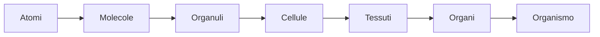

EBN: **Elementi di Biologia e Neuroscienze**
CdL Filosofia, a.a 2020/21
Prof. *Mario Pirchio*

---

[toc]

---

# Introduzione

L'obiettivo del corso é fornire le conoscenze di  biologia e di neuroscienze necessarie per una moderna indagine  filosofica su importanti tematiche legate soprattutto alla Vita e alla filosofia della mente, quali *origine della Vita, embrione, mente, coscienza, percezioni, libero arbitrio*.

Lasciamo decidere totalmente agli scienziati questioni legate agli stili di vita, modelli sociali e ambiente? 

> Sentiamo crescere intorno a noi e dentro di noi l'esigenza di un mondo  nuovo consapevole e solidale, l'urgenza di un nuovo modello di vita  capace di orientare un progresso che, privo di regole e di scopi,  risulta sempre più insensato. Ma a chi tocca l'onere di elaborare questo nuovo modello?
>
> -Domenico De Masi, Mappa Mundi, 2014 Rizzoli

Probabilmente sono proprio i filosofi gli unici in grado di poter governare saggiamente (come ci insegna Platone nel libro VI della Repubblica).

> Socrate adimanto, metafora capitano-nave

Nelle ultime lezioni del corso, inoltre, verranno discussi alcuni *recenti  tentativi compiuti da parte delle neuroscienze* per affrontare  sperimentalmente problematiche come coscienza e libero arbitrio.

Le parole d'ordine del corso sono *interdisciplinareità* e *nuove idee*.

*Qual é il livello di complessità oltre il quale si manifestano coscienza e libero arbitrio?*

*Inizialmente verranno introdotti alcuni concetti basilari in biologia, come l'organizzazione gerarchica delle strutture biologiche e  la correlazione tra forma e funzione.*

## Concetti basilari in biologia

La biologia è una scienza multidisciplinare, che richiede conoscenze di chimica, fisica e matematica. Ma è anche la disciplina scientifica che presenta maggiori connessioni con le realtà umane e le scienze sociali. Nuove conoscenze innescano rivoluzioni in campi come medicina, agraria, ecologia, sociologia, ...

### I 10 temi fondamentali

- **A ogni livello di indagine le strutture biologiche mostrano caratteristiche peculiari. Proprietà emergenti**

L'organizzazione biologica si basa su una gerarchia di livelli strutturali, ognuno dei quali poggia su un gradino sottostante:

In questa nuova gerarchia passando da un livello al superiore, *si palesano nuove proprietà* che non erano presenti ai livelli più semplici, le **proprietà emergenti**.

Su queste osservazioni poggia le basi la teoria dell'**Emergentismo**, secondo la quale *la mente nasce come proprietà emergente del cervello.*

*? Si deve privilegiare l'analisi o la sintesi ?*
La biologia cerca di bilanciare per tentare di comprendere come i singoli componenti siano integrati funzionalmente, integrando riduzionismo e comprensione delle proprietà emergenti.
Senza ridurre, a causa della complessità dei componenti, non potrei comprenderli. Applicando solo la riduzione distruggerei il loro funzionamento.

Un singolo neurone non sa parlare italiano. *Le capacità di un essere umano vanno oltre le singole capacità dei pezzi di cui è composto*.

- **Le cellule rappresentano le unità strtutturali e funzionali degli organismi. La teoria cellulare**

Tutti gli esseri viventi sono composti da cellule o sono cellule (organismi *unicellulari*).

- Il perpetuarsi della vita è possibile grazie alla trasmissione dei geni
- **La forma e la funzione delle strutture biologiche sono correlate a tutti i livelli**

Anche a livello molecolare. L'ala di un uccello, un neurone, un mitocondrio. *Forma e funzione sono sempre correlate*.
Se l'ala di un uccello fosse diversa esso rischierebbe di non volare, 
i neuroni senza ramificazioni non potrebbero lavorare così come i
mitocondri senza striature.

*Cambiando la forma la funzione si modificherà di conseguenza.*

- Gli organismi sono sistemi aperti che interagiscono continuamente con l'ambiente
- Meccanismi di regolazione ed *omeostasi*

- **Diversità e unità: le 2 facce della vita sulla Terra**

La biodiversità ci destabilizza, da 5 a 30 milioni di specie. In passato si parlava di *somiglianze morfologiche* per distinguere le specie, oggi la **tassonomia** (*la disciplina che si occupa della classificazione di esseri che siano viventi o anche inanimati*)  si fa tramite somiglianza di **DNA**, che ha portato a una revisione dei vecchi sistemi di classificazione.

Se scendiamo ai livelli bassi siamo più simili di quanto pensiamo agli altri esseri viventi, così come si somigliano tutti gli organismi.

> es: ciglio di *paramecium* e ciglia di una cellula epiteliale delle vie aeree degli esseri umani presentano la stessa sezione trasversale. *Più scendiamo più siamo simili*.

-  L'evoluzione rappresenta il tema centrale ed unificante della biologia

Darwin, nel 1859, partì da 2 osservazioni: la variabilità individuale e la competizione per la sopravvivenza. Da qui dedusse che *gli individui con caratteristiche più correlate con le condizioni di quell'ambiente lasciano un maggior numero di figli in grado di sopravvivere e riprodursi: **la selezione naturale***

- L'indagine scientifica

# Dall'atomo alla cellula

*Si parla della cellula partendo dai  singoli atomi. Un breve viaggio per introdurre alcuni concetti di  chimica necessari per comprendere meglio gli argomenti che verranno  trattati in seguito, come ad esempio la comunicazione neuronale.*

>cap. 2,3,4 atomi molecole, acqua, carbonio - Campbell
>cap. 2 EBG

## Elementi e composti

*Empedocle, Anassimene: aria, acqua, terra, fuoco*
*Leucippo, Democrito, Epicuro: atomi*

**Atomo**: è la più piccola quantità di materia che mantiene le proprietà di un elemento (es. ferro). Consiste di un nucleo e 1 o più elettroni.

**Massa**: misura della quantità di materia presente. Più massa => maggior quantità di materia

Tutta la materia è costituita da 94 elementi chimici in natura (tralasciando quelli non stabili, altri 24 sono stati creati in laboratorio).
In forma pura parliamo di *elemento*, ovvero una sostanza pura che contiene solo un tipo di atomo. In combinazione sono *composti*. 

4 sono i più importanti: **carbonio, ossigeno, azoto, idrogeno** (C, O, N, H), sono il 96% di un organismo. Aggiungendo anche fosforo e zolfo si ha la maggior parte della materia di cui sono composti gli organismi viventi (98%).

*La struttura di un atomo determina le sue proprietà.*
Il numero di protoni nel nucleo di un atomo determina il suo elemento, in altre parole *ogni elemento ha un numero unico di protoni*, che definisce il suo **numero atomico**.
Ogni elemento, tranne l'idrogeno, ha uno o più neutroni nel nucleo.

Un atomo ha un nucleo composto da neutroni e protoni circondato da una *nube di elettroni in rapido movimento*. 
Sebbene il *nucleo raprresenti quasi tutto il peso* dell'atomo esso occupa solo $\frac{1}{10000}$ del volume dell'atomo.

Un singolo protone o neutrone ha una massa di 1 dalton (Da), ovvero
$1.7×10^{-24}$ grammi (0.0000000000000000000000017 g), ed un elettrone è ancora più leggero: $9×10^{-28}$ g (0.0005 Da).
1 Dalton è l'unità della massa atomica.

**Isotopi:** dato un elemento essi hanno lo stesso numero di protoni ma differiscono nel numero di neutroni.
La maggior parte di essi sono stabili, mentre altri, **radioisotopi** non lo sono e rilasciano spontaneamente energia sottoforma di $\alpha, \beta, \gamma$  radiazioni dal loro nucleo atomico. *Decadenza radioattiva*.

Se un radioisotopo è incorporato all'interno di una molecola può agire come un'etichetta permettendo di tracciare tale molecola nel corpo o in un esprerimento.

**Molecola:** sostanca chimica composta da 2 o piú atomi uniti da legami covalenti o attrazione ionica.

Le reazioni solitamente coinvolgono cambiamenti nella distribuzione di elettroni fra atomi.

> La locazione di un certo elettrone in un atomo in un qualsiasi momento è impossibile da determinare. Possiamo solo descrivere un volume di spazio all'interno dell'atomo entro il quale l'elettrone è possibile si trovi.

**orbitale**: non è un orbita in senso stretto, è più simile a una nube/sfera. É una regione di spazio intorno al nucleo nella quale è probabile trovare un elettrone (vi si trova circa il 90% del tempo).

Un orbitale può essere occupato al massimo da 2 elettroni. 
**electron shell** (guscio orbitale): la regione circostante il nucleo ad un livello di energia fisso nel quale gli elettroni orbitano.

Nel primo guscio: vi è 1 solo orbitale => posso mettere al massimo 2 elettroni
Il 2° guscio contiene 4 orbitali, da cui 8 elettroni max
Vengono prima inseriti elettroni negli orbitali a più bassa energia (quelli più vicini al nucleo). Piú un elettrone è lontano dal nucleo più è alto il suo livello di energia per rimanere in quel guscio

**Elettroni di valenza**: elettroni più esterni. Determinano il comportamento chimico di un atomo. Si parla di *valence shell*.

Quando un guscio di valenza con 4 orbitali contiene 8 elettroni non ve ne sono di elettroni liberi => l'atomo è **stabile**, ovvero è meno probabile che reagisca con altri atomi (es: elio, neon, argon).
Mentre quando un atomo ha elettroni liberi nel guscio più esterno può reagire (ovvero si può legare) con altri atomi.

Atomi *inerti* e *reattivi*, metafora di coppie e single in cerca di comapgno.
**Regola dell'ottetto**: tendenza degli atomi a formare molecole stabili così da avere 8 elettroni nel guscio più esterno.
La stabilità può essere ottenuta sia condividendo elettroni con altri atomi sia guadagnando o perdendo uno o più elettroni.

## Legami fra atomi 

legami chimici che tengono legati atomi

legame *covalente*: 2 elett. di valenza fra più atomi, è il + forte

2 o più atomi tenuti insieme da legami covalenti formano una molecola. Idrogeno può unirsi solo con idrogeno.

H - H

compartecipazione di elettroni. Vanno a soddisfare entrambi i nuclei.

ossigeno: ha 6 elettroni ne condivide 2 con un altro atomo di ossigeno.

la molecola dell'acqua è *polare*. H2O è sbilanciata verso l'ossigeno. $\delta-$ indica un accumulo di negatività in percentuale

il protone resta nell'atomo di idrogeno ma l'elettrone si sposta verso l'atomo di ossigeno

il metano è una molecola *non polare*. 

Legame *ionico*: 

l'atomo più elettronegativo strappa completamente un elettrone al suo compagno

squilibrio che crea il legame. catione e anione

il sodio e il cloro sono abbondanti al di fuori dei neuroni. 

legame *idrogeno*: quando un atomo di idrogeno si trova fra due atomi elettronegativi vicini

interazioni di van der Waals: formazione di regioni momentaneamente polari 

per la vita i legami importanti sono tutti, abbiamo bisogno sia di cose rigide che trasformabili

funzione e forma delle molecole

reazioni chimiche: continuamente, formazione e rottura dei legami chimici. C'è solo ridistribuzione di materia, nè creazione nè distruzione.

Demiurgo (in Platone, Timeo). Demiurgo trasformatore che trasforma continuamente la materia. 

spore: forme di resistenza nei confronti delle situazioni sfavorevoli.

---

## Acqua

70-95 % di acqua formano le cellule
Qual é la caratteristica chimica che l'ha resa così importante? *il legame idrogeno*. 

Senza bollirebbe a -120C. l'idrogeno è allineato fra 2 rossi. 

Il ghiaccio galleggia sull'acqua.

l'acqua quando si solidifica si espande. Se non facesse il contrario non si sarebbe creata la vita per congelamento dell'acqua.

il ghiaccio diventa meno denso e galleggia. I legami idrogeno diventano stabili.

*omeopatia memoria acqua*

l'acqua è essenziale per sciogliere le sostanze. 

*sostanze idrofile*: tutte le sostanze che si sciolgono in acqua o che assorbono acqua (es. cotone) anche senza sciogliersi.

contrario: *idrofobe*, quelle che non possiedono l'ossigeno. 
quelle come metano/carbonio

dicotomia: sostanze idrofobe e idrofile, cosa importante!
vitamina A, D: si accumulano, sono idrofobe, si accumulano nel fegato

molti esploratori glaciali muoiono per questa ragione (mangiando fegato animali).

PCB: policlorobifenilis...
ce li ritroviamo nelle farine. si accumulano e anche nel latte materno. 

casi di infertilità/ alterazioni cicli mestrauli vengono imputati all'uso dei pesticidi.

olio vegetale è idrofobo. 
? Queste molecole sono idrofile o idrofobe?

l'essere solida o liquida è una proprietà emergente delle molecole d'acqua. Le singole molecole non sono nè liquide nè solide. 

 ## Gli elementi chimici della vita e l'acqua

## Il carbonio e le piccole molecole organiche
## Le macromolecole della vita: carboidrati, lipidi, proteine, acidi nucleici (DNA e RNA)

 ## I componenti cellulari: membrana plasmatica, nucleo, mitocondri, ribosomi...
 ## La cellula e l'energia, metabolismo cellulare, respirazione cellulare.

# Dalla cellula agli organismi

*Partiremo dalla singola cellula per  arrivare fino all'organismo completo. Parleremo perciò di DNA, di  embrione, di cellule staminali.*

 ## Divisione cellulare: mitosi e meiosi

## DNA, RNA, proteine

## Batteri e virus

 ## Controllo dell'espressione genica

 ## Sviluppo embrionale umano

# Dagli organismi alle specie

*Vedremo come la biodiversità possa  essere spiegata mediante l'evoluzione. Parleremo quindi di variabilità  genetica, di selezione naturale, di origine delle specie.*

## Darwin, la variabilità genetica, la selezione naturale
## L'origine delle specie

## Origine della vita

# Neuroscienze

*In questa parte ci concentreremo sui neuroni e sul cervello. Tratteremo molti  temi, fra cui il potenziale d'azione, i neurotrasmettitori, le sinapsi, i meccanismi della percezione, l’apprendimento, la memoria, il sonno.*

 16 - Organismi pluricellulari e comunicazione cellulare.
 17 - Evoluzione e neuroni.
 18 - Neuroni e neuroglia.

# Il singolo neurone
## Membrana plasmatica e canali ionici

## Proprietà elettriche dei neuroni

## Sinapsi, integrazione sinaptica, neurotrasmettitori

# Dal singolo neurone al cervello
## Organizzazione del sistema nervoso

## Meccanismi neurofisiologici della percezione (sistemi visivo, acustico, somatosensoriale)

## Reti neurali

## Sviluppo, apprendimento, memoria

## Lezione sperimentale. Misurazioni psicofisiche (tempo di reazione, soglia uditiva, misurazioni soprasoglia)

# Cervello e mente
## Illusioni sensoriali e allucinazioni
## Schizofrenia, depressione, stati d'ansia, sistemi della ricompensa, droga
## Sonno, sogni, coma, morte cerebrale
## Lezione sperimentale. Misurazione di segnali elettroencefalografici di tipo cognitivo
# Fra neuroscienze e filosofia

*Un paio di lezioni in cui leggeremo e  discuteremo alcuni articoli scientifici originali in cui neuroscienziati affrontano sperimentalmente le problematiche della coscienza, delle  percezioni, del libero arbitrio.*

## Coscienza. Libero arbitrio. Immaginazione. Creatività

# Bibliografia consigliata

- Sadava, Hillis, Heller, Hacker. *Elementi di biologia e genetica*. Editore: Zanichelli. Quinta edizione italiana.
- Kandel, Schwartz, ecc. *Principi di neuroscienze*. Casa Editrice  Ambrosiana - Zanichelli. Quarta edizione.  Volume unico.
- Watson, Breedlove. *Il cervello e la mente. Le basi biologiche del comportamento.* Zanichelli editore.