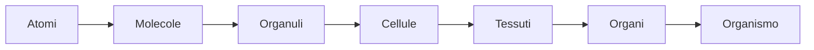
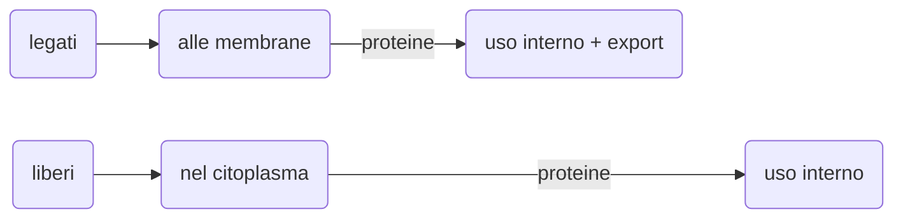

EBN: **Elementi di Biologia e Neuroscienze**
CdL Filosofia, a.a 2020/21
Prof. *Mario Pirchio*

---

[toc]

---

# Introduzione

L'obiettivo del corso è fornire le conoscenze di  biologia e di neuroscienze necessarie per una moderna indagine  filosofica su importanti tematiche legate soprattutto alla Vita e alla filosofia della mente, quali *origine della Vita, embrione, mente, coscienza, percezioni, libero arbitrio*.

Lasciamo decidere totalmente agli scienziati questioni legate agli stili di vita, modelli sociali e ambiente? 

> Sentiamo crescere intorno a noi e dentro di noi l'esigenza di un mondo  nuovo consapevole e solidale, l'urgenza di un nuovo modello di vita  capace di orientare un progresso che, privo di regole e di scopi,  risulta sempre più insensato. Ma a chi tocca l'onere di elaborare questo nuovo modello?
>
> -Domenico De Masi, Mappa Mundi, 2014 Rizzoli

Probabilmente sono proprio i filosofi gli unici in grado di poter governare saggiamente (come ci insegna Platone nel libro VI della Repubblica).

> Socrate adimanto, metafora capitano-nave

Nelle ultime lezioni del corso, inoltre, verranno discussi alcuni *recenti  tentativi compiuti da parte delle neuroscienze* per affrontare  sperimentalmente problematiche come coscienza e libero arbitrio.

Le parole d'ordine del corso sono *interdisciplinareità* e *nuove idee*.

*Qual è il livello di complessità oltre il quale si manifestano coscienza e libero arbitrio?*

*Inizialmente verranno introdotti alcuni concetti basilari in biologia, come l'organizzazione gerarchica delle strutture biologiche e  la correlazione tra forma e funzione.*

## Concetti basilari in biologia

La biologia è una scienza multidisciplinare, che richiede conoscenze di chimica, fisica e matematica. Ma è anche la disciplina scientifica che presenta maggiori connessioni con le realtà umane e le scienze sociali. Nuove conoscenze innescano rivoluzioni in campi come medicina, agraria, ecologia, sociologia, ...

### I 10 temi fondamentali

- **A ogni livello di indagine le strutture biologiche mostrano caratteristiche peculiari. Proprietà emergenti**

L'organizzazione biologica si basa su una gerarchia di livelli strutturali, ognuno dei quali poggia su un gradino sottostante:

In questa nuova gerarchia passando da un livello al superiore, *si palesano nuove proprietà* che non erano presenti ai livelli più semplici, le **proprietà emergenti**.

Su queste osservazioni poggia le basi la teoria dell'**Emergentismo**, secondo la quale *la mente nasce come proprietà emergente del cervello.*

*? Si deve privilegiare l'analisi o la sintesi ?*
La biologia cerca di bilanciare per tentare di comprendere come i singoli componenti siano integrati funzionalmente, integrando riduzionismo e comprensione delle proprietà emergenti.
Senza ridurre, a causa della complessità dei componenti, non potrei comprenderli. Applicando solo la riduzione ignorerei il loro funzionamento emergente.

Un singolo neurone non sa parlare italiano. *Le capacità di un essere umano vanno oltre le singole capacità dei pezzi di cui è composto*.

- **Le cellule rappresentano le unità strtutturali e funzionali degli organismi. La teoria cellulare**

Tutti gli esseri viventi sono composti da cellule o sono cellule (organismi *unicellulari*).

- Il perpetuarsi della vita è possibile grazie alla trasmissione dei geni
- **La forma e la funzione delle strutture biologiche sono correlate a tutti i livelli**

Anche a livello molecolare. L'ala di un uccello, un neurone, un mitocondrio. *Forma e funzione sono sempre correlate*.
Se l'ala di un uccello fosse diversa esso rischierebbe di non volare, 
i neuroni senza ramificazioni non potrebbero lavorare così come i
mitocondri senza striature.

*Cambiando la forma la funzione si modificherà di conseguenza.*

- Gli organismi sono sistemi aperti che interagiscono continuamente con l'ambiente
- Meccanismi di regolazione ed *omeostasi*

- **Diversità e unità: le 2 facce della vita sulla Terra**

La biodiversità ci destabilizza, da 5 a 30 milioni di specie. In passato si parlava di *somiglianze morfologiche* per distinguere le specie, oggi la **tassonomia** (*la disciplina che si occupa della classificazione di esseri che siano viventi o anche inanimati*)  si occupa della somiglianza di **DNA**, che ha portato a una revisione dei vecchi sistemi di classificazione.

Se scendiamo ai livelli bassi siamo più simili di quanto pensiamo agli altri esseri viventi, così come si somigliano tutti gli organismi.

> es: ciglio di *paramecium* e ciglia di una cellula epiteliale delle vie aeree degli esseri umani presentano la stessa sezione trasversale. *Più scendiamo più siamo simili*.

-  L'evoluzione rappresenta il tema centrale ed unificante della biologia

Darwin, nel 1859, partì da 2 osservazioni: la variabilità individuale e la competizione per la sopravvivenza. Da qui dedusse che *gli individui con caratteristiche più correlate con le condizioni di quell'ambiente lasciano un maggior numero di figli in grado di sopravvivere e riprodursi: **la selezione naturale***

- L'indagine scientifica

# Dall'atomo alla cellula

*Si parla della cellula partendo dai  singoli atomi. Un breve viaggio per introdurre alcuni concetti di  chimica necessari per comprendere meglio gli argomenti che verranno  trattati in seguito, come ad esempio la comunicazione neuronale.*

>cap. 2,3,4 atomi molecole, acqua, carbonio - Campbell
>cap. 2 EBG

## Elementi e composti

*Empedocle, Anassimene: aria, acqua, terra, fuoco*
*Leucippo, Democrito, Epicuro: atomi*

**Atomo**: è la più piccola quantità di materia che mantiene le proprietà di un elemento (es. ferro). Consiste di un nucleo e 1 o più elettroni.

**Massa**: misura della quantità di materia presente. Più massa => maggior quantità di materia

Tutta la materia è costituita da 94 elementi chimici in natura (tralasciando quelli non stabili, altri 24 sono stati creati in laboratorio).
In forma pura parliamo di *elemento*, ovvero una sostanza pura che contiene solo un tipo di atomo. In combinazione sono *composti*. 

4 sono i più importanti: **carbonio, ossigeno, azoto, idrogeno** (C, O, N, H), sono il 96% di un organismo. Aggiungendo anche fosforo e zolfo si ha la maggior parte della materia di cui sono composti gli organismi viventi (98%).

*La struttura di un atomo determina le sue proprietà.*
Il numero di protoni nel nucleo di un atomo determina il suo elemento, in altre parole *ogni elemento ha un numero unico di protoni*, che definisce il suo **numero atomico**.
Ogni elemento, tranne l'idrogeno, ha uno o più neutroni nel nucleo.

Un atomo ha un nucleo composto da neutroni e protoni circondato da una *nube di elettroni in rapido movimento*. 
Sebbene il *nucleo raprresenti quasi tutto il peso* dell'atomo esso occupa solo $\frac{1}{10000}$ del volume dell'atomo.

Un singolo protone o neutrone ha una massa di 1 dalton (Da), ovvero
$1.7×10^{-24}$ grammi (0.0000000000000000000000017 g), ed un elettrone è ancora più leggero: $9×10^{-28}$ g (0.0005 Da).
1 Dalton è l'unità della massa atomica.

**Isotopi:** dato un elemento essi hanno lo stesso numero di protoni ma differiscono nel numero di neutroni.
La maggior parte di essi sono stabili, mentre altri, **radioisotopi** non lo sono e rilasciano spontaneamente energia sottoforma di $\alpha, \beta, \gamma$  radiazioni dal loro nucleo atomico. *Decadenza radioattiva*.

Se un radioisotopo è incorporato all'interno di una molecola può agire come un'etichetta permettendo di tracciare tale molecola nel corpo o in un esprerimento.

**Molecola:** sostanca chimica composta da 2 o piú atomi uniti da legami covalenti o attrazione ionica.

Le reazioni solitamente coinvolgono cambiamenti nella distribuzione di elettroni fra atomi.

> La locazione di un certo elettrone in un atomo in un qualsiasi momento è impossibile da determinare. Possiamo solo descrivere un volume di spazio all'interno dell'atomo entro il quale l'elettrone è possibile si trovi.

**orbitale**: non è un orbita in senso stretto, è più simile a una nube/sfera. È una regione di spazio intorno al nucleo nella quale è probabile trovare un elettrone (vi si trova circa il 90% del tempo).

Un orbitale può essere occupato al massimo da 2 elettroni. 
**electron shell** (guscio orbitale): la regione circostante il nucleo ad un livello di energia fisso nel quale gli elettroni orbitano.

Nel primo guscio: vi è 1 solo orbitale => posso mettere al massimo 2 elettroni
Il 2° guscio contiene 4 orbitali, da cui 8 elettroni max
Vengono prima inseriti elettroni negli orbitali a più bassa energia (quelli più vicini al nucleo). Piú un elettrone è lontano dal nucleo più è alto il suo livello di energia per rimanere in quel guscio

**Elettroni di valenza**: elettroni più esterni. Determinano il comportamento chimico di un atomo. Si parla di *valence shell*.

Quando un guscio di valenza con 4 orbitali contiene 8 elettroni non vi sono elettroni liberi => l'atomo è **stabile**, ovvero è meno probabile che reagisca con altri atomi (es: elio, neon, argon).
Mentre quando un atomo ha elettroni liberi nel guscio più esterno può reagire (ovvero si può legare) con altri atomi.

Atomi *inerti* e *reattivi*, metafora di coppie e single in cerca di comapgno. Gli atomi inerti sono quelli che hanno il guscio più esterno (strato di valenza) completo (*elio, neon, argon*)
**Regola dell'ottetto**: tendenza degli atomi a formare molecole stabili così da avere 8 elettroni nel guscio più esterno.
La stabilità può essere ottenuta sia condividendo elettroni con altri atomi sia guadagnando o perdendo uno o più elettroni. Si formano così dei legami chimici che mantengono gli atomi vicini.

## Legami fra atomi

I legami chimici sono (in ordine di forza): il *legame covalente*, il *legame ionico* e il legame *idrogeno*.

### Legame covalente

Un legame *covalente* prevede la compartecipazione di 2 elettroni di valenza fra più atomi ed è il tipo di legame più forte. La notazione col trattino indica una coppia di elettroni in compartecipazione. (es: H-H)

*Due o più atomi tenuti insieme da legami covalenti formano una molecola*. 

- **Idrogeno**: quando si incontrano, due atomi di idrogeno liberi formano un singolo legame covalente
- **Ossigeno**: due atomi di ossigeno formano una molecola mettendo ognuno in compartecipazione una coppia di elettroni di valenza: si forma così un legamo covalente doppio
- **Acqua**: due atomi di idrogeno possono legarsi con legami covalenti a un atomo di ossigeno per produrre una molecola d'acqua

- **Metano**: quattro atomi di idrogeno possono soddisfare la valenza di un atomo di carobonio formando una molecola di metano
  

**Elettronegatività**

La molecola dell'acqua è *polare*. Ciò vuol dire che l'atomo di ossigeno attrae molto verso di sè le due coppie di elettroni dei legami covalenti con l'idrogeno, pertanto si trovano più vicino al nucleo dell'ossigeno che a quello dell'idrogeno. 
Di conseguenza l'atomo di ossigeno si trova ad essere un po' più carico *negativamente* e i 2 atomi di idrogeni sono un po' carichi *positivamente*.

Nella figura si può notare come $\delta-$ indichi un accumulo di negatività in percentuale. Le 2 frecce indicano che l'ossigeno attira verso di sè le 2 coppie di elettroni. Non attrae per intero la carica dell'elettrone dell'idrogeno, solo *parzialmente*. 
Il protone resta nell'atomo di idrogeno ma l'elettrone si sposta verso l'atomo di ossigeno.

Il metano è invece una molecola *apolare*. Il carbonio è un atomo più *democratico*, le coppie di elettroni sono distribuite più equamente con gli atomi di idrogeno.

### Legame ionico

*L'atomo più elettronegativo strappa completamente un elettrone al suo compagno.*

Prendiamo il cloruro di sodio: l'atomo di sodio ha 1 elettrone nel suo strato di valenza mente l'atomo di cloro ne ha 7. Per *completarsi* a vicenda l'atomo di cloro strappa l'elettrone all'atomo di sodio e si trovano così bilanciati (nello sbilanciamento individuale). L'atomo di sodio assume così una carica prevalentemente positiva (*catione*) mentre quello di cloro negativa (*anione*).

*Per la presenza delle cariche di segno opposto anioni e cationi si attraggono con una forza detta **legame ionico.***

È importante notare che il sodio e il cloro sono abbondanti al di fuori dei neuroni, sono alla base del funzionamento di essi.

<u>?? Composti ionici o sali, forza dei legami ionici in aria e in acqua ??</u> 

### Legame idrogeno

Un legame *idrogeno* si verifica quando un atomo di idrogeno si trova fra due atomi elettronegativi vicini.

Nell'acqua gli atomi di idrogeno si trovano fra due atomi di ossigeno, che sono elettronegativamente negativi, pertanto l'idrogeno si *stabilizza* fra i 2 atomi di ossigeno.

L'allineamento delle molecole d'acqua non è casuale quindi, i legami a idrogeno tendono a dare una struttura. 

### Interazioni di van der Waals

Nelle molecole d'acqua lo sbilanciamento dovuto alla polarità è sempre presente, dato che sono molecole *polari*.
Nelle molecole *apolari* (es. metano) si possono accumulare casualmente in modo asimmetrico gli elettroni, *formando regioni momentaneamente polari*, in particolare fra molecole (o gruppi di atomi di una stessa molecola) che si trovano a breve distanza.
Queste regioni polari possono far sì che le molecole si stabilizzino temporaneamente, come accade per le molecole d'acqua.

### Conclusioni sui legami

Per la vita i legami importanti sono tutti, abbiamo bisogno sia di legami rigidi e forti che di quelli più deboli.
Abbiamo bisogno di legami covalenti per strutture rigide (ossa, capelli) con legami robusti. Molti neurotrasmettitori invece formano legami ionici e sono la base del funzionamento dei neuroni.

**Funzione e forma delle molecole**
La funzione chimica di una molecola è in relazione con la sua forma. Molecole biologiche si riconoscono l'una con l'altra se una complementarietà di forma che permetto loro la formazione di legami (ormoni, neurotrasmettitori, ...).

**Reazioni chimiche**
La formazione e la rottura dei legami chimici (che portano a modifiche della composizione della materia) vengono chiamate *reazioni chimiche*.
La materia in una reazione chimica non viene nè creata nè distrutta, ma ridistribuita.

Possiamo immaginare un *Demiurgo* trasformatore che trasforma continuamente la materia, piuttosto che un Demiurgo creatore. 

> Il demiurgo, figura filosofica e al tempo stesso mitologica, è un essere divino, dotato di capacità creatrice e generatrice, descritto la prima volta da Platone nel Timeo.
>
> La figura del Demiurgo, senza il quale «è impossibile che ogni cosa abbia nascimento», non è propriamente un dio generatore come quello cristiano, ma piuttosto ordinatore: egli dà il soffio vitale a una materia informe e ingenerata che preesiste a lui.
>
> Fu descritto all'inizio da Platone soltanto come ipotesi cosmologica che ha carattere verosimile, cioè in forma di mito, di cui egli si serviva come in altri casi per descrivere in modo intuitivo e narrativo, anzichè con una rigorosa argomentazione dimostrativa, un aspetto del suo pensiero particolarmente difficile da illustrare e comprendere.
>
> «Artefice e padre dell'universo», il Demiurgo è nel mito platonico una forza ordinatrice, imitatrice, plasmatrice, che vivifica la materia, dandole una forma, un ordine, e soprattutto un'Anima Mundi. 

*A stati macroscopicamente diversi* come il passaggio dalla vita alla morte, dal sonno alla veglia, *si accompagna una situazione microscopica diversa.*

In situazioni svantaggiose l'uomo non può resistere, ma vi sono batteri, ad esempio le *spore* che anche in situazioni sfavorevoli sono in grado di sopravvivere trasformando la materia, sono forme di resistenza nei confronti delle situazioni sfavorevoli.

---

## Acqua

L'acqua è per ovvie ragioni fondamentale per la vita, si sa che sulla Terra la vita ha avuto origine proprio nell'acqua per spostarsi successivamente sulla terraferma.
Sappiamo anche che le cellule sono formate per il 70-95 % di acqua.

*?Qual è la caratteristica chimica che l'ha resa così importante?* 
Il fatto di avere una molecola *polare* e di permettere  il formarsi di *legami idrogeno*.

Senza i legami idrogeno l'acqua bollirebbe a -120°C. Grazie all'energia (fornita ad esempio da un fornello a gas) si riesce a strappare questi legami idrogeno e a rendere queste molecole più libere così che queste possano evaporare.

Descriviamo ora 2 proprietà essenziali per la vita e che derivano dal fatto che le molecole d'acqua sono polari.

### Il ghiaccio galleggia sull'acqua

Quasi tutte le sostanze quando si solidificano si contraggono diventando più pesanti.
L'acqua quando si solidifica diventando ghiaccio invece si espande diventando così più leggera. 
Se  il ghiaccio non galleggiasse non si sarebbe creata la vita per via del congelamento dell'acqua dei laghi, stagni e perfino dei mari/oceani. Invece galleggiando lo strato ghiacciato superficiale protegge l'acqua liquida dal contatto con l'aria più fredda:  l'acqua sottostante si mantiene liquida, permettendo così la vita

*?Perchéè questo è dovuto alla polarità dell'acqua?*
Nell'acqua liquida la maggior parte delle molecole risultano legate con legami idrogeno (*non tutte*) ed è importante notare che questi legami vengono continuamente rotti e riformati. 
Quando invece l'acqua si solidifica e diventa ghiaccio *tutte* le molecole si legano fra loro con legami idrogeno formando un retacolo cristallino in cui le molecole risultano più distanti di quanto avviene nell'acqua liquida. Di conseguenza diminuisce la densità del ghiaccio rispetto all'acqua e ciò gli permette di galleggiare.

(*omeopatia memoria acqua*)

### L'acqua è il solvente della vita

L'acqua è essenziale per la vita in quanto consente di sciogliere le sostanze. 
Riprendendo il *cloruro di sodio*, se lo si immerge in acqua:

dato che l'acqua è una molecola polare, con atomi di ossigeno carichi parzialmente negativamente e quelli di idrogeno parzialmente positivamente

- gli atomi di ossigeno attraggono perciò gli atomi di sodio (cationi, ioni positivi), strappandoli dal cristallo

In questa maniera le molecole di acqua circondano gli atomi di sodio, con gli atomi di ossigeno più vicini ad essi e quelli di idrogeno più lontani.

- gli atomi di idrogeno attraggono gli atomi di cloro (anioni, ioni negativi) , strappandoli anche in questo caso

Le molecole d'acqua avvolgono così gli atomi di cloro con gli atomi di idrogeno più vicini a questi.
*guscio di idratazione*: lo formano ad esempio le molecole d'acqua disposte intorno al sodio e al cloro ordinatamente come nel caso sopra (ne riparleremo per i neuroni).

Per potersi sciogliere in acqua un composto non deve essere necessariamente di tipo ionico (un sale). È sufficiente che sulla superficie vi siano un numero sufficiente di regioni ionizzate, cioè con cariche unitare (es. cloruro di sodio) o di regioni polari, cioè con cariche parziali.
*C'è un'attrazione reciproca fra le molecole d'acqua e qualsiasi regione ionica o polare di una molecola.*

*sostanze idrofile*: tutte le sostanze che si sciolgono in acqua o che assorbono acqua (es. cotone) anche senza sciogliersi.

contrario: *sostanze idrofobe*: sostanze che si comportano come se avessero una repulsione per l'acqua; possiedono molti legami *covalenti* non polari fra atomi di carbonio e di idrogeno come i legami del metano; es. olio vegetale

dicotomia: sostanze idrofobe e idrofile, è un dettaglio importante! 
*?Queste molecole sono idrofile o idrofobe?* è una domanda che ci porremo spesso nel corso.

Le vitamina A, D si accumulano dato che sono idrofobe, ad esempio si accumulano nel fegato. Molti esploratori glaciali sono morti per questa ragione (mangiando fegato animali in particolare di foche).

PCB: policlorobifenili, ce li ritroviamo nelle farine, si accumulano anche nel latte materno. Casi di infertilità e alterazioni di cicli mestrauli vengono imputati all'uso dei pesticidi.

| idrofila | molte zone ioniche o polari  |
| -------- | ---------------------------- |
| idrofoba | molti legami covalenti C - H |

L'essere solida o liquida è una *proprietà emergente* delle molecole d'acqua. Le singole molecole non sono nè liquide nè solide. 
È difficile dire se un pezzo di cervello (dei neuroni) sia vivo o no.

Quando una sostanza si scioglie in acqua si ottiene una *soluzione*. L'acqua è il *solvente*, la sostanza disciolta è il *soluto*.

## Il carbonio e le piccole molecole organiche

### Composti organici e chimica organica

I composti *organici* contengono carbonio. La chimica organica studia i composti del carbonio.
Berzelius, all'inizio dell '800 distinse per primo fra composti organici (prodotti <u>esclusicamente</u> da esseri viventi) e inorganici.

Inizialmente la chimica organica si fondò sul *vitalismo*, ovvero la fede nell'esistenza di una forza vitale non subordinata a leggi della chimica/fisica. 
Ci fu una rivoluzione in seguito a:

- sintesi in laboratorio di composti organici (acido acetico, urea) a partire da elementi chimici puri 
- una dimostrazione di Miller del 1953 secondo la quale le ipotetiche condizioni della Terra primordiale pre-biotica erano favorevoli alla sintesi spontanea di composti organici, simulando quelle condizioni e fornendo scariche elettriche in sostituzione dei raggi solari (non c'era atmosfera che potesse indebolirli)

I fondamenti del pensiero biologico si spostarono *dal vitalismo al meccanicismo* secondo il quale tutti i fenomeni naturali, vita compresa, siano governati da leggi della chimica e della fisica, sia per sostanze organiche che inorganiche.

*?La coscienza deriva da proprietà meccanicistiche?*

Lo scheletro delle molecole organiche è formato da *catene carboniose*, cioè catene di atomi di carbonio lunghe legati fra loro da legami covalenti (singoli, doppi, tripli). Le catene sono lunghe e stabili e consentono la formazione di strutture spaziali anche complesse, come i *fullereni* (che sono valsi come Nobel per la chimica nel 1996) qui sotto:

Il carbonio è l'unico elemento che riesce a formare delle catene lunghe e stabili. Anche il silicio in realtà è simile, ma consente catene meno lunghe (4-5 atomi) dopodichè diventa instabile e la catena tende a rompersi.

Alle catene carboniose si possono legare singoli atomi o gruppi funzionali. 
I composti organici non sono idrofili, non vanno d'accordo con l'acqua, non possono formare legami idrogeno dato che i legami che forma il carbonio non sono polari.

Giulio Natta, Nobel per la chimica nel 1963, ha compiuto scoperte nella tecnologia dei polimeri (per dei catalizzatori).

Il polipropilene(PP) è un polimero termoplastico, formato da catene così lunghe che non ce ne liberiamo più. 

Il *Pacific Trash Vortex*, è un'enorme isola di plastica, le stime vanno da 700.000 km² fino a più di 10 milioni di km², tra lo 0,41% e il 5,6% dell'Oceano Pacifico, l'area potrebbe contenere fino a 100 milioni di tonnellate di detriti.
Uno studio del 2021 rivela che già nella *placenta* si trovano particelle di microplastica. Nutriamo di plastica anche i nostri embrioni.

*gruppi funzionali*: il comportamento chimico di un gruppo funzionale è sempre lo stesso anche se in molecole diverse. Il numero e la disposizione di questi gruppi in una molecola organica contribuisce a determinarne le proprietà.

I 6 gruppi funzionali più importanti nella chimica della vita sono tutti *idrofili*, aumentano l'idrosolubilità dei composti organici in cui sono presenti. 

## Le macromolecole della vita

> EBG: cap 3,4

Le cellule sono un continuo laboratorio, per tornare al concetto del Demiurgo trasformatore.
Le cellule uniscono tra loro piccole molecole organiche formando molecole più grandi, le *macromolecole biologiche*. 
L'efficienza è venuta strada facendo con l'evoluzione. Si sale di un livello nella gerarchia di organizzazione biologica.

Vi sono 4  classi principali di macromolecole biologiche: *carboidrati, lipidi, proteine, acidi nucleici*. Studiamo l'architettura delle macromolecole per capire meglio in che modo essa funzioni.

### Polimeri

> Un polimero (dal greco polymerḗs, letteralmente "che ha molte parti") è una macromolecola, ovvero una molecola dall'elevato peso molecolare, costituita da un gran numero di gruppi molecolari (o unità strutturali) uguali o diversi (nei copolimeri), uniti "a catena" mediante la ripetizione dello stesso tipo di legame (covalente). 

I polimeri sono una sequenza di monomeri. 

>Col termine monomero (dal greco una parte) in chimica si definisce una molecola semplice dotata di gruppi funzionali tali da renderla in grado di combinarsi ricorsivamente con altre molecole (identiche a sè o reattivamente complementari a sè) a formare macromolecole. 
>
>Per estensione, il termine viene usato anche per identificare l'unità strutturale ripetitiva che forma un polimero (detta più propriamente "unità ripetitiva" del polimero).
>Il processo di trasformazione del monomero a polimero si chiama polimerizzazione 

Alfabeto e parole. Con un piccolo di numero di monomeri (40-50) posso comporre un'infinità di polimeri. Sono molecole a catena, formate dall'unione di subunità identiche o simili.
Carboidrati, proteine e acidi nucleici (ma non lipidi) sono *polimeri*.
Gli organismi utilizzano gli stessi monomeri ma li utilizzano in modo diverso.

*Le differenze fra individui della stessa specie o tra specie diverse non sono dovute ai singoli monomeri ma ai polimeri (proteici).*

### Carboidrati

I carboidrati sono gli zuccheri semplici e i loro polimeri.

- **monosaccaridi**
  
  Hanno uno scheletro di carbonio con atomi O e H, in pratica è come se ogni atomo di carbonio avesse legata una molecola di acqua. Hanno legami covalenti prevalentemente singoli e alcuni doppi.
  Si dividono in zuccheri *triosi, pentosi ed esosi* in base al numero di atomi di carbonio (rispettivamente: 3,5,6).
Sono molecole idrofile in quanto l'ossigeno crea regioni polari ed in acqua ci sarà la possibilità per la creazione di legami idrogeno.
  Una volta in acqua assumono una forma ad anello. Ad esempio il glucosio, uno zucchero esoso (con 6 atomi di carbonio) forma un anello con 5 atomi di C e un atomo di O (la forma reale è più simile ad una barca o una sedia dato ch il carbonio tende a formare strutture a tetraedro).
  
  
  I nostri neuroni vanno prevalentemente a glucosio. I monosaccaridi sono *combustibili cellulari*, e per questa ragione questi zuccheri sono molecole importantissime.
  I monosaccaridi sono monomeri e possono mettersi insieme per formare molecole più complesse:
  
- **disaccaridi**
Sono formati da due zuccheri semplici (monomeri), ad esempio maltosio, saccarosio e lattosio.
  Il *maltosio* (che si trova nella birra) è composto da due molecole di glucosio, le quali si uniscono tramite l'ossigeno, formando una molecola d'acqua:
  
  
  Il *lattosio* è composto da glucosio + galattosio. L'unica differenza fra glucosio e galattosio è una sistemazione differente di un atomo di ossigeno.
  
  
  
  Un'intolleranza peggiore di quella al lattosio è la *galattosemia*, l'intolleranza al galattosio, pericoloso soprattutto per i neonati. Il lattosio viene scisso in glucosio e galattosio e successivamente il galattosio dovrebbe venire trasformato in glucosio ma ciò, nei soggetti con galattosemia, non avviene.
  
- **polisaccaridi**

  Sono polimeri di glucosio, possono essere usati come deposito di energia o come materiale da costruzione (polisaccaridi strutturali).

  - *Amido* e *glicogeno* sono un vero e proprio deposito di energia, sono entrambi digeribili. Quando necessario il polisaccaride viene scisso nei monomeri di glucosio e utilizzato come combustibile cellulare.

  

  ​	Il glicogeno si trova nel nostro corpo, nel fegato (ca. 100g) e nel tessuto muscolare (ca. 3-	400g). Durante uno sforzo prolungato scomponiamo il glicogeno nei muscoli e nel fegato.

  ​	L'amido si trova nei vegetali (tuberi, patate, semi cereali); è composto da tue tipi di 		polimeri, amilosio e amilopectina.

  - I polisaccaridi strutturali come la *cellulosa*  sono materiale da costruzione per la sintesi di varie strutture. 
    La cellulosa è il materiale organico più abbondante sulla Terra, non è digeribile dall'uomo ma solo da alcuni batteri (le termiti e i ruminanti riescono a mangiare il legno perché hanno dentro di loro questi batteri). 
    La cellulosa forma catene lineari, dritte, mai ramificate, tenute insieme parallelamente da *tanti legami idrogeno*.
    Circa 80 molecole di cellulosa si associano a formare una microfibrilla, la principale unità strutturale della *parete delle cellule vegetali*, una struttura così rigida da consentire alle sequoie di raggiungere i 100 metri.

  Una piccolissima diversità nella forma (disposizione di alcune molecole) causa la differenza fra  amilosio (amido, digeribile) e cellulosa (non digeribile):

  

I carboidrati sono quindi molecole vincenti, ma non troppo.

### Lipidi

I lipidi sono molecole non idrofile, hanno pochissime regioni polari. Non sono polimeri in genere.

**Grassi o trigliceridi**

I trigliceridi hanno tre acidi grassi.
In genere i grassi animali (lardo, burro) sono saturi e quelli dei vegetali e dei pesci sono instaturi (oli). Gli acidi grassi sono una catena idrocarburica. Il glicerolo è un alcol.
In base alla presenza di doppi legami C=C nella catena carboniosa, gli acidi grassi possono essere classificati come:

- *acidi grassi saturi*: se non sono presenti doppi legami nella catena carboniosa
- acidi grassi insaturi: se sono presenti doppi legami nella catena carboniosa; a loro volta si suddividono in:

  - acidi grassi *monoinsaturi*, se è presente un solo doppio legame C=C 
  - acidi grassi *polinsaturi*, se sono presenti due o più doppi legami C=C

>La presenza di doppi legami C=C e la lunghezza della catena carboniosa influenza la temperatura di fusione e la temperatura di cristallizzazione degli acidi grassi. 
>
>Maggiore è la percentuale di doppi legami e più le catene carboniose risultano corte, più alta risulta la fluidità dell'acido grasso e la sua temperatura di  cristallizzazione si abbassa. 
>
>Il metabolismo di grassi saturi e insaturi attiva gli stessi  enzimi, e l'organismo non è in grado di regolare questa competizione  enzimatica. 
>Pertanto, è importante mantenere l'equilibrio corretto  nell'assunzione di questi due tipi di grassi. Un sovraccarico di acidi  grassi in generale riduce la quantità di enzimi e aggrava il problema  della competizione.

I doppi legami causano una "gobba".
Le funzioni dei grassi nel nostro corpo sono:

- *deposito* di energia incredibile, forniscono il doppio di energia rispetto al glicogeno/amido; ce ne sono vari kg nel corpo
- funzione *protettiva*, ad esempio intorno all'orbita oculare e nei reni; anche in condizioni estreme di denutrizione questi grassi non vengono mai utilizzati (si è visto nelle autopsie nei campi di concentramento)
- funzione *termoisolante*, i mammiferi marini grazie al tessuto di grasso possono sopportare basse temperature

| macromolecole | kcal/g |
| ------------- | ------ |
| proteine      | 4,2    |
| carboidrati   | 4,3    |
| grassi        | 9,5    |

**Fosfolipidi**
Sono simili ai grassi, ma con *due* acidi grassi, invece di tre. Al posto del terzo acido grasso c'è un gruppo fosfato, carico negativamente.

In acqua i fosfolipidi si organizzano in *micelle*, cioè in aggregati che escludono le parti idrofobe dal contatto con l'acqua. Le micelle vengono *emarginate* nell'acqua non formando legami idrogeno. 

*? Posso usare i fosfolipidi per costruire la membrana cellulare?*
Le cellule hanno bisogno di un materiale impermeabile, di un "cappotto". Immaginando di avere acqua all'esterno di essa e all'interno ho bisogno di un doppio strato impermeabile, uno esterno ed uno interno.
Se usassi il cloruro di sodio mi si scioglierebbe subito. 
Si può usare un doppio strato fosfolipidico.

Anche i neuroni sono dotati di questo cappotto esterno. Come fa allora una molecola ionica o polare ad attraversare questo cappotto idrofobo? lo vederemo..

- **steroidi**
  Il colesterolo è il precursore degli steroidi (ormoni steroidei).
  

  Gli steroidi hanno uno scheletro carbonioso con 4 anelli fusi, variano per i gruppi funzionali che si trovano uniti a questi 4 anelli. 

  > È da sottolineare che la parola "steroide" si riferisce soltanto alla struttura chimica, e non alle funzioni biologiche. Infatti, ad esempio, il testosterone migliora l'azione dell'insulina, il cortisolo la inibisce; allo stesso modo, il testosterone stimola la sintesi di massa ossea e muscolare, mentre il cortisolo la degrada. 

I lipidi sono macromolecole interessanti, sono depositi di energia, svologno funzioni termoisolanti, protettive, sono usati nelle membrane cellulari e sono alla base degli steroidi. Sono anche'esse molecole vincenti.. ma non troppo.

### Proteine

Le proteine sono le molecole più importanti utilizzate dal *demiurgo trasformatore* per costruire la vita. 
Sono tante, e svolgono moltissime funzioni, ad esempio: 

- *collageno* ed *elastina* nei tendini e nei legamenti, 
- *cheratina* nei peli, nelle piume, 
- *ovalbumina* nell'albume delle uova, 
- *caseina* nel latte, 
- *emoglobina* nel sangue che trasporta ossigeno, 
- *insulina* per regolare la concentrazione di glucosio nel sangue, 
- proteine *recettoriali* nella membrana delle cellule nervose, 
- *actina e miosina* per il movimento dei muscoli
- *proteine di difesa*, gli anticorpi
- *enzimi digestivi* 

Anche nel Covid-19 ci sono le proteine (la cosiddetta proteina *spike*):

Le parti rosse sono le proteine, la sfera bianca è composta da lipidi.

**Struttura di una proteina**
Le proteine sono le molecole più complesse strutturalmente. 
Una proteina è costituita da 1 o più *polipeptidi*, ripiegati e impacchettati in specifiche conformazioni.

***polipeptide***: polimero di amminoacidi
***amminoacido***: è una molecola organica contenente un gruppo *carbossilico* e gruppo *amminico*, è formato in particolare da: 

- un atomo di carbonio asimmetrico a cui è legato 

- un atomo di H, 

- un gruppo amminico, 

- un gruppo carbossilico,

- un gruppo variabile R

  

Gli amminoacidi sono circa un 20ina, il gruppo amminico (NH_2) e quello carbossilico (CO_2H) rimangono invariati, è la R il pezzo "magico" che permette la creazione di migliaia differenti proteine. 
Il gruppo variabile R non partecipa alla catena degli amminoacidi, è libero! In questo modo può legarsi (con qualsiasi legame: ionico, covalente, idrogeno) ad altri amminoacidi per dare una forma al polipeptide.

Le proprietà fisiche e chimiche del gruppo R determinano le proprietà di un particolare amminoacido. Ve ne sono di polari e non polari, acidi e basici,  idrofobi e idrofili.

Il legame *peptidico* è il legame che unisce il gruppo carbossilico e il gruppo amminico di due amminoacidi. 

Ad esempio qui si viene a formare una molecole di acqua all'unione del gruppo carbossilico e amminico di due amminoacidi. Questa molecola di acqua se disperde nell'ambiente acquoso, ciò che rimane forma il legame peptidico fra due amminoacidi che rimangono legati.

Lo scheletro della catena carboniosa è N-C-C, come avevamo visto il carbonio consente la creazione di catene lunghe e stabili. Notare che le catene laterali sono libere.

*lisozima*: è un polipeptide, è un piccolo enzima che attacca la parete cellulare dei batteri si trova ad esempio nelle lacrime, ci aiuta ad uccidere i batteri. È formato da 129 amminoacidi, legati fra di loro da legami peptidici:

Il trucco consiste nel raggomitolare gli amminoacidi così da poterci costruire "nano-forchettine" molecolari. 

Ci sono proteine *globulari* (lisozima), *fibrose* (collageno) oppure *molto raggomitolate* (emoglobina, formata da 4 polipeptidi).

La conformazione di una proteina è determinata dalle sequenza dei suoi amminoacidi (cosiddetta *struttura primaria*). 

La striscia viola è lo scheletro del polipeptide, come si può notare i gruppi variabili liberi formano dei legami fra di loro che danno una forma al polipeptide.
Il *Demiurgo* utilizza il carbonio per comporre catene lunghe e stabili e successivamente usa delle molecole come gli amminoacidi con un gruppo laterale libero per consentire il raggomitolamento

Questi legami possono venire spezzati, ad esempio assumendo nicotina, *qualche droghetta come  un po' di cocaina,* qualche farmaco (es. valium) queste vanno ad interagire con le proteine che stanno sulla membrana dei neuroni. La presenza di queste sostanze può rompere questi legami e crearne di altri, modificando la forma e di conseguenza modificandone la funzione.

*?Se sostituisco un amminoacido con un altro?*
Alcuni amminoacidi sono polari, alcuni acidi ecc.. quindi i ripiegamenti possono risultare alterati, con funzioni alterate se la sostituizione produce una notevole alterazione delle interazioni fra i gruppi R. Si ottiene quindi una proteina alterata, con funzioni alterate. 

*es: anemia falciforme dei globuli rossi: 1 solo amminoacido di differenza, tra glutammato e valina*
La differenza fra glutammato e valina è nel gruppo laterale, il primo è polare, il secondo no, di conseguenza non può formare legami idrogeno.

Una chiave di lettura fondamentale è l'elettronegatività, il pensare alla nube elettronica, alla polarità...

I veri utensili molecolari sono proprio le proteine, siamo in grado di produrre 80.000/90.000 proteine diverse, svolgono tante funzioni.
Struttura secondaria e terziaria sono relative ai ripiegamenti tridimensionali.

### Acidi nucleici

*? Chi determina la sequenza amminoacidica (struttura primaria) delle proteine?*
La sequenza è determinata dalle info contenute nei *geni*, i quali sono costituiti da *DNA*.

Il *DNA* è il materiale genetico che gli organismi ereditano dai loro genitori, esso impartisce le direttive per la propria replicazione. 
Dirige anche la sintesi dell'RNA e attraverso questo controlla la sintesi delle proteine.
Nella struttura del DNA sono programmate tutte le attività cellulari.

Si pensava che un gene codificasse una proteina cioè che a 100 proteine corrispondessero 100 geni. Si è visto che non è così, sono circa 30.000.

Gli acidi nucleici sono DNA ed RNA. Essi sono polimeri di *nucleotidi*.
Un ***nucleotide*** è formato da una 

- base azotata
- uno zucchero pentoso, il *ribosio* (ha 5 atomi di carbonio) nell'RNA,  *desossiribosio* nel DNA
- un gruppo fosfato (O4P)

RNA: acido *ribonucleico*, DNA: acido *desossiribonucleico*.

Le basi azotate sono anelli in cui è presente carbonio e azoto, *Citosina (C), Timina(T) Uracile(U)*. Le basi azotate si dividono in *pirimidine* (un anello) e *purine* (due anelli):

- *pirimidine*
  - Citosina, C
  - Timina, T (nel DNA)
  - Uracile U (nell'RNA)
- *purine*
  - Adenina A
  - Guarina G

Nello scheletro del polinucleotide ci accorgiamo che solo gli zuccheri e i gruppi fosfati fanno parte della catena, le basi azotate *sporgono*, come per le proteine i gruppi *variabili*.

L'informazione contenuta in ogni gene è determinato dalle sequenze delle quattro basi azotate.
La sequenza di basi azotate determina la sequenza degli amminoacidi (struttura primaria) e quindi la funzione delle proteine.

Nel caso dell'*anemia falciforme* vuol dire che è presente una base azotata che codifica una valina al posto del glutammato.

Per proteggere l'informazione del DNA si viene a formare una doppia elica, con scheletro *zucchero-fosfato* all'esterno e basi azotate all'interno, vengono così a formarsi tanti legami idrogeno che danno forza alla struttura.

Gli accoppiamenti seguono delle *regole* precise: GC, AT/AU (Claver Gold A Terni / A Urbino).
L'accoppiamento deriva anche dal fatto che da una parte deve esserci una pirimidina e dall'altra una purina (in totale 3 anelli).

Quando una cellula si prepara per dividersi i due filamenti della doppia elica si separano, ed ognuno di essi serve da stampo per il nuovo filamento.

### Panoramica

Molecole vincenti:
*carboidrati* C H O
*lipidi* C H
*proteine* C H O N (anche azoto, permette lo scheletro CCN)
*acidi nucleici* C H O N P (anche fosforo)

Catene molecolari con trucco dei gruppi laterali
Ciò è una *logica a posteriori*

Trucchi vincenti:
molecole stabili -> polimeri
gruppi laterali
legami deboli per consolidare

 ## La cellula e la sua struttura

La cellula è la più piccola unità in grado di vivere. Per poter fare questa affermazione abbiamo prima bisogno di definire cosa intendiamo per vita.
Diciamo che un essere è vivente quando presenta:

- *organizzazione, complessità*
- *metabolismo*, saper scomporre sostanze e ricostruirne
- *omeostasi*, rimanere uguali a sè stessi nel tempo
- *interazione* con l'ambiente esterno
- *adattamento*
- *crescita*
- *riproduzione*

Senza queste proprietà è difficile parlare di vita.

Le cellule sono autosufficienti e possiamo associare loro la seguente metafora: la cellula è come una *casa*.
Ci sono organsimi *unicellulari* e *pluricellulari*. Un problema che nasce da questi ultimi è la *coordinazione* dell'insieme di cellule.

Gli esseri viventi si classificano tassonomicamente in due domini: *eucarioti* e *procarioti*. 
Gli eucarioti (*dal greco eu «buono» e káryon «nucleo»*) costituiscono il dominio più complesso e includono cinque regni: piante, funghi, animali, protisti e cromisti. 
I procarioti (*dal greco pro «prima» e karyon «nucleo»*) includono due regni, Archaea e Bacteria, e sono caratterizzai dall'essere 

- privi di un sistema endomembranoso; 
  - in particolare mancano di un nucleo strutturato, al contrario degli eucarioti.

Le cellule procariotiche ed eucariotiche si somigliano per molti aspetti:

- membrana plasmatica, organuli, cromosomi, geni, DNA, ribosomi

Ma si differenziano per: 

- *dimensioni*, 1-10 micron procariotiche, mentre 10-100 micron per le eucariotiche 
- scomparti delimitati da membrane (assenti nelle procariotiche)

Per avere 1 millimetro con cellule eucariotiche di 50 micron, devo metterne 20 in fila.

Le cellule nervose hanno dei prolungamenti, fino ad 1 metro (filamenti dal midollo spinale al piede), e anche le cellule muscolari possono essere molto più lunghe di 100 micron.

Esiste un *limite inferiore* alle dimensioni di una cellula ovvero il volume occupato dalla complessità necessaria per la vita della cellula occupa dalla minima quantità di DNA e altre sostanze tali da assicurare sopravvivenza e riproduzione.
Esiste anche un limite superiore, un rapporto volume/siperificie. troppo grande non consente scambi sufficienti con l'esterno.

Organismi più grandi => maggior numero di cellule (non cellule più grandi).

### Cellula animale

**Membrana plasmatica**
È formata un doppio strato delle macro-molecole fosfolipidiche. 
La membrana plasmatica è l'*impermeabile* delle cellule.

**Nucleo**
È composto dall'involucro nucleale, cromatina e nucleolo.
Il DNA è contenuto principalmente qui dentro, ed una piccola parte nei mitocondri.

L'involucro nucleare è formato da una doppia membrana (ognuna formata da un doppio strato lipidico con proteine) ed è perforato da *pori*. Attraverso questi possono transitare alcune proteine.
Il DNA è associato a delle proteine con cui forma un materiale fibroso chiamato *cromatina*. Quando la cellula si riproduce tali fibre si ispessiscono divenendo visibili come strutture singole:  i *cromosomi*.

La cromatina ha un aspetto a filamento ed è così poiché svolge il ruolo di ricettario, se fosse chiuso non si riuscirebbe a leggerlo. 
Il DNA è tutto sfilacciato perché deve poter essere letto. 
In un momento in cui la lettura non si può fare il ricettario verrà compattato, ovvero durante la riproduzione cellulare quando si andranno a formare i cromosomi.
*Cromosomi (compatti) e cromatina (sfilacciato).*

Il nucleolo non è provvisto di membrana e serve per la sintesi di RNA ribosomiale, cioè l'RNA che uscendo dai pori dell'involucro nucleare andrà nel citoplasma a formare i ribosomi.

*?cosa può entrare ed uscire dai pori dell'involucro nucleare?*
Può uscire RNA e proteine ma non il DNA. 
L'RNA uscirà e andrà nel citoplasma. Le proteine entrano ed escono attraverso questi pori, ci torneremo per i vaccini. 

Il nucleo è la *cassaforte* della nostra cellula, anche se ha delle aperture. 
Il DNA è chiso lì dentro, c'è un buon motivo. È prezioso, va rispettato e protetto.

**Ribosomi**

I ribosomi sono formati da RNA ribosomiale e proteine. 
Servono a sintetizzare le proteine. 
Possono essere legati (vicini alle membrane) o liberi (sospesi nel citoplasma).

I ribosomi *liberi* producono proteine ad uso interno.
I ribosomi *legati* producono proteine per uso interno e per esportazione. 
È una separazione mobile, ogni tanto un ribosoma si sposta e si attacca al reticolo endoplasmatico.
I ribosomi sono un *tavolo da lavoro* della cellula. 

#### Sistema Endomembranoso
È un insieme di membrane presenti nel citoplasma.
Comprende:

- la membrana cellulare 
- e tutta una serie di organuli che includono:
  - l'involucro nucleare, il reticolo endoplasmatico, l'apparato del Golgi, i lisosomi, le vescicole e i vacuoli

Tutte queste strutture interagiscono fra loro e svolgono principalmente la funzione di produrre lipidi, enzimi, e proteine destinati a essere secreti o a comporre la membrana cellulare.

È una delle differenze tra eucariotiche e procariotiche. Con le pareti creiamo scompartimenti.

**Reticolo endoplasmatico**
Il reticolo endoplasmatico è formato da tubuli e cisterne, è in comunicazione con l'involucro nucleare.
È *liscio* se privo di ribosomi =>

- nelle ovaie e nei testicoli si occupa di sintesi di steroidi
- nel fegato immagazzina il glicogeno metabolizzando i carboidrati (*il glicogeno è un polimero, formato da tanti polimeri di glucosio, possono essere spezzettati per essere usati*)
- nel fegato e nei reni eliminano sostanze nocive (cellule epatiche: barbiturici, alcool, droghe vengono eliminati nel reticolo endoplasmatico del fegato)

*Proliferazione*
Aumenta la quantità di reticolo endoplasmatico del fegato; le parti all'interno delle cellule non hanno una quantità fissa, ma rispondono alle esigenze.

> *Potere dell'abitudine*
> L'efficienza è sempre a livello cellulare, allenamento, allenamento e allenamento!
> Le modifiche sono a livello cellulare.

È *rugoso* quando sono presenti ribosomi =>

- sintesi proteine export, di secrezione (penetrano all'interno del reticolo e poi *gemmazione* di vescicole di trasporto)
- produzione proteine e fosfolipidi per altri componenti del sistema endomembranoso, usando le vescicole di trasporto

**Apparato del Golgi**
È una centrale di smistamento per confezionare le sostanze da esportare all'esterno della cellula.
*Non è del tutto noto come vengono esportate.*

Dal reticolo endoplasmatico rugoso provengono le vescicole di trasporto con materiale proteico che viene elaborato nuovamente.
Le vescicole *gemmano* poi si fondono con la membrana. Vengono formate anche nuove vescicole di trasporto che andandosi a fondere con la membrana plasmatica riversano il proprio contenuto all'esterno della cellula.
*?Come esporto le sostanze, come fanno le vescicole a spostarsi?* 
?? Il doppio strato fosfolipidico diventa una cosa unica e ciò che è interno fuoriesce.
È possibile anche l'opposto! Possono anche entrare vescicole.

**Lisosomi**
Ultima componente del reticolo endoplasmatico.
Sono vescicole che aggrediscono e scindono tutte le macromolecole organiche (enzimi litici, *dal greco lytós "solubile, sciolto"*).
*Pericolo di autolisi*! Ovvero morte cellulare per autodigestione.

Sono prodotti dal reticolo endoplasmatico rugoso e trasferiti all'apparato di Golgi che attiva gli enzimi idrolitici.

Fagocitosi, le amebe (unicellulari) ricavano il nutrimeno per fagocitosi, la particella alimentare esterna viene inglobata in vacuoli alimentari, successivamente si fondono con un lisosoma che li digerisce.

Nell'uomo i *macrofagi* utilizzano la fagocitosi per distruggere batteri e altri microrganismi patogeni.

*Autofagia*: digestione e inglobamento di materiale interno alla cellula. 
Il materiale interno alla cellula danneggiato viene digerito dai lisosomi e *riciclato*! 
I monomeri organici vengono *riciclati*, così da permettere una rigenerazione autonoma e continua della cellula.

Intervengono nella distruzione parziale o totale delle cellule durante lo sviluppo di organismi pluricellulari, ad es. anche durante la metamorfosi degli anfibi e durante lo sviluppo dell'embrione umano. 

Concetto: I lisosomi *riciclano*.

*?La longevità non sarà dovuta all'attività dei lisosomi?* 
Dipende anche da altri meccanismi biologici. L'autofagia, i lisosomi e i mitocondri sono fattori  implicati nel processo di invecchiamento.

***Covid, vaccini a mRNA***
*?Da cosa sono fatti? Come funzionano?*
Il vaccino è composto, per avere un ingresso facile, da un mantello di fosfolipidi, si vuole che venga inglobato dalle cellule. 
Apparentemente non c'è un meccanismo di riconoscimento per le cellule, essenzialmente non si sa quali cellule prendano il vaccino e quali no, appena vede una membrana cellulare ci va dentro.
Però attraverso una puntura intramuscolo ecc.. dovrebbe essere garantita.

*Morte cellulare programmata*
Produciamo tante più cellule di quante ne abbiamo bisogno. Tutto è programmato nelle nostre cellule, in qualche modo.
Il meccanismo di autolisi è il meccanismo principale per provocare la morte di queste cellule.

**Mitocondri**
Utilizzano l'ossigeno per bruciare molecole organiche come zuccheri e grassi, *respirazione cellulare*.
L'ossigeno arriva nei mitocondri, il vero utilizzo dell'ossigeno avviene proprio qui.

*globuli rossi*: sono cellule del sangue; la funzione principale dei globuli rossi è il trasporto dell'ossigeno dai polmoni verso i tessuti e di una parte dell'anidride carbonica dai tessuti ai polmoni, che provvedono all'espulsione del gas all'esterno del corpo. 
Fanno parte degli elementi figurati del sangue insieme ai leucociti e alle piastrine. Nei mammiferi sono privi di nucleo, mentre nei restanti vertebrati (come gli uccelli) ne sono provvisti. 

*emoglobina*: è una proteina globulare; è solubile e di colore rosso. È presente nei globuli rossi dei vertebrati (esclusi alcuni pesci antartici) per i quali svolge la funzione vitale di trasporto dell'ossigeno molecolare da un compartimento ad alta concentrazione di O2, il sangue arterioso, ai tessuti. 

> I polmoni,  i globuli rossi e l'emoglobina non fanno altro che trasportare l'ossigeno ai mitocondri.

Hanno una doppia membrana, una esterna ed una interna, ognuna formata da un doppio strato fosfolipidico. Quella esterna ha un profilo regolare mentre quella interna è pieghettata formando creste mitocondriali. È un trucco per aumentare la superficie (..?come i radiatori nelle case?..)

*Oss: non fanno parte del sistema endomembranoso. Contengono ribosomi e una piccola quantità di DNA*
È piuttosto strano, l'ipotesi più accreditata è che fossero delle cellule indipendenti e che siano state inglobate da altre cellule adattandosi al ciclo di vita di queste. Ora sono degli organuli all'interno delle cellule. Dal caso è divenuto poi necessità, portando vantaggi interni.
*I mitocondri sono i radiatori/la caldaia delle cellule.* 

L'avvenelamento da cianuro avviene proprio nei mitocondri.

#### **Citoscheletro**
La membrana non è rigida pertanto il citsoscheletro, lo scheletro della cellula, fornisce un supporto meccanico. 
Nelle cellule animali manca la parete delle cellule vegetali la quale è composta di cellulosa, polimero di glucosio. É molto robusta al punto tale da permettere alle sequoie di superare i 100 metri. 

Il citoscheletro è molto dinamico, può essere smantellato e ricostruito per dare alla cellula un nuovo assetto.
Il citoscheletro è formato da 3 tipi di strutture fibrillari: microtubuli, microfilamenti e filamenti intermedi.

**Microtubuli**
Servono da *binari* lungo cui si spostano gli organuli (es. mitocondri) o vescicole provvisti di molecole motrici (alimentate da ATP), come le vescicole secretorie dall'apparato di Golgi alla membrana plasmatica. 

Le molecole motrici che si attaccano ai recettori di un organulo possono far muovere l'organulo lungo i microtubuli. Il movimento è unidirezionale verso la periferia della cellula e microtubuli si creano e assemblano autonomamente.
In questo modo le vescicole che contengono neurotrasmettitori si portano all'apice degli assoni della cellula nervosa.

Le *chinesine* sono una famiglia di proteine facenti parte della famiglia dei motori proteici (insieme a miosina e dineina). Sono capolavori della microingegneria, sono macchine di trasporto motorizzate. Hanno due piedi, le teste globulari che camminano letteralmente un piede avanti all'altro. Conosciute anche come "cavalli da lavoro delle cellule," le chinesine possono trasportare merce molte volte più grande di loro. Fanno fino a 100 passi al secondo, 8nm a passo, quindi 800nm/s.
A volte più chinesine si uniscono per avere più forza. 

(https://www.youtube.com/watch?v=y-uuk4Pr2i8,  )

*?Cosa ci ricorda questo modo di camminare?*
-2001 odissea nello spazio->

Sono responsabili del movimento di ciglia e flagelli (spermatozoi).
All'interno di ciglia e flagelli troviamo 9 coppie di microtubuli ad anello e 2 centrali.

Coscienza e libero arbitrio: non è concepibile che le cellule si rifiutino di svolgere il loro compito.
*Hameroff, Penrose*: coscienza deriva dai microtubuli: Neural basis for emergent consciusness?

**Filamenti intermedi**
Consolidano la forma tipica di una cellula (ad es. neuroni). Fissano la posizione di alcuni organuli all'interno della cellula.

### Produzione di energia nella cellula

Il *meccanicismo* permea tutta la teoria cellulare.
Per svolgere le funzioni le cellule anno bisogno di energia. 

Le 2 leggi della termodinamica governano le trasformazioni di energia nei sistemi biologici, una reazione biochimica può rilasciare o consumare energia e può non arrivare a compimento ma invece può terminanre in un punto di equilibrio.

- Per la prima legge della termodinamica l'energia non può essere né creata né distrutta, può solo essere trasferita e trasformata
- Per la seconda legge della termodinamica quando l'energia viene convertita da una forma ad un'altra, parte di quell'energia diventa indisponibile per compiere lavoro => 
  - nessuna reazione chimica è efficiente al 100%
  - parte di questa energia è persa in una forma associata al disordine
    disordine: un tipo di casualità dovuto al movimento termico delle particelle
    - *entropia*: misura del disordine in un sistema. Reazioni spontanee in un sistema sono sempre accompagnate da un'innalzamento di entropia

*Ci vuole energia per imporre ordine a un sistema, e a meno che l'energia non sia applicata ad un sistema essa sarà organizzata randomicamente o in modo disordinato*.

*Il disordine tende a incrementare*. 

>Getting ordered is coupled to the generation of disorder. 
>Making 1 kg of a human body (soft tissues, not bones) requires the catabolism of about 10 kg of highly ordered biological materials (our food), which are converted into CO2, H2O, and other simple molecules. So this process creates far more disorder (more energy is lost to entropy in the small molecules) than the amount of order (total energy; enthalpy) stored in large molecules in 1 kg of a person.

Nel *motore a scoppio* l'energia viene liberata dalla combustione delle molecole organiche (benzina), vi è una degradazione veloce con utilizzo di ossigeno.
Anche le cellule *liberano* energia da molecole organiche, ma c'è una grossa differenza, la nostra è molto più lenta, controllata ed efficiente. Nel motore a scoppio viene convertita solo la minor parte (15-20%) in energia meccanica ed il resto in calore.

Nelle nostre cellule l'efficienza è quasi totale (99%), il calore è quasi nullo. I brividi ad esempio,  sono utili grazie alla piccola inefficienza degli organelli . Il calore è "perso". 
L'eccesso di calore fa male ai neuroni. L'energia non viene né prodotta né distrutta ma liberata. Il processo di degradazione si chiama *catabolismo*.

La via catabolica principale è la respirazione cellulare.

L'energia *potenziale* presente nei legami chimici di carboidrati e lipidi può essere convertita in energia potenziale nella forma di ATP. Questa può poi essere convertita in energia *cinetica* per fare lavoro meccanico (es. contrazione di muscoli) o lavoro biochimico (sintesi di proteine).

Nei sistemi biologici l'energia totale (usabile + non usabile per produrre lavoro) viene chiamata *entalpia* mentre l'energia usabile viene chiamata *energia libera*.

#### Respirazione cellulare

La respirazione cellulare avviene nei mitocondri.

L'ossigeno che respiriamo arriva ai polmoni, si trasferisce nei globuli rossi e viene trasportato dall'emoglobina fino in prossimità delle cellule, dove entra per diffusione (passa attraverso il doppio strato fosfolipidico), non ha bisogno di energia (come  il profumo che si espande per la stanza).
Arriva poi nei mitocondri dove viente utilizzato per bruciare molecole organiche. Viene prodotta anidride carobonica che esce per diffusione e viene buttata furoi sempre nell'emoglobina fino ai  polmoni. Viene anche prodotta acqua.

> Composti organici + Ossigeno -> anidride carbonica + acqua + energia.

La materia rimane quella di prima, viene solo ridistribuita. Viene prodotta energia.

La *fotosintesi* è la reazione opposta: l'energia del sole (radiazioni elettromagnetiche) viene utilizzata nei cloroplasti per produrre molecole organiche + ossigeno utilizzando anidride carbonica. Trasformazione di energia che può andare in entrambi i sensi.

La vita sulla Terra è strettamente legata al Sole.

#### Fermentazione lattica

In certe situazioni, come nei movimenti veloci, l'apporto di ossigeno non è sufficiente di conseguenza è insufficiente l'energia prodotta dalla respirazione cellulare. 

Le cellule muscolari possono ricavare energia dalle molecole organiche attraverso la fermentazione lattica, senza usare ossigeno.

*Fermentazione lattica*: senza ossigeno, e senza produrre anidride carbonica, produzione di energia partendo da molecole organiche.
Viene prodotto *lattato*, acido lattico che appesantisce  i muscoli e che verrà poi riconvertito dal fegato.
Nei neuroni questo meccanismo è assente o insufficiente. Se restano senza ossigeno i neuroni muiono entro pochi minuti. 

### ATP

*?Cos'è questa energia? Come la catturo? Dove la deposito?*

Il deposito è proprio l'ATP, la "moneta dell'energia" nelle cellule. Nel motore a scoppio l'energia viene direttamente utilizzata per produrre lavoro.
Nella cellula invece l'energia ricavata (con o senza ossigeno) dai composti organici non può essere direttamente utilizzata per produrre lavoro. L'energia viene immagazzinata nell'ATP (adenosina trifosfato).

Le molecole vincenti vengono riutilizzate e riciclate. 

Spezzando ATP viene liberata energia; questa non è fluttuante ma ceduta dall'ATP facendoloa partecipare alle varie reazioni che richiedono energia. 
Spezzando l'utlimo legame col fosfato ottengo energia (si può anche spezzare l'ADP ottenendo AMP): 

Adenosina trifosfato -> 

Ottengo fosfato inorganico + Adenosina difosfato + energia. Le reazioni sono *accoppiate*.

I gruppi fosfato hanno carica negativa e quindi si respingono, di conseguenza è necessaria energia per far formare legami covalenti che li unisce; parte di questa energia si accumula nei legami P~O tra i fosfati dell'ATP (la lineetta indica legame ad alta energia).

In seguito all'idrolisi si libera energia utilizzabile, quella del legame P~O divenuto un legame O-H, molto più debole.

**Ciclo dell'ATP**

- La cellula scinde i composti organici per ottenere energia
- l'energia ricavata viene depositata sottoforma di molecole di ATP
- Per compiere i vari lavori (meccanici e biochimici) la cellula utilizza l'energia demolendo molecole di ATP

Le reazioni sono spostamenti di materia, hanno bisogno di energia, e l'ATP partecipa a moltissimi processi metabolici.

*?La cellula somiglia più ad un'automobile alimentata a benzina o a batteria?*
L'energia viene prodotta bruciando il combustibile (come nel motore a benzina), però poi ogni lavoro viene eseguito prelevando la necessaria energia dall'ATP (come per la batteria).
Una singola quantità di ATP non aumenta l'energia. Servono tante molecole di ATP per avere più energia. 
*Nella cellula non abbiamo una singola batteria ma tante molecole di ATP.*

### Panoramica

Cellula:

| Parte biologica cellula | Metafora funzionale |
| ----------------------- | ------------------- |
| membrana plasmatica     | impermeabile        |
| nucleo                  | cassaforte          |
| DNA                     | ricettario          |
| ribosomi                | tavolo da lavoro    |
| apparato del Golgi      | logistica           |
| lisosomi                | riciclatori         |
| mitocondri              | radiatori/caldaia   |
| microtubuli             | binari              |

Cromosomi (compatti) e cromatina (sfilacciato)

# Dalla cellula agli organismi

*Partiremo dalla singola cellula per arrivare fino all'organismo completo. Parleremo perciò di DNA, di  embrione, di cellule staminali.*

È solo ipotizzato come possa essere avvenuto il passaggio da cellule a organismi pluricellulari. Di certo richiede:

- Dobbiamo poter moltiplicare le cellule, divisione cellulare -> mitosi
- cellule figlie devono rimanere connesse e cooperare, altirmenti non formeremmo un organismo
- l'organismo deve essere capace di riprodursi e poter trasmettere alle prossime generazioni. 
  Inventare nuovi oggetti, qalcuno sarà vincente e si conserverà

C'è una predisposizione della natura a creare macro-strutture più complesse, qualcuna sarà vincente e si conserverà.
Incontri fortuiti? C'è un progetto? Sono quesiti filosofici importanti.

Nel corso dell'evoluzione ci sono stati vari tentativi per costruire organismi pluricellulari: da cellule riunite in *colonie cellulari* a organismi pluricellulari.

Volvox, alghe unicellulari, quelle che sporcano di verde le pareti degli acquari. Hanno le capacità di aggregarsi a formare colonie, non è permanente come invece l'unione degli organismi pluricellulari.

La riproduzione può essere:

- asessuata -> mitosi
- sessuata -> meiosi

Individui che si riproducono asessualmente danno origine a *cloni*, individui geneticamente identici.  Alcuni organismi pluricellulari (es. idra d'acqua dolce) si riproducono per gemmazione, asessualmente.

> Mitosi deriva dal greco mìtos, "filo": nome dovuto all'aspetto filiforme dei cromosomi durante la profase. 
>
> Meiosi: dal greco *mèiōsis*, diminuzione

## Ciclo cellulare

**Ciclo cellulare, 4 fasi**

- *G1*, growth 1, la cellula cresce, aumenta di volume
- *S*, sintesi del DNA, ogni cellula dovrà avere una copia completa del DNA della cellula genitrice, non può essere diviso a metà fra le 2 cellule figlie
- *G2*, crescita completa
- *M*, la cellula si divide, mitosi

***genoma***: indica patrimonio complessivo del DNA di una cellula
I genomi di cellule procariotiche (no compartimenti, più piccole) in genere hanno una sola molecola di DNA.
I genomi di cellulle eucariotiche, in genere più molecole di DNA

*1,1 metri* di DNA, 23 cromosomi, corredo aploide
*2,2 metri* di DNA, 46 cromosomi, corredo diploide

Le cellule dei mammiferi impiegano da 18 a 24 ore per completare un ciclo di mitosi, mentre i lieviti ci mettono 90 minuti. Il lievito da fornaio è usato come organismo modello da biologi che studiano genetica e biologia molecolare (in particolare ciclo cellulare) perché è facile crescerlo in coltura ed in quanto eucariota ha una struttura cellulare complessa. 
L'autofagia cellulare e l'invecchiamento cellulare dovuto ai telomeri sono scoperte fatte grazie a esperimenti e analisi del lievito da fornaio; il suo genoma è stato quello sequenziato completamente. 

 ## Mitosi, divisione cellulare

Il perpetuarssi della vita si basa sulla riproduzione delle cellule, o divisione. 

La divisione cellulare partecipa a 

- riproduzione
- crescita/sviluppo
- rinnovamento/riparazione

Le amebe sono organismi eucarioti unicellulari, si riproducono per mitosi.
I gemelli omozigoti, uno si può chiedere dove nasce la coscienza.. le cellule hanno coscienza?

**Leibniz, «è il migliore dei mondi possibili»**
Neuroni e cellule muscolari dell'adulto non si dividono, sarebbe stato vantaggioso.
I neuroni usano il glucosio come combustibile, usano sempre ossigeno. Un danno cerebrale non può essere riparato come invece una ferita. 

Forse si poteva fare qualcosa di più per il cervello? è leggermente blasfemo ma vero.

**Mitosi**

- Interfase G2
- Profase
- Prometafase
- Metafase
- Anafase
- Telofase
  

**Interfase G2**
La cromatina, DNA+proteine si è duplicata, il centrosoma si è duplicato. Da ogni centrosoma partono i microtubuli che formano l'aster.

**Profase**
Il DNA si è condensato, le fibre di cromatina si condensano in *cromosomi*, formati da 2 *cromatidi* fratelli. I centrosomi si allontanano producendo microtubuli. 

**Prometafase** 
L'involucro nucleare si frammenta, consentendo ai microtubuli di entrare nel nucleo.
Alcuni microtubuli si agganciano ai cromosomi, precisamente nei loro *centromeri*, mentre altri non si interessano dei cromosomi.

**Metafase** 
I centrosomi si trovano ai poli opposti della cellula, i microtubuli formano il *fuso mitotico* e i cromosomi si trovano allineati a metà distanza dai centrosomi, sulla *piastra metafasica*, una sorta di equatore.

*? perché fuso?*
Un attrezzo che veniva usato per filare la lana, molti anni fa. Fuso orario perché hanno forma a fuso. Sono meridiani.

**Anafase** 
I cromosomi migrano verso i 2 poli. I cromatidi, ovvero i 2 pezzi gemelli e paralleli di ogni cromosoma, prima uniti ora si separano. I cromatidi camminano sui microtubuli migrando verso il rispettivo polo. 

- Mano a mano che il cromosoma si sposta sul binario il microtubulo viene riassorbtito, poiché la cellula ricicla sempre, mentre 
- i microtubuli che non si erano attaccati ai centromeri si allungano provocando l'allontanamento dei due poli della cellula

**Telofase e Citocinesi** 
Alla fine si riformano due involucri nucleari e i cromosomi perdono la loro compattezza tornando pian piano alla cromatina. Un anello con proteine contrattili agisce da laccio che si chiude, strozza in 2 la cellula causando così la divisione.

**Orologiaio**
*William Paley*, per dimostrare l'esistenza di Dio sostiene che  la struttura complessa delle cose viventi e i notevoli adattamenti  delle piante e degli animali richiedano un disegnatore intelligente.

> Nell'attraversare una brughiera, supponi io sbattessi il piede contro  una pietra, e mi venisse chiesto come essa fosse venuta a essere proprio lì'; potrei con tutta probabilità rispondere che, fino a prova  contraria, fosse lì da sempre [..] Ma supponi anche che trovassi per terra  un orologio, e mi venisse riposta la stessa domanda [..] fino a prova contraria, l'orologio avrebbe potuto  essere lì anche da sempre. (...) Dev'essere esistito, in qualche tempo, e in questo o quel posto, un artefice, o più, a mettere assieme i pezzi  dell'orologio comunque, a fabbricarlo..

Negli Stati Uniti da qualche anno ci sono vari movimenti creazionisti, contrari all'evoluzione che ostacolano l'insegnamento del darwinismo.

*?Ci sono cellule che non obbediscono a questi meccanismi di regolazione?*
I neuroni e cellulari muscolari non si dividono, quelle del fegato solo se necessario.

Le cellule tumorali ignorano i normali segnali che regolano il ciclo cellulare e si dividono eccessivamente: se sfuggono alla sorveglianza e alla distruzione da parte del sistema immunitario proiliferano, invadendo gli altri tessuti e potenzialmente uccidendo l'organismo.

*?Quanto a lungo vivono le cellule?* 
Gli organismi unicellulari, come le spore, anche decenni

Negli organismi pluricellulari, le singole cellule muoiono, l'organismo sopravvive. 
I globuli bianchi si riproducono ogni 2 giorni, le cellule dell'intestino ogni 7 giorni, ogni 20 giorni la pelle. La maggior quantità di polvere la creiamo noi stessi.

Le cellule cerebrali non le cambiamo, si modificano, la neurogenesi è molto scarsa. 
Perdiamo circa un neurone al secondo (misurazioni indirette, misurando densità).

## Riproduzione sessuata

La trasmissione dei caratteri ereditari dai genitori ai figli si basa sulla trasmissione dei geni.
I geni sono le unità ereditarie, ogni gene contiene le informazioni per la sintesa di 1+ proteine. 
L'uomo ha 46 cromosomi, ogni cromosoma è una singola molecola di DNA compressissima. 
Un gene è un segmento del DNA, una ricetta del ricettario.

**Riproduzione asessuata**
Un solo genitore, eucariote unicellulare che si riproduce per mitosi.
Si dà origine a un clone, individui geneticamente identici.

**Riproduzione sessuata**
I figli differiscono sia tra loro che rispetto ai genitori. Determina una maggiore variabilità genetica.
Il vantaggio è che eventuali errori non si perpetuino. Si spera che non tutte e due le copie delle ricette siano sbagliate.

Le cellule per organismi che si riproducono in maniera sessuata si dividono in cellule riproduttive (gameti) e cellule somatiche (tutte le altre).
*gameti*: sono le cellule riprodutive, spermatozooi, ovuli.

Tutte le cellule sono diploidi ad eccezione di quelle riproduttive.

Per guardare i cromosmi, il momento migliore è nelle metafase della mitosi, con il massimo compattamento dove i cromosomi sono disposti all'equatore, sulla piastra metafasica. 
Si cerca di bloccare questo processo, bloccando la mitosi.
Usando la colchicina si danneggiano i microtubuli cosicché non ci sono più i binari e i cromosomi si bloccano. 
Si osservano le coppie dei cromosomi, 23 coppie, il tecnico di laboratorio cerca gli omologhi. ogni coppia è identificata dalle dimensioni e dalla posizione dei contromeri. In ogni coppia di omologhi un cromosoma deriva dal padre e uno dalla madre.

Il numero di basi più lungo ha 245 mln di basi di nucleotidi.
I cromosomi non hanno tutti la stessa forma.

La 23° coppia sono i cromosomi X,Y: cromosomi sessuali 

- donna 2X 
- uomo XY, 

le altre 22 coppie sono *autosomi*, e il vantaggio del doppio corredo cromosomico è che in caso di errori in una ricetta è più bassa la probabilità che in entrambi i cromosomi la ricetta sia sbagliata.  

I gameti sono le uniche cellule aploidi (unico corredo cromosomico). Tutte le cellule somatiche ne hanno 46.

### Ciclo biologico dell'uomo

La mitosi entra in gioco per lo sviluppo, la meiosi per la riproduzione.

*Oss*: persone contaminate da molti pesticidi hanno pochi spermatozoi e questi si muovono poco.

***zigote***: cellula uovo fecondata.

Lo zigote avrà 46 cromosomi. Poi che succede? sviluppo embrionale => mitosi e sviluppo.
Un individuo produce gameti ma questi conterranno solo 23 cromosomi, il corredo diploide deve spezzarsi in un corredo aploide.
Vi è un dimezzamento intelligente con la meiosi. 

*?Gli altri organismi si riproducono come l'uomo?*

Non necessariamente, esistono organismi aploidi che affrontano una fase di fecondazione in cui lo zigote è diploide (es. molti funghi) e le piante composte sia da organismi aploidi che diploide.
Ad esempio il muschio, è un organismo pluricellulare diploide (sopra) e aploide (sotto). Siamo fortunati come umani poiché se esistessero organismi aploidi dotati di coscienza sarebbe un problema.

La capacità di memorizzare è presente anche nelle piante, come il compito che deve fare.

### **Meiosi**

Tutte le cellule del corpo umano originano per mitosi ad eccezione dei gameti che originano per meiosi. Se il meccanismo riproduttivo rimanesse invariato e anche i gameti originassero per mitosi il numero di cromosomi raddoppierebbe ad ogni generazione.

La *meiosi* è preceduta dalla replicazione del DNA a cui seguiranno 2 divisioni cellulari: da una cellula madre si formano quattro cellule figlie, tutte diverse fra loro e con patrimonio genetico dimezzato. 

- duplicazione DNA

- separazione dei cromosomi omologhi
- separazione dei cromatidi fratelli

La meiosi determina:

- la riduzione del numero di cromosomi, da una duplice copia  (2n, in tutte le cellule), a una semplice copia (n), indispensabile per permettere la riproduzione sessuale
- la *ricombinazione genetica*, meccanismo fondamentale  per aumentare la diversità genetica delle specie, tramite un processo  chiamato *crossing-over* in cui avviene lo scambio di parti (e quindi di  geni) tra i cromosomi omologhi.

**Interfase**
Ogni cromosoma sa]rà composto da 2 cromatidi fratelli => cromosomi omologhi duplicati.

**Meiosi I**

I cromosomi omologhi si separano. Si ottengono due cellule aploidi dopo la separazione dei due omologhi, 46 cromosomi.

**Meiosi II**

I cromatidi fratelli si separano, generando cellule aploidi con un singolo cromosoma (in tutto 23).
É una mitosi, una divisione cellulare.

Si fanno 2 divisioni: separo prima gli omologhi, poi i fratelli. perché 2? 
La cellula fa sempre una duplicazione del DNA, sia che faccia mitosi che meiosi.
Non si poteva fare una meiosi con 1 sola divisione? per la cellula sarebbe un grosso compito. 
La cellula ha già scritto come compito di duplicare il DNA per riprodursi.
Perché non ha inventato un nuovo modo? magari la avrebbe complicata molto

*Appaiamento degli omologhi*: una volta raddoppiati i cromosomi si riconoscono fra omologhi!
Come si riconoscono i cromosomi? è stupefacente, lo fanno.

### Mitosi e meiosi a confronto
Con la meiosi si dimezzano i cromosomi, ottengo 4 cellule figlie, che <u>non sono</u> il clone della cellula madre. Si ha un mescolamento dei cromosomi materni e paterni.

|                            mitosi                            | meiosi                                                       |
| :----------------------------------------------------------: | ------------------------------------------------------------ |
|              avviene nelle cellule *somatiche*               | avviene nelle cellule della linea *germinale*, producendo *gameti* |
| implica una sola replicazione del DNA cromosomico seguita da una *singola divisione* del nucleo e del citoplasma | implica una sola replicazione del DNA cromosomico seguita da *due divisioni* nucleari e citoplasmatiche. |
| è una *divisione* **equazionale** (conservativa) con produzione di due cellule figlie identiche alla cellula parentale (corredo cromosomico *diploide 2n*) | è una *divisione riduzionale seguita da una divisione equazionale* con produzione di quattro cellule figlie diverse (corredo cromosomico *aploide n*) |
| non si verifica il crossing-over né l’appaiamento dei cromosomi omologhi | nel corso della profase I si verificano processi di *crossing-over* per ogni coppia di cromosomi omologhi appaiati (le tetradi) |
| durante l'anafase i *centromeri si spezzano* determinando la migrazione dei cromatidi fratelli verso i poli della cellula | durante l'anafase I i *centromeri* dei cromosomi *non si spezzano e si formano due cellule (aploidi n*) che contengono un solo cromosoma omologo di ogni coppia, ma *raddoppiato* in  due cromatidi fratelli che si separano nel corso dell'anafase II |
|          i cromosomi omologhi restano indipendenti           | i cromosomi omologhi si appaiano formando *tetradi* (4 cromatidi fratelli) |

Il cariotipo viene effettuato tramite un accoppiamento manuale, mentre in natura nella piastra metafasica ciò avviene naturalmente.

Mitosi -> 2 celluli diploidi identiche
Meiosi -> 4 cellule aploidi diverse

### Origini della variabilità genetica

Lo stesso gene nella stessa specie può esistere in varie forme, con leggre differenze nella sequenza nucleotidica, questo sono i differenti *alleli* del gene. 
Gli alleli di tutti i geni di un individuo determinano il suo *genotipo*. 

I 3 meccanismi con cui c'è variabilità genetica sono:

**Assortimento indipentende dei cromosomi omologhi**
L'orientamento delle coppie di omologhi rispetto ai due poli cellulari è casuale. Ogni coppia di omologhi si può disporre in 2 modi sulla piastra metafasica:

Con 23 cromosomi si hanno più di 8 mln di possibili gameti per la madre e per il padre.

**Crossing over**
È un meccanismo molto poetico. Durante l'appaiamento fra omologhi alcune porzioni corrispondenti di due cromatidi non fratelli si scambiano di posto.

I cromosomi omologhi formano una tetrade (4 cromatidi) quando si appaiono. Nelle parti blu-rosse si scambiano codice genetico, un taglia-e-cuci del DNA. Si ottengono cromosomi che hanno un po' di DNA materno e un po' materno, i *cromosomi ricombinanti*.

Nella nostra specie si verificano 2 o 3 scambi per ogni coppia di omologhi, chiamati *chiasmi*. 

*Oss*: Quando uno spermatozoo e una cellula uovo si fondono i cromosomi materni e paterni *si uniscono, ma non si mescolano*. Stanno all'interno della stessa cellula, in parallelo.
Il vero *matrimonio dei geni*, il vero mescolamento fra il patrimonio genetico paterno e materno avviene quando i loro figli producono le proprie cellule germinali.

**Fecondazione causale**
Senza contare il crossing over si hanno già 8mln di possibilità $\cdot $ 8mln di possibilità di fecondazione. 

**Mutazione**
Il DNA viene modificato e questo contribuisce ulteriormente alla variabilità genetica.

## Sintesi del DNA

**Struttura del DNA**
1953, Watson e Crick, struttura a doppia elica del DNA. Rosalind Franklin, scienziata (avrebbero dovuto assegnare il Nobel anche a lei).

Larghezza 2nm. Ogni filamento è un polinucleotide. 
Il DNA è una molecola estremamente dinamica, sempre in movimento (un bambino di 3 anni).

I legami a idrogeno sono fondamentali per rafforzare lo scheletro zucchero-fosfato a doppia elica del DNA.
Un altissimo numero di legami a idrogeno lo avevamo trovato anche nella cellulosa, un particolare carboidrato, nelle proteine e nell'acqua. 

Per ogni giro dell'elica del DNA vi sono 10 coppie di basi, un giro è alto 3,4 nm, ogni coppia quindi è lunga 0,34nm. 

Progetto genoma: ci dice che ci sono 3,2 mld di coppie di basi in un corredo aploide. 
*Lunghezza del DNA* per 23 cromosomi (cellula aploide, gamete):
$3,2 \cdot 10^9 \cdot 0,34 \cdot 10^{-9} = 1,1 m$

I due filamenti sono accoppiati ma sono antiparalleli, ci sono conseguenze. 

Le basi azotate le prendiamo dall'esterno. Per crescere abbiamo bisogno di tempo per fare tante mitosi.

**Replicazione**
Watson e Crick proposero un modello semiconservativo per spiegare la replicazione del DNA.

Inizialmente si ha una molecola di DNA completa dei due filamenti complementari

- I due filamenti si separano
- Ognuno dei 2 vecchi filamenti fa da stampo per determinare l'ordine dei nucleotidi dei nuovi filamenti che vengono a formarsi e a completare lo stampo
- Si completa il processo avendo 2 molecole di DNA uguali a quella originaria; ognuna possiede un filamento nuovo e una vecchio

C'è una probabilità infima che il filamento di base sia lo stesso di quello dello spermatozoo di nostro padre o dell'ovulo di nostra madre (feticismo del filamento genico?)

*La separazione e la copia procedono di pari passo* (non è una zip), i filamenti non vengono completamente separati prima e successivamente completati.

***?Come avviene  più precisamente la replicazione?***
Studiamo l'*escherichia coli*, ce l'abbiamo anche noi e si trova nell'intestino. Ha un singolo cromosoma circolare, ha 5 mln di paia di basi, la replicazione avviene in meno di un'ora.
Nell'uomo abbiamo 3,2mld di paia di basi e la replicazione avviene in poche ore.

Si formano delle *bolle di replicazione*. I filamenti si allontanano, c'è spazio sufficiente per appaiare le basi giuste. Nel batterio ce n'è una, nell'uomo molte.

I nucleotidi si appaiono sul filamento che serve da stampo e vengono legati insieme dall'enzima polimerasi (polimerizzazione). Nell'uomo in 1s => 50 nucleotidi polimerizzati.
*enzimi*: catalizzatori di processi biologici (quasi sempre proteine).

C'è però una complicazione, la DNA polimerasi sa polimezzare solo in direzione 5' -> 3', è bravissima ma ha questo limite. 

La DNA polimerasi cuce in 2 direzioni opposte, asimmetria di allungamento, un filamento si allunga in modo continuo, mentre l'altro si allunga a segmenti, i quali verranno poi uniti insieme dalla DNA-ligasi.

Grazie al *ripiegamento* le proteine enzimi si adattano alle molecole da cucire.

La DNA polimerasi non *inizia* la sintesi del nuovo filamento, può solo proseguirla.
Ci vuole uno *schiavetto* che inizi. 
La parte iniziale viene formato dall'enzima *primasi*, nell'uomo sintetizza circa 10 nucleotidi di RNA che alla fine verranno sostituiti con gli analoghi del DNA da un'altra DNA polimerasi. 

- interviene la primasi sul filamento genitore, utilizzando però basi RNA, inizia la sequenza fornendo alla DNA polimerasi la possibilità di continuare
- la DNA polimerasi aggiunge nucleotidi di DNA all'innesco
- una DNA polimerasi diversa sostituisce l'RNA con il DNA, avendo così ripulito il filamento di basi RNA
- una DNA ligasi lega insieme i segmenti 

*?Perchè è così difficile per una cosa così semplice?*
Ci portiamo dietro tutte queste imperfezioni. Nessuno riesce a intrevedere fino ad ora un modo logico per spiegare tutto ciò. Finché le cose vanno bene ce le portiamo dietro. Il Demiurgo ha fatto così.

*?È un meccanismo davvero efficiente e sicuro?* 
L'accuratezza non è molto alta. Ogni tanto ci sono degli errori negli appaiamenti di AT, CG; 1 ogni 10000 base azotata è errata. Sarebbe un numero enorme se lasciato così.
La DNA polimerasi si accorge degli errori, si scende a 1 ogni 1-10 miliardi.
Ci sono circa 3-0,3 errori per ogni mitosi.
Per gli errori sfuggiti a tale controllo ci sono altri *enzimi riparatori*.

Danneggiamenti possono essere prodotti da agenti chimici dannosi, radioattività, raggi X, raggi ultravioletti..
Se ci sono 2 timine vicine i raggi ultrvioletti le fanno unire con legami covalenti e se non ci fossero gli enzimi riparatori che riparano si impedirebbe la replicazione del DNA oltre quel punto, come accade nelle persone affette da *xeroderma pigmentoso* che non hanno questo enzima riparatore.

### Telomeri, invecchiamento, immortalità

La DNA polimerasi ha 2 complicazioni:

- può solo proseguirla
- può polimerizzare solo in direzione 5'->3'

*?Tutti i pezzetti di RNA possono essere effettivamente sostituiti dalla DNA polimerasi?*
Non tutti. Quando l'ultimo innesco a RNA è rimosso, non c'è nessun innesco a monte  cui una DNA polimerasi possa legarsi per riempire il vuoto derivante  dalla rimozione di tale primer. A causa di ciò, il filamento di DNA che  si è formato come filamento tardivo sarebbe accorciato ad ogni divisione cellulare.

La soluzione adottata è di togliere quel pezzetto lasciato dalla primasi, si perdono così 10 nucleotidi: dopo ogni riproduzione il DNA risulta più corto, questo potrebbe portare alla perdita di geni importanti, ma il Demiurgo ci ha pensato!
Ipoteticamente: nell'intestino in 60 anni perderemmo 31200 basi azotate.

Per i procarioti non c'è problema, il DNA è circolare, non ha estremità.

Nelle eucarioti le molecole di DNA hanno alle estremità speciali sequenze nucleotidiche
TTAGGG ripetute 100-1000 volte, i *telomeri*, che proteggono i geni dall'erosione che si verifica a ogni replicazione di DNA.
Inizialmente sono della stessa lunghezza per tutti.

C'è un enzima, la *telomerasi*, che rimpiazza i pezzetti dei telomeri perduti, ma NON è presente nelle cellule somatiche; la telomerasi è invece presente nelle cellule germinali.
Questo vuol dire che il DNA delle cellule somatiche che si dividono tende a essere più corto negli anziani (e nelle cellule in coltura). È possibile quindi che i telomeri rappresentino un fattore limitante per la durata della vita di certi tessuti e persino di organismi interi.
Nell'embrione inizialmente la telomerasi funziona poi gradualmente viene spenta.

Quando la lunghezza dei telomeri scende sotto una soglia critica definito *Hayflick limit*, che si crede essere tra *50-70* divisioni cellulari, le cellule diventano senescenti e la divisione cellulare si ferma. Nella specie umana, la telomerasi è attiva nelle cellule germinali, nelle cellule staminali e nelle cellule tumorali ma non nelle cellule somatiche (che rappresentano la maggior parte delle cellule del nostro corpo).

Nei tumori, che generalmente si originano per trasformazione di cellule somatiche, i telomeri non si accorciano provocando il blocco della proliferazione cellulare perché le cellule tumorali riattivano la telomerasi che consente loro  una crescita illimitata. 
Ricerche recenti hanno anche dimostrato che vari fattori, quali ad esempio lo *stress*, possono portare  all'accorciamento dei telomeri. Si è quindi posta la domanda, se la lunghezza dei telomeri potesse essere considerata un indicatore dello  stato di salute e un predittore di longevità. 
Possiamo aspettarci che la ricerca risolverà il problema del completo controllo della telomerasi,  riuscendo ad attivarla in cellule senescenti e a spegnerla nei tumori.
Come sconfiggere il cancro? Inibendo la loro telomerasi, trasformandole così in comuni cellule mortale. L'esercizio fisico aumenta la telomerasi, specialmente la corsa continua in ATP.

Si sa che le cellule cancerose possono dividersi all'infinito senza che i telomeri si accorcino, grazie all'iperattività della telomerasi. Il  cancro potrebbe dunque essere trattato, tra l'altro, spegnendo la  telomerasi: diversi studi sono in corso, inclusi test clinici su vaccini che hanno come bersaglio le cellule con un'elevata attività della  telomerasi. È infatti in corso la sperimentazione clinica di prodotti  con attività anti-telomerasica che potrebbero, sulla luce di quanto  accennato sopra, rivelarsi molto interessanti nel trattamento di questa  patologia. Ma l'enzima ha un ruolo chiave anche in alcune malattie congenite.

**HeLa**: Le HeLa sono state le prime cellule umane immortalizzate; questa linea cellulare è stata isolata da un cancro della cervice uterina di Henrietta Lacks (dal cui nome deriva quello delle cellule), che morì di questo cancro nel 1951. Il tecnico di laboratorio moltiplicò tali cellule tumorali in vitro senza il consenso della Lacks; presto si accorse di avere per le mani un tipo di cellule di particolare interesse e le rese disponibili per la commercializzazione.
Le HeLa:

- posseggono 82 cromosomi
- sono molto più resistenti delle altre cellule tumorali e sono in grado di sopravvivere in condizioni che altre cellule non possono tollerare
- sono in grado di vivere per un periodo relativamente lungo anche in assenza di terreno di coltura
- le HeLa possono dividersi molte più volte rispetto alle altre cellule e ciò dipende da una mutazione della telomerasi

*Odissea:* Ninfa *Calipso* che promette l'immortalità.
The age of adaline, nel cinema. 

## Dal gene alle proteine

Per passare dal DNA alle proteine

- nei procarioti servono 2 passi: trascrizione e traduzione
- negli eucarioti 3 passi: 
  - trascrizione
  - *maturazione*
  - traduzione
    - La trascrizione e la traduzione sono separate localmente e temporalmente a causa dell'involucro nucleare mentre nei precoraioti no 

Il DNA non interagisce con i ribosomi ci vuole un intermediario, questo è l'mRNA.

RNA: identifica tutti i tipi: snRNA, mRNA, RNAm ...

La sintesi dell'mRNA è diretta dal DNA mentre la sintesi del polipeptide è sotto la guida dell'mRNA.

*?Perché si parla di traduzione?*
Il codice genetico è utilizzato da DNA e RNA per memorizzare informazioni.
Abbiamo 4 nucleotidi e dobbiamo codificare 20 amminoacidi. Come fare?
Utilizzando solo 2 nucleotidi per amminoacido avrei 4 possibilità per la prima base azotata e 4 per la seconda, in totale potrei codificare 4x4= 16 amminoacidi
Con 3 posso farne 64 (4x4x4). 
*Codice a triplette* per codificare un amminoacido. 

> La logica della biologià è la complementarietà di forma.

es: codifica della *glicina*:

Un filamento fa da stampo, permettendo di formare dell'RNA complementare. Le triplette nucleotidiche dell'mRNA sono dette *codoni*, e codificano un amminoacido. La molecole di RNA lascia il nucleo attraverso i pori nucleari.

*Oss*: non tutti i geni codificano proteine. In altre parole, l'espressione genica non sempre implica uno step di traduzione, anche se si passa sempre per uno step di trascrizione. Pertanto a volte lo stadio di trascrizione può essere quello finale.

Ci sono dei codoni iniziali (AUG) e finali (UAA, UAG, UGA). Alcune triplette sono ridondanti e codificano lo stesso amminoacido (61 triplette e 20 amminoacidi).

Il codice genetico è *universale*, è condiviso da batteri/piante/animali, per tutti la *prolina* si codifica in CCG.

Biotecnologie: batteri programmati per produrre proteine umane, senza inventarle chimicamente.
Si può mettere il gene della lucciola (luciferina) in una pianta di tabacco.. in un gatto..

|                                                              |                                                              |                                                              |
| ------------------------------------------------------------ | ------------------------------------------------------------ | ------------------------------------------------------------ |
|  |  |  |

Dizionario del codice genetico. Alcuni virus sono capaci di inserirsi nel DNA. Questo DNA chiuso in cassaforte non è stabile! È molto suscettibile, è molto mobile. Se così non fosse noi non saremmo qui. Siamo qui perché il DNA non è così stabile come sembra.

### Trascrizione

La RNA polimerasi si lega al promotore, la zona iniziale del gene che non verrà trascritta; viene riconosciuta la TATA box.
Diversi fattori di trascrizione si legano al DNA (prima della polimerasi).
I fattori di trascrizione danno il permesso all'RNA polimerasi di partire.

**Inizio trascrizione**

L'RNA polimerasi svolge la doppia elica del DNA e inizia la sintesi dell'RNA seguendo i vincoli dell'appaiamento delle basi, in direzione 5'->3'.

Non c'è materia pensante, solo complementareità di forma. 

**Allungamento**
L'RNA polimerasi allarga il DNA non più di 10-20 basi azotate a volta, la doppia elica viene richiusa in fretta; prosegue la sintesi fino alla sequenza di terminazione.

**Terminazione**
L'RNA polimerasi riconosce il *terminatore* cioè una sequenza di DNA che segnala il punto finale della trascrizione del gene. Rilascia l'RNA sintetizzato e si stacca dal gene.

*Oss*: l'apertura, la trascrizione e la chiusura della doppia elica procedono di pari passo, non si ha un'apertura totale del DNA a mo' di zip.

*Oss:* l'RNA polimerasi sbaglia molto di più della DNA polimerasi e non corregge i propri errori! Fortunatamente è meno longeva.

Il fungo *amanita falloide* agisce sull'RNA polimerasi inibendola, mortale. Ci deve fare capire che non c'è nessun finalismo, nessun progetto: chi mangiava questi funghi moriva di conseguenza sono sopravvissuti.

### Maturazione
*Solo negli eucarioti*
Uno dei trucchi per codificare 100.000 proteine: l'RNA vorrebbe una protezione: roba gialla impedisce l'attacco.

**Incapsulamento**
L'mRNA viene incapsulato aggiungendo una *coda* all'estremità 3' e un *cappuccio* all'estremità 5', al fine di proteggerla dalla degradazione da parte di enzimi idrolitici e per segnalare l'attacco ai ribosomi. L'RNA vuole una protezione dai *cattivi* del citoplasma.

**Splicing dell'RNA**
Gran parte dei geni eucarioti possiedono lunghe sequenze nucleotidiche *non codificanti* che non vengono tradotte:

- introni 

- esogeni

  

Gli introni vengono rimossi e gli esoni vengono riuniti insieme per formare una molecola di RNA codificante continua. Nello splicing è coinvolto uno specifico tipo di RNA, l'snRNA.
In questra maniera creiamo *geni discontinui* (Nobel per questo).

Il vantaggio dei *geni discontinui* è che un singolo gene può dare origine a due o più polipeptidi diversi a seconda di quali porzioni vengano trattate come esoni nel corso della maturazione dell'RNA. Splicing alternativo dell'RNA.

Creo 2 mRNA, da un unico gene codifico 2 proteine diverse poiché alcuni esoni vengono copiate solo in un mRNA e non nell'altro. Pochi geni, tante proteine.

### Traduzione

Con la traduzione la cellula interpreta il messaggio genetico (mRNA) e sulla base di questo polimerizza gli amminoaccidi per costruire una proteina.
Il messaggio è la sequenza dei codoni dell'mRNA.
La fabbrica è il *ribosoma*. Ha 4 siti di legame:

Il processo di traduzione è la transizione da un linguaggio a 4 (A,C,G,T) lettere ad un lingugaggio a 20 lettere(i 20 amminoacidi).

Non è così semplice appaiare gli amminoacidi secondo la sequenza dettata dall'mRNA (come fa la polimerasi), è necessario un *adattatore* da <u>linguaggio genetico a linguaggio amminoacidi</u>.
Il tRNA (transfer) è il nostro adattatore, trasforma una tripletta in un amminoacido.

|                                                              |                                                              |
| ------------------------------------------------------------ | ------------------------------------------------------------ |
|  |  |

Il tRNA si chiama così perché trasferisce: trasporta ai ribosomi gli amminoacidi conenuti nel citoplasma. È un acido nucleico (ovviamente) corto, formato da 80 basi, ha una forma a L. Ad una estremità vi è l'*anticodone* (interfaccia con linguaggio genetico) e dall'altra vi è il sito di legame con un amminoacido.

Ogni tRNA è specifico per un amminoacido, di conseguenza ci sono almeno 20 tRNA; ce ne sono 45 poiché alcuni codificano più di una tripletta.

**Costruzione polipeptide nel ribosoma**
Ingredienti:

- subunità minore (su cui poggia mRNA)
- mRNA
- tRNA
- *metionina*, amminoacido che segnala l'inizio (tripletta AUG)

Si deve formmare il complesso iniziale, poi arriva la subunità maggiore. Una volta a regime vari tRNA provano a legarsi, solo quelli che *incastrano* bene lasciano l'amminoacido.

*?Come si attaccano più amminoacidi?*

|  |  |  |  |
| ------------------------------------------------------------ | ------------------------------------------------------------ | ------------------------------------------------------------ | ------------------------------------------------------------ |
| un tRNA si incastra in posizione A; in posizione P c'è il tRNA con il polipeptide in formazione | gli amminoacidi si trovano vicini e formano un legame peptidico | gli amminoacidi si sono legati                               | i tRNA *slittano*, e quella senza amminoacido se ne va passando per la posizione E, mentre il tRNA con il polipeptide in formazione è in posizione P |

Metaforia: *agenzia matrimoniale*, tutto il complesso è *un sito di incontri*.
Ogni volta che si termina un ciclo si ricomincia aggiungendo un amminoacido a volta.

Riassunto: *marcomolecole biologiche si riconoscono grazie alla complementareità tridimensionale*.

Manca la matematica per la teoria della complessità.

*?Come aumentiamo l'efficienza del polipeptide?*
*Poliribosomi*, un'unica moecola di mRNA utilizzata da più ribosomi per produrre quasi simultaneamente più copie di uno stesso polipeptide.

Nel sistema nervoso ce ne sono tanti di poliribosomi.

Avevamo detto che i ribosomi, a seconda che siano legati o liberi, producono proteine ad uso interno od esterno (legati). 
*?Come vengono esportate le proteine?*

|  |  |  |      |
| ------------------------------------------------------------ | ------------------------------------------------------------ | ------------------------------------------------------------ | ---- |
|                                                              |                                                              |                                                              |      |

C'è una molecola che capta l'inizio della produzione di una proteina, riconoscendo il segnale (SRP RNA) si attacca al polipeptide e la produzione si interrompe per dare il tempo al complesso di spostarsi verso il reticolo endoplasmatico.
La collana (il polipeptide) scivola all'interno del RE e col sistema delle vescicole se ne va all'esterno.

### Panoramica

*?Quanti tipi di RNA abbiamo?* 

| tipo di RNA | funzione                      |     RNA polimerasi |
| :---------: | ----------------------------- | -----------------: |
|    mRNA     | trascrizione                  |  RNA polimerasi II |
|    snRNA    | splicing (nella maturazione)  |                    |
|    tRNA     | adattatori (nella traduzione) | RNA polimerasi III |
|    rRNA     | ribosomial                    |   RNA polimerasi I |
|   SRP RNA   | export proteine               |                    |

L'RNA poliemerasi I 

L'RNA è una molecola molto versatile, può formare legami idrogeno fra parti della stessa molecola, un po' come le proteine e diversasmente dal DNA (che è a doppio filamento). 
Essendo una catena singola si può ripiegare e formare forme tridimensionali.

*?Chi è nato prima? proteine, ribosomi, acidi nucleici..*
Speculazione: forse all'inizio il codice genetico era più semplice, ad 1 sola base.
Si ipotizza un mondo a solo RNA, con ribozimi (enzimi costituiti da RNA)

Nei procarioti non ci sono barriere, si fa tutto nello stesso pentolone: l'efficienza è maggiore:

**Antibiotici**
A volte agiscono sui ribosomi dei batteri, intaccano la loro vita e non possono più vivere. Perchè sono diversi dai nostri, mentre altre volte potrebbero influenzare anche nostri.

| biologicamente | metafora funzionale                           |
| :------------: | --------------------------------------------- |
|      tRNA      | adattatore (interfaccia) elettrico            |
|    ribosoma    | fabbrica di polipeptidi, agenzia matrimoniale |
|   complesso    | sito di incontri                              |
|  polipeptide   | collana                                       |

 ## Sviluppo embrionale umano

Teoria del *preformismo*: si pensava che l'embrione fosse già preformato in un uovo (300 anni fa); l'uovo o lo spermatozoo contiene un'embrione in miniatura il quale nelle sue gonadi contiene una serie di embrioni più piccoli (recursive)..

É bene ricordarla perché non è vero che l'embrione cresce e basta tridimensionalmente.

La somiglianza fisica ci condiziona molto nelle valutazioni etiche. (aspetto psicologico)
Gli organismi viventi sono distruttori di entropia interno, aumentando entropia esterno.
Per mantenere equilibrio aumentiamo entropia esterna per diminuire la nostra interna.

I correlati neurali che nell'adulto corrispondono all'attività pensante, in quale momento li troviamo?

### Gametogenesi

**Nel maschio**
La riproduzione dei gameti prevede:

- 1 *mitosi*, dalla quale vengono generate 2 cellule figlie identiche
- una di queste cellule figlie verrà reimpiegata per la duplicazione, l'altra:
  - 1 *meiosi*, produrrà 4 spermatozoi, ognuno differente, con corredo aploide

Il trucco risiede nella freccia all'indietro: uno spermatogonio diploide rimane tale e quale, la divisione mitotica è asimmetrica.
Tutto avviene nei tubuli dei testicoli.

**Nella femmina**

Ogni 28 giorni circa, un certo numero di follicoli inizia la maturazione, 10/15 al mese, ne arriva solo 1 a maturazione alla fine.

*?Come mai solo 1 ne arriva a maturazione?*
Un ormone che viene dall'ipofisi, nel cervello fa scattare la maturazione di un certo numero di follicoli (10-15 come detto sopra); appena un follicolo è maturo lo segnala al cervello e questo smette di produrre l'ormone; di conseguenza gli altri follicoli che rimangono più indietro muoiono.

Successivamente abbiamo una divisione mitotica e la meiosi. 
Ma al termine della meiosi abbiamo solo un oocita, poiché uno prende tutto il citoplasma (che non viene condiviso tra le altre cellule, che diventano 2-3 globuli polari). 
La meiosi può completarsi solo se viene fecondato da uno spermatozoo.

**Diversità**

|                                   | maschi                                                       | femmine                                                      |
| :-------------------------------: | ------------------------------------------------------------ | ------------------------------------------------------------ |
|         Cellule prodotte          | 4 spermatozoi                                                | 1 cellula uovo (+2/3 globuli polari)                         |
|              Meiosi               | meiosi solo a partire dalla pubertà                          | già nello sviuluppo embrionale inizia la meiosi ma si interrompe; alla pubertà mensilmente produce una cellula uovo (metafase meiosi II); la meiosi si completa solo se c'è fecondazione |
|           Durata Meiosi           | 2 mesi, 100-300 milioni di spermatozoi al giorno, solo 50% vitali | 500.000-700.000 oogoni presenti alla nascita, non si possono aggiungere |
|             Frequenza             | ca. 2000 spermatozoi al secondo                              | 1 cellula uovo al mese, il 14° giorno del ciclo mestruale    |
| Vita nelle vie genitali femminili | 5-6 giorni                                                   | poco                                                         |

I PCB sono inversamente proporzionali alla mobilità spermatica (1986). 
Diossina, incidente a Seveso; la qualità dello spermo è stato danneggiato permanentemente.

Aroclor (Monsanto) fu bandito. Se desse disturbi subito ci si accorge e si interviene, mentre dopo 7- anni è difficile trasmettere consapevolezza.

### Periodo germinale

**Spermatozoo**

Flagello, guaina mitcocondriale per muoversi lungo le vie genitali femminili. L'acrosoma servirà come testa d'ariete.

**Fecondazione**
La cellula uovo è ferma nella metafase della meiosi II:

Una volta risalite le vie genitali femminili e incontrato l'ovulo, lo spermatozoo:

|  |  |
| ------------------------------------------------------------ | ------------------------------------------------------------ |
|                                                              |                                                              |

1. passa fra le cellule follicolari della corona radiata
2. grazie all'acrosoma(testa d'ariete) digerisce per penetrare la zona pellucida
3. lo spermatozoo raggiunge la membrana plasmatica dell'ovulo
4. le due membrane plasmatiche si fondono 
5. zigote: cellula uovo fecondata

Lo spermatozzo supera dunque 3 barriere: corone radiata, zona pellucida e membrana plasmatica
Si deve bloccare l'accesso ad altri spermatozoi nell'ovulo, la fusione delle 2 membrane plasmatiche produce:

- *depolarizzazione*: si forma una barriera elettrica che impedisce agli altri spermatozoi di entrare

  - blocco *rapido* della polispermia

    

- reazione corticale, la zona pellucida viene modificata

  - blocco *lento* della polispermia

- completamento della seconda divisione meiotica 

Una volta entrato restano solo il nucleo e il corpo basale del flagello dello spermatozoo nell'ovulo..
Stanno nel citoplasma ma non nello stesso nucelo. Vanno nello stesso nucleo solo dopo

Una dichiarazione di maternità poco convenzionale per una donna pootrebbe essere: 
*mi fai completare una meiosi?*
Una ragazza non fecondata non ha mai completato una meiosi in vita sua.

**Unione spermatozoo e ovulo**

Solo dopo la prima divisione mitotica i cromosomi materni e paterni si troveranno nello stesso nucleo, nelle cellule figlie. 
Prima di far ciò i due pronuclei replicano il proprio DNA e la membrana nucleare si dissolve. 
Il corpo basale del flagello dà origine a due centrosomi.
Si genera  il fuso mitotico della prima divisione cellulare in comune per i due pronuclei; successivamente si formano le due cellule.

Si comincia a parlare di embrione.

### Periodo embrionale

Si divide in 3 fasi

- segmentazione
- gastrulazione
- organogenesi

**Segmentazione**
*divisioni e citoplasma spartito fra le cellule*

Si hanno una serie di mitosi che danno origine a un ammasoo rotondeggiante di cellule dette *blastomeri*. Si hanno solo le fasi S e M, non G1, G2 del ciclo cellulare.

L'embrione perciò non si accresce, il citoplasma della cellula uovo si distribuisce ai diversi blastomeri.

|  |  |  |
| ------------------------------------------------------------ | ------------------------------------------------------------ | ------------------------------------------------------------ |
|                                                              |                                                              | morula                                                       |

Fanno tante meiosi ma rimangono insieme.

Successivamente la morula comincia a formare una cavità al suo interno e si sposta nella cavità uterina; al 5-6° giorno si impianta nella parete uterina e l'embrione prende il nome di blastocisti.

**Blastocisti**
*cavità formata, si impianta nell'utero*

La massa cellulare interna, *nodo embrionale*, darà origine all'embrione.
La massa cellulare esterna, *trofoblasto*, formerà la porzione fetale della placenta.

Fine della 2° settimana: all'interno dell'epiblasto compare la cavità amniotica.

**Gastrulazione**
*Stravolgimenti tridimensionali*

|  |  |
| ------------------------------------------------------------ | ------------------------------------------------------------ |
| solo la parte celeste e gialla è l'embrione (epiblasto + ipoblasto) | linea primitiva                                              |

Sulla superficie dell'epiblasto si forma la *linea primitiva*.
Le cellule dell'epiblasto migrano verso la linea primitiva; quando arrivano si separano da esso e scivolano al di sotto andando a disporsi in 2 strati.

- *ectoderma*: cellule rimaste nell'epiblasto (blu)
  - originano strutture che rapportano col mondo esterno (es. SNC)
- *mesoderma*: cellule dello stato intermedio
  - derivano muscoli e ossa
- *endoderma*: cellule dello stato profondo
  - derivano il rivestimento del tratto gastrointestinale e dei polmoni, il fegato, il pancreas

Con la *gastrulazione* si formano questi 3 *foglietti germinativi*.

*La gastrulazione corrispone alle placche tettoniche della Terra*

L'ectoderma si ispessisce e si forma la *placca neurale*, che poi diventerà un tubo.

**Organogenesi**
Dalla 3° all'8° settimana, poi periodo fetale. I 3 foglietti danno origine ai tessuti e organi specifici. Durante questo periodo l'embrione cambia notevolmente; successivamente si parla di *feto*.

A 28 giorni si originano le interfacce col mondo esterno: orecchio, occhi, cuore

### Periodo fetale

Maturano i tessuti e gli organi; la crescita corporea è rapida.

I genitali esterni si cominciano a riconoscere dalla 12° settimana. L'attività muscolare è presente alla fine del 3° mese, ma avvertibile dalla madre non prima del 5° mese.
La gravidanza dura 280 giorni, 40 settimana dall'ultima mestruazione. Quando la blastocisti si impianta nell'utero si hanno delle perdite ematiche e si può scambiare per una mestruazione, quindi è difficile da dire quanto duri effettivamente.

La fecondazione avviene in genere entro 12 ore dall'ovulazione, ma lo sperma può sopravvivere fino a 6 giorni. 

### Conclusioni sulla gravidanza
Pericoli durante la gravidanza:

**Agenti infettivi**
Rosolia, Toxoplasmosi

**Agenti fisici**
Ipertermia: bagni caldi, saune
Raggi X

**Agenti chimici**
Talidomedide: la madre di Thomas Quasthoff ha preso un farmaco: *talidomide* produce malformazioni agli arti e cardiache. 

Sostanze idrofobiche e idrofile: le sostanze idrofobiche si accumulano nei depositi di grasso, non si sciolgono nel sudore, perchè sono apolari e non possono formare legami idrogeno con l'acqua.

*?Cosa ci assicura agricoltura biologica?* Una bassa percentuale di pesticidi usati (secondo l'EU, quello italiano ha un disciplinare fra i più stringenti; probabilmente a 0 non viene praticato da nessuno).
Prima di una gravidanza è consigliabile una dieta dimagrante e un'alimentazione biologica, liberandoci dal grasso contenente pesticidi.

**Trisomia di Down**
Ci deve ricordare che siamo il frutto di un caleidoscopio, non c'è una perfezione. 
A causa della mancata separazione dei cromosomi omologhi nell'anafase I o dei cromatidi fratelli nella meiosi II si ha la presenza di una copia extra del cromosoma 21, da cui un gamete con 24 cromosomi, da cui un embrione con 47 cromosomi.

La *colpa* genetica è attribuibile nel: 88% alla madre, 8% all'uomo, 3% dopo la fecondazione.

**Aborto**

- RU-486 (mefipristone): vero farmaco anti-abortivo. Obbliga ad espellere la mucosa dell'utero, induce una mestruazione forzata
- Pillola del giorno dopo (Levonorgestrel) farmaco anti-ovulazione, impedisce che l'ovulo completi la fecondazione (se non c'è già stata)

**Implicazioni delle attività della madre sul feto**
Sapori nel liquido amniotico e nel latte: se la mamma beve molto succo di carota il bambino non farà smorfie bevendolo.

**Gemelli**
Dizigoti e monozigoti

Nei gemelli monozigoti a un certo punto le cellule si dividono, e il giorno in cui si dividono determina lo svolgimento della gravidanza.
I *gemelli monozigoti* hanno lo stesso genoma, sono casi perfetti per comprendere questioni etiche, comportamentali, psicologiche.. I comportamenti sono innati?

Gemelli *siamesi*: se avviene dopo il 12° giorno, non si separano più.

**Attività cerebrali**
Non ci sono dati sicuri sull'attività dei correlati neurali, a quando risalgono.
Nel 2009 Changeux in un articolo riporta che 

- il dolore, e conseguentemente i *riflessi* possono essere registrati dalla 19° settimana.
- l'udito dalla 16° settimana
- la memoria dalla 22-23° settimana, se è esposto ad uno stimolo ripetuto dopo una moltituidine di stimoli non reagisce più.

Si accetta che il cervello è correlato alle attività mentali.

## Virus 

I virus non sono cellule. Sono dei genomi (da 4 a centinaia di geni), acido nucleico racchiuso in guscio proteico chiamato *capside*.

Il secondo virus in figura ha una forma ad *icosaedro*, un solido platonico.
*Solido platonico*: ne parla Platone (nel Timeo e nel Fedone), ottaedro, cubo, tetraedro, icosaedro, dodecaedro; assegna a una diversa forma geometrica diverse qualità, legata anche alla mobilità.

L'ultimo virus sembra invece il lander della navicella spaziale Apollo.

I virus sono molto piccoli: 

Un virus può essere un DNA o un RNA, a filamento singolo o doppio. Può essere nudo o avvolto (se ha anche l'involucro lipidico).
Virus a DNA, a doppio filamento: *Papovirus, Adenovirus*
Virus a RNA: *Coronavirus, Picornavirus*

Alcuni virus in più hanno un involucro lipidico ricavato dalle membrane della cellula infettate.
Ricapitolando i <u>virus nudi sono formati</u> da:

- *genoma*: RNA o DNA
- *capisde*: involucro proteico che racchiude il genoma

E se il virus è *avvolto* anche da:

- *involucro lipidico*: preso dalla cellula infettata
- *proteine di superficie*: aiutano il virus a riconoscere e a legarsi alle cellule nell'organismo infettato

I virus che infettano i batteri sono detti *batteriofagi*.

**Ciclo vitale dei *virus* in generale**

- il virus, formato da DNA e capside, entra nella cellula liberando DNA
- partendo dal filamento di acido nucleico sfrutta la cellula infettata per
  - *replicazione*, replicano il DNA
  - *trascrizione*, producono mRNA per produrre proteine del capside
- autoassemblaggio di DNA e proteine per fare tante copie di se stesso

Un virus isolato non è in grado di riprodursi, si possono riprodurre solo all'interno della cellula infettata. Sono parassiti intracellulari.

(https://www.scientificanimations.com/coronavirus-explained-through-3d-medical-animation/)
Le proteine servono per colpire cellule con particolare recettori (bersagli). 
Entrano per endocitosi, escono per esocitosi.

**Virus nei batteri**
Dato un batteriofago, il virus infetta un batterio iniettando il proprio acido nucleico e si circolarizza, successivamente alcuni fattori determinano se viene indotto un:

- ciclo *litico*: virus riprodotto e lisa il batterio (muore)

  - nuovo DNA fagico e proteine vengono sintetizzati ed assemblati in virus fagici
  - la cellula va incontro a lisi rilascinado i nuovi virus assemblati

- ciclo *lisogeno*: virus riprodotto senza lisare il batterio (rimane nel genoma del batterio)

  - il DNA fagico si integra nel cromosoma batterico, diventando un *profago*
  - il batterio si riproduce normalmente, copiando il profago e trasmettendolo alle cellule figlie, con la conseguenza che divisioni cellulari ripetute producono una larga popolazione di batteri infetti
  - occasionalmente il profago può uscire dal cromosoma batterico e iniziare un ciclo litico
  - alcuni geni profagici possono indurre nel batterio la produzione di tossine (es. nell'uomo scarlattina, botulismo)
  
  

Abbiamo dei geni che si attivano dopo anni e anni; abbiamo anche dei pezzetti di genoma dei virus che si riattivano dopo tempo, in poche parole sono una *bomba ad orologeria*. 

Ma allora i batteri dovrebbero morire tutti? No, sono mutanti ecc.. I virus violentano, schiavizzano, violenza sessuale a livello cellulare. 

**Virus animali**
L'herpes ad es. si ingloba nel genoma delle cellule arteriose ecc.. rimane per tutta la vita. 
*Debellare un virus*: toglierlo anche all'interno dei genomi in cui è presente.

*?Come ci si difende dai virus?* 
L'entità del danno causato da un virus dipende in parte dalla capacità del tessuto infettato di rigenerarsi.
Virus del raffreddore: danneggia epitelio respiratorio ma questo si rigenera; 
Virus della poliomielite: i neuroni non si dividono.

*?Perché abbiamo dolori/febbre?* 
In gran parte è dovuto all'attività del sistema immunitario per sconfiggere il virus.s
Dobbiamo usare antipiretici? Ci sono più scuole di pensiero.

I virus tumorali possono trasformare le cellule normali in cellule cancerose integrando il proprio acido nucleico nel DNA della cellula infettata (es. papilloma virus). Virus emergenti (HIV, ebola), forse non sono nuovi, ma già esistenti nel genoma di qualcuno e diffuso tramite viaggi, trasfusioni ecc...

*?Come si sono originati i virus, se hanno bisogno di cellule per vivere?*
Forse, da frammenti di acidi nucleici che potevano spostarsi da una cellula all'altra, in particolari da *plasmidi*  e *trasposoni*. Plasmidi, trasposoni e virus sono elementi genetici mobili.

*?Che differenze ci sono fra virus a DNA e RNA?*

- Per i virus a DNA, il DNA virale è iniettato direttamente nela cellula infettata in modo da replicarsi ed esprimere i suoi geni per produrre proteine virali. 
  In altri casi il DNA si può integrare nel genoma delle cellule infettate.
- Per i virus a RNA:

  - es. HIV, sono dei *retrovirus* (vedi sotto)
  - es. SARS-CoV-2, l'RNA virale è direttamente tradotto dalla cellula e per questo può produrre le varie proteine virali, inclusi gli enzimi richiesti per la replicazione dell'RNA in un numero alto di copie. Il genoma delle cellule non viene influenzato.

**Retrovirus**

Ad esempio il virus dell'HIV è un retrovirus, il pallino giallo è la trascrittasi inversa, un enzima che compie il contrario di una trascrizione, passa da RNA a DNA. 

- Una volta penetrato nella cellula infetta l'RNA virale viene convertito dalla trascrittasi inversa prima in un ibrido RNA-DNA poi totalmente in DNA
- questo DNA risultante entra nel nucleo attraverso i pori nucleari e si integra nel genoma delle cellule infettate. Questo step è facilitato dall'enzima *integrasi*. 
- iniziare il processo di sintesi di proteine
- viene generato l'mRNA per la creazione di tutto ciò che il virus necessita per riprodursi (compresa la trascrittasi inversa) 
- nuovi virus sono pronti 

Ricombinazione: sessualità pura fra acidi nucleici, cellulare. 

## Batteri

- cellule procariotiche
- si replicano velocemente, singolo cromosoma circolare
- solo traduzione e trascrizione per la produzione di proteine

Ci sono anche una o più molecole circolari di DNA, i *plasmidi*, oltre al cromosoma batterico.

Riproduzione per scissione binaria, asessuata, si ottengono due cloni. Non c'è un fuso mitotico, *ancora non è conosciuto il meccanismo col quale i due cromosomi figli si separano nelle cellule figlie*.

*?Nei batteri si può formare DNA ricombinante anche se il corredo è aploide?*
Sì, in 3 modi! Pur non essendoci né meiosi né fecondazione si può formare DNA ricombinante (ovvero la combinazione di DNA proveniente da 2 individui distinti nel genoma di un unico individuo). 

- ***trasformazione***: assorbire frammenti di DNA dall'esterno proveniente da batteri simili per endocitosi, e inglobare nel loro genoma al posto della omologa porzione originale

  

- ***trasduzione***: i fagi sono i virus che attaccano i batteri e si possono comportare da *vettori* trasportando materiale genetico da un batterio all'altro.
  Durante il ciclo litico di molti virus il DNA si spezza in frammenti e alcuni tratti di DNA batterico possono essere inglobati nei nuovi virus in costruzione poiché le cose non sono sempre perfette. 

  - *generalizzata*: se il virus viene usato come *vettore* per un pezzo di DNA del batterio; infettando una nuova cellula batterica e non svolgendo la fase litica, i geni batterici trasportati dal virus possono essere incorporati nella cellula infettata: non sappiamo quale pezzetto del DNA del batterio iniziale si ricombinacon il DNA della cellula infettata (utilizzando il virus unicamente come *vettore*). 

    

  - *specializzata*: quando il profago si stacca dal cromosoma del batterio si porta dietro un pezzettino di DNA *adiacente* (si dice *specializzata* per questa ragione); trasferisce solo geni specifici del batterio infettato, quelli vicini. Una successiva iniezione in un batterio ricombinerà solo una parte specifica di DNA del primo batterio.

    

    

- ***coniugazione***: due batteri possono unirsi temporaneamente, permettendo un trasferimento di materiale genico direttamente dall'uno all'altro. 

  |  |  |
  | ------------------------------------------------------------ | ------------------------------------------------------------ |
  |                                                              |                                                              |

  Il batterio "maschio" emette un *pilo sessuale*. Come se ci fosse un batterio maschio e femmina, il maschio inietta nella femmina una parte del suo cromosoma attraverso un ponte citoplasmatico temporaneo. 

  Può inviare parte del plasmide F che porta alla sua replicazione o, se nel maschio il pasmide F si è integrato nel suo genoma, può inviare parte del genoma e dare luogo a una ricombinazione, creando un sito di crossing-over. In questo caso il batterio femmina dispone temporaneamente di un corredo diploide parziale.

  

  Il fattore F è un plasmide della fertilità che esprime geni per la generazione del pilo, si duplica e una copia rimane nel donatore.

  Plasmide F integrato:

  

  Trasferimento del fattore F:

  

  

  La coniugazione è stata scoperta nel 1946 da Lederberg e Tatum.
  (https://www.youtube.com/watch?v=Pbr2SYNIFY0)

  I plasmidi sono essenziali in biologia molecolare: sono il modo in cui si trasporta, amplifica e manipola il DNA.

Una panoramica delle modalità di ricombinazione batteriche è la seguente:

Plasmidi e virus non sono la stessa cosa; i plasmidi non esistono all'infuori del batterio, non hanno un capside. Anche il fago può esistere separato dal cromosoma batterico o inglobato in esso, *episomi*.
I plasmidi R contengono geni che conferiscono la resistenza agli antibiotici, contengono anche geni per codificare pili sessuali e permettere la coniugazione batterica, trasferendo così ad altri batteri la capacità di resistere agli antibiotici. Contengono fino a 10 geni che conferiscono resistenza ad altrettanti antibiotici.

### Trasposoni

*?Come trovano la strada per raggruppare tanti geni in un solo plasmide?*
I trasposoni sono frammenti di DNA che possono spostarsi da una parte all'altra del genoma.
Grazie ad essi i geni che conferiscono la resistenza agli antibiotici e che provengono da plasmidi differenti possono spostarsi su di un solo plasmide R. Può saltare il gene originale, *geni saltatore*, o una sua copia.
Sono aumentate le possibilità di ricombinazione.

I trasposoni più semplici sono le *sequenze di inserzione*. La trasposasi è un enzima che sa riconoscere le ripetizioni inverse, taglia e cuce, legandosi alle 2 regioni che delimitano il gene e a un sito bersaglio taglia e cuce effettuando lo spostamento. 
Le sequenze di inserzione sono causa di mutazione.

Ci sono anche trasposoni *composti*, che oltre al DNA necessario per la trasposizione includono geni che si trovano compresi fra due sequenze di inserzione.

Questo è il modo con cui vengono aggiunti geni di resistenza agli antibiotici ai plasmidi R e la selezione naturale favorisce i cloni batterici che possiedono tali pasmidi R.

Scopo: ridistribuzione della materia con creazione di forme complesse in grado di autoreplicarsi.
Il DNA può cambiare, è dinamico.

## Vaccini

> Christian Vélot

Lo scopo della vaccinazione è di stimolare il sistema immunitario, esponendolo volontariamente a un agente virale o a uno dei suoi componenti (chiamato un *antigeno*).

I tipi di vaccini che esistono classicamente sono:

- <u>iniettare il virus per intero</u>, senza che diano la malattia, in maniera:

  - attenuata , *vaccini vivi* 
    - è reso un po' inoperativo ma non è morto, spesso sono ceppi dello stesso virus termosensibili o adattati al freddo, che non sono più in grado di moltiplicarsi alla nostra temperatura corporea di 37 C°
    - un altro modo è coltivare il virus in colture di cellule di altre specie in modo che non possano più moltiplicarsi nell'uomo (es. usato per il morbillo)
    - ha un effetto immunogenico più forte, lo svantaggio è che il virus non è morto e si ha un rischio maggiore, potrebbe rivelarsi insufficientemente attenuato specialmente per persone immunodepresse, donne incinte (è sconsigliato per queste persone)
    - un altro rischio è la ricombinazione tra questa specie di virus vaccinale e una specie patogena presente nella persona vaccinata
  - inattivato, *vaccini inattivati*
    - il virus è stato inattivato da un trattamento chimico, di solito è formolo, formaldeide, o da un trattamento fisico ad es. per irradiazione con raggi UV
    - sarà riconosciuto dal nostro organismo come corpo estraneo e di conseguenza il nostro organismo si allenerà a produrre anticorpi
    - il giorno in cui gli arriverà il virus la persona sarà capace di proteggersi
    - Lo svantaggio è che sono poco *immunogenici*, si deve potenziare l'effetto immunogenico con coadiuvanti (es. sali di alluminio, formaldeide) che potrebbero risultare tossici
    - Ci vogliono ripetute iniezioni

- <u>iniettare una proteina ricombinante</u>: si inietta la proteina (specialmente la proteina superficiale se il virus è avvolto, altrimento la proteina del capside se il virus è nudo) al fine di innescare gli anticorpi. Non c'è alcun rischio di diffondere la malattia. 

  È stato usato contro l'epatite B con la proteina di superficie, e con il papillomavirus (cancro al collo dell'utero) usando le proteine del capside. 
  *?Come si fa il vaccino per l'epatite B?*
  Si crea in laboratorio la proteina di superficie. Questa va prima trovata nel materiale genetico del virus, va trovato il gene che detiene il segreto di fabbricazione della proteina superficiale. Una volta trovato ci si assicura che questo gene sia in grado di funzionare correttamente nelle cellule che siamo in grado di moltiplicare ripetutamente in laboratorio, come batteri, cellule del lievito (si possono far fermentare in contenitori industriali da 400 litri), cellule di radici di piante (moltiplicabili facilmente in bioreattori). Sono cellule *transgeniche* in quanto si implementa nel loro genoma dei geni estranei.
  Queste proteine prenderanno il gene della proteina autonomamente, lo decodificheranno e fabbricheranno da sole la proteina, che chiameremo *proteina ricombinante*, nome dovuto al fatto che sono prodotto da cellule diverse da quelle che il genoma iniziale prevedeva.

  Questa proteina ricombinante verrà purificata estraendola dalla cellula che l'ha prodotta, eventualmente aggiungendo coadiuvanti, poi si farà l'iniezione, avendo una proteina vaccinante.

  Il costo di produzione è particolarmente alto in particolare per lo step di purificazione dell'antigeno.

- <u>vaccini genetici</u>: l'antigeno (proteina) del virus viene direttamente prodotto dalle cellule del paziente iniettando DNA o RNA codificante la proteina virale in questione.
  Iniettare questo materiale nelle cellule richiede un vettore, in genere molecole basate su plasmidi o nano-particelle di lipidi, o virus geneticamente modificati.

  - plasmidi: piccole molecole di DNA circolare dei batteri nel quale il DNA virale viene introdotto
  - nanoparticelle di lipidi: l'RNA viene intrappolato in questo doppio strato lipidico piccolissimo
  - virus GM: virus disarmati, resi incapaci di replicarsi eliminando parte del loro materiale genetico rimpiazzato da materiale genetico che si vuole introdurre. In questo caso si usa la normale abilità dei virus in questione di iniettare il materiale genetico nelle cellule umane.

*?Per il covid-19 quali vaccini sono stati usati?*

- vaccini *inattivati* 
  - vaccini cinesi, Sinopharm, sono stati messi sul mercato nel Luglio 2020, quando ancora si era appena all'inizio della fase 3 dei testi clinici
    - non sono esenti da rischi, i coadiuvanti potrebbero essere dannosi e c'è un possibile aumento di rischio di infezione con lo stesso virus
- vaccini a *proteina ricombinante*
  - Novavax, inietta la proteina Spike di superficie 
  - Medicago, inietta la proteina del capside (è una scommessa forse?) anche se questa non è visibile ed è avvolta da un involucro, prodotta su cellule vegatli, cellule transgeniche
    - poco efficaci e possono avere effetti tossici, Nonostante il gene contenga la sequenza degli amminoacidi non è detto che la cellula la produca esattamente come scritto, dipende anche dall'ambiente in cui si trova la cellula; proteine non esattamente uguali possono avere effetti collaterali forti
- vaccini *genetici*
  - Pfizer-BionTech, Moderna, basati su RNA
  - Sputnik, AstraZeneca basati su DNA
    - rischi: virus ricombinanti, mutagenesi inserzionale 

I vaccini anticovid a mRNA non contengono quindi proteine Spike, hanno un guscio lipidico e in teoria possono entrate in qualsiasi cellula, e questa è una cattiva notizia. 
Nel maggio 2019 si è visto che iniettando in scimpanzè un vaccino a mRNA con elementi radioattivi (radioisotopi di rame) intramuscolarmente, la radioattività è limitata alle vie linfatiche. C'è un ottimismo su questa cosa ma anche delle paure.
Le vie di ritorno sono le vie linfatiche, con punture intramuscolo.

2019, Vélot, il glifosato, il pesticidia Roundup, nonostante dosi bassissime ha trovato che 1800 geni del fungo sono alterati.

**Il rischio della comparsa di virus ricombinanti**
Questo rischio è indipendente dal vettore usato per consegnare DNA o RNA virale (plasmidi, nanoparticelle o virus GM), nonostante il rischio sia ancora più alto usando virus GM.
I virus hanno una grande capacità di scambiarsi frammenti dei rispettivi materiali genetici, fintantochè i genomi virali interessati siano della stessa natura (DNA o RNA entrambi, condividendo geni simili).  
Questo processo di scambi è chiamato *ricombinazione*, non è riservato a DNA/RNA virale ma questi sono molto *recombingenic*. 

In molti casi questi virus ricombinanti sono molto più virali dei virus originali e possono causare infezioni aggravate. Es. H1N1 virus, influenza ricombinante fra una versione, suina, umana e aviaria (uccelli).  

Questo processo può accadere solo se il materiale genetico di almeno due virus si trova nelle stesse cellule, e fortunatamente è estremamente raro in natura poichè implica che le stesse cellule siano coinfettate con almento due virus.
Ma sotto l'influenza dell'uomo questo fenomeno può divenire più comune (es. piante transgeniche in cui è stato iniettato un transgene virale). Nel caso dei vaccini per il Covid-19 di tipo genetico essi sono somministrati intramuscolarmente o introderma. Le cellule target perciò sono: cellule muscolari, pelle, fibroplasti, cellule del sangue circolanti, ecc.. Queste cellule possono essere target di infezioni da altri virus, ad esempio *enterovirus* è stato individuato nelle cellule muscolari, *Zika virus* nelle cellule della pelle, ...
Poichè la vaccinazione sarà di massa nel mondo la probabilità di una ricombinazione NON è zero, anche se la frequenza indubbiamente rimane bassa. É abbastanza comunque per la comparsa di un nuovo virus che possa mettere in ginocchio la salute mondiale.

**Il rischio della mutagenesi inserzionale **

## Controllo dell'espressione genica

Eventuali cambiamenti sono *intracellulari*. Un cambiamento in una cellula non si ripercuote alle sue sorelle.

**Analisi del genoma**
Il DNA è quasi sempre unito a delle proteine chiamate *istoni*, avvlogono. Gli istoni sono ricchi di cariche positive e si legano strettamente al DNA, carico negativamente (gruppi fosfato). 
Ci vuole spazio per leggere il DNA, ci serve la *cromatina*, composta da DNA + istoni (in quantità pressoché equivalenti.

*genoma*: tutto il DNA della cellula.
*geni*: un segmento di DNA che codifica un polipeptide o una molecola di RNA. 

I geni costituiscono solo una piccola parte del genoma degli organismi eucariotici, il 3% nell'uomo (6cm), 97% junk DNA. C'è un progetto dal 2012, l'Encode project per scoprire questa parte del DNA.

Nel genoma abbiamo:

- *introni*: pezzi usati durante la trascrizione per lo splicing alternativo dell'mRNA, geni discontinui
- *DNA satellite (o DNA ripetitivo tandem)*: brevi sequenze, non più di 10 basi, che si ripetono migliaia di volte, localizzato nei *telomeri* e nei centromeri; serve nel test di paternità, sono parti estremamente variabili da una persona all'altra ma molto simili fra padre-figlio

- *DNA ripetitivo disperso*: pezzi di DNA lunghi centinaia o migliaia di basi, si ritrovano identici in più punti del genoma; a volte sono codificanti
  - ne fanno parte i trasposoni (in teoria non dovrebbero avere ruoli importanti)

Forse non è così negativo il fatto che i trasposoni possano saltare da una parte all'altra, se il 97% è junk.

Il genoma può modificarsi nel corso della vita

- amplificazione genica
- perdita di geni
- *trasposoni e retrotrasposoni*: 
  
  - i trasposoni sono tratti di DNA che si possono spostare da una posizione all'altra del genoma; se un trasposone salta all'interno del gene e lo interrompe ne impedisce il normale funzionamento. 
  
  - i *retrotrasposoni* restano dove sono, ma è una loro copia che si sposta con un meccanismo analogo a quello dei *retrovirus* (es.HIV). 
    La *trascrittàsi inversa* fa l'inverso, converte da RNA a DNA. Dal gene del retrotrasposone si passa alla trascrizione generando mRNA, successivamente la trascrittasi inversa riconverte il gene in DNA, questo viene poi duplicato e viene inserito in un'altra parte del genoma.
  
    

Il DNA non è stabile, il cambiamento è intrinseco al sistema. 

Secondo un articolo del 2018 su Science si è visto che sui topi le cure materne modificano il DNA: nel DNA dei topini c'erano meno sequenze ripetute nel gruppo di topi in cui le mamme erano state più affettuose. La quantità di DNA saltato dei retrotrasposoni L1 è minore. In qualche maniera lo stato emotivo, l'amore, lo stress fanno produrre sostanze al cervello (in particolare all'ippocampo) che possono influenzare addirittura il genoma delle cellule.

Nell'uomo i trasposoni non dovrebbero esserci, solo retrotrasposoni che dovrebbero comporre circa il 17% del genoma umano, ma solo poche copie riescono a copiarsi.

**Espressione genetica**
*?Quali di questi geni vengono espressi?*
Nel corso dello sviluppo diminuisce il numero dei geni espressi; si parla di *differenziamento cellulare*. 
Questo perchè le cellule si specializzano.  
Il controllo dell'espressione genica in termini molecolari riguarda la modulazione dei processi di traduzione e trascrizione. 

Le cellule di uno stesso organismo originano per mitosi da zigote, quindi hanno lo stesso DNAm da cui gli stessi geni (salvo errori non corretti durante la replicazione, geni saltatori, ecc..).

**Proteine diverse in cellule diverse**
Le proteine create sono diverse perché ogni tipo cellulare esprime un particolare sottinsieme di geni. 
Potrebbe sorgere un'ambiguità nel termine *diverse*: il genoma rimane immodificato quindi una proteina è sempre fatta allo stesso modo in tutte le cellule (es. tubuline, binari lungo cui si muovono le vescicole) mentre ce ne sono alcune che vengono prodotto solo da alcune. L'insulina   che si trova nel cromosoma 11 è prodotta solo dalle cellule del pancreas, anche se il suo gene è presente in tutte le cellule.
Analogamente per la *prolattina*: ormone che stimola la lattazione, è prodotta solo dalla adenoipofisi: il feedback positivo del bambino che succhia stimola il rilascio dell'ormone; l'emoglobina solo nel midollo osseo.
I geni sono attivi solo in alcuni tipi di tessuti, e non sempre.

**Fattori di controllo dell'espressione genica**

1. <u>durante la Trascrizione</u>

Ci sono 2 forme chimiche di controllo della trascrizione:

- si può inattivare il DNA tramite
  - *metilazione*,  = legame di un gruppo -CH3 (metile) a una base azotata.
- si può liberare o reprimere la trascrizione tramite
  - Acetilazione o deacetilazione degli istoni, = legame di un gruppo acetile (-COCH3) a azoto di un amminoacido degli istoni, per cui in quel punto si verifica distacco dal DNA

*epigenetica*: studio dei cambiamenti dell'espressione genica che avvengono *senza* cambiamenti nella sequenza di DNA. I cambiamenti sono *reversibili*; a volte sono stabili ed ereditari.

Ogni tappa che conduce dal gene alla proteina è un potenziale punto di controllo in cui l'espressione genica può essere attivata, spenta, accelerata, rallentata..
I fattori di trascrizione durante la trascrizione danno il permesso all'RNA polimerasi di partire. - 

-  La RNA polimerasi si può controllare tramite fattori di trascrizione

L'mRNA si degrada, quanto vive? pochi minuti nei procarioti, nei globuli rossi fino a 4 mesi, nelle altre cellule eucarioti ore, giorni o settimana

- La velocità di degradazione può essere un altro fattore di trascrizione; cambiandola l'mRNA è più o meno presente e cambia la quantità di proteine prodotte

2. <u>durante la traduzione</u>

es. fecondazione; solo al raggiungimento di un certo stadio di sviluppo si procede

3. <u>successivamente alla produzione</u> della proteina

Le proteine si degradano; nella *fibrosi cistica* si ha un gene mutato nel cromosoma 7 con una delezione di 3 nucleotidi, causa una proteina anomala  (si ripiega in modo anomalo) e non si inserisce nella membrana plasmatica dove sarebbe servita a far uscire il cloro che avrebbe trascinato acqua, formando un muco fluido; di conseguenza il muco è denso e i virus ne approfittano. Ne riparleremo con i neuroni.

.. ci sono molti punti di controllo per differenziare l'espressione genica!

I g eni devono essere coordinati.

*?Cosa transita attraverso questi pori nucleari?*
mRNA, proteina, anche DNA tramite trascrittasi inversa (da un virus). 

1. con il DNA facciamo varie cose, rRNA finisce nel citoplasma e contribuisce a formare il ribosoma, tRNA (trasporta amminoacidi al ribosoma, adattatore elettrico), mRNA codifica proteine
2. pori: mRNA, rRNA, tRNA, proteine, subunità ribosomiali
3. proteina sintetizzata, alcune tornano nel nucleo (proteine ribosomiali, istoni, fattori di trascrizione)

Traffico avanti-indietro

### Cancro
Il ciclo cellulare è sotto il controllo di alcuni geni; alcuni geni stimolano la crescita e altri la bloccano. Le cellule sono sottoposte a controllo: aggiustamento continuo (sterzo e curve).
Se questi geni che regolano la crescita vengono alterati le rispettive cellule possono trasformarsi in cellule tumorali: mutazioni spontanee, agenti cancerogeni, radiazioni, virus.
Perché una cellula diventi tumorale devono avvenire varie mutazioni somatiche che interessano entrambi i tipi di geni. In molti tumori viene attivato il gene della telomerasi.

Alcuni tessuti possono generare tumori molto più spesso degli altri; il rischio è correlato con il numero totale di divisioni. Durante le mitosi possono avvenire errori, più ne faccio più la probabilità aumenta, *bad luck*?

## Geni e sviluppo

*?Quando vengono espressi i geni? Finora abbiamo soprattutto guardato lo spazio, e il tempo?*
Durante lo sviluppo embrionale si osservano modifche temporali, che portano al differenziamento cellulare.

Fattori (compresi fino a oggi):

- determinanti citoplasmatici

  - Il citoplasma di una cellula uovo non fecondata non è perfettamente omogeneo durante la divisione, quando la cellula si divide abbiamo che gli organuli, RNA e proteine del citoplasma dell'ovulo materno si divisono in modo non uniforme

    Il gradiente di concentrazione dei determinanti citoplasmatici materni può determinare quali porzioni diventeranno anteriori e quali superiori.

    

- segnali di induzione

  - le cellule embrionali producono molecole (es. fattori di trascrizione) che inducono cambiamenti nelle cellule vicine regolandone l'espressione genica

    

  

Questi fattori contengono delle *infromazioni posizionali* che determinano l'organizzazione tridimensionale dell'organismo.
Queste molecole sono dei *fattori di trascrizione*, che regolano i *geni di segmentazione*, geni che vengono accesi e spenti a cascata, geni che attivano altri geni.

**Drosophila (mosca)**

Si dividono in 3 gruppi:

- geni gap
- pair-rule 
- polarità segmentale

Vengono poi attivati altri geni, i *geni omeotici*, che determinano le strutture, le appendici che si formeranno (es. mutazione: zampe al posto delle antenne in una mosca). Sono caratterizzati da una *homeobox*, 180 nucleotidi condivisi da molti organismi e sopravvissuta nell'evoluzione.

> specializzazione temporale => *sequenzialità*. 
> Ci sono geni che attivano altri geni.

Il Progetto Genoma Umano ha definito le coppie di basi. Ha definito la sequenza spaziale dei nucleotidi, ma la sequenza temporale? I nostri geni non agiscono contemporaneamente con successivo assemblaggio dei prodotti, ma con attivazione sequenziale di gruppi di geni. Come i caratteri sessuali secondari.

## Cellule staminali

La differenza cellulare è dovuta alla diversa espressione dei geni.

*?Quali differenze sono reversibili o irreversibili?*
Secondo alcuni esperimenti su piante ed animali il differenziamento è reversibile (non sempre).

- piante: es. carote mature, le sue cellule sono totipotenti ovvero capaci di generare una nuova pianta completa

  

  

- animali: si sostitusce il nucleo di una cellula uovo non fecondata o di uno zigote (ad es. distruggeno l'acido nucleico con raggi UV) con quello di una cellula differenziata

  - anfibi: es. girini, successo meno probabile tanto più la cellula era differenziata
  - mammiferi: es. pecora Dolly, clonata con successo sostituendo il nucelo con quello di una cellula della ghiandola mammaria della madre 

**Cellule staminali**

- Sono cellule poco differenziate (ovvero che hanno iniziato da poco la sequenza temporale di attivazione)
- si riproducono facilmente in vitro

La divisione delle cellule staminali è *asimmetrica*, come per gli spermatozoi: una rimane staminale e l'altra si differenzia dando origine a uno dei circa 200 tipi cellulari.

Categorie di cellule staminali:

| da                   |      nome      | si possono produrre                             |
| -------------------- | :------------: | ----------------------------------------------- |
| zigote               | *totipotenti*  | intero organismo                                |
| epiblasto            | *pluripotenti* | tutti i tipi di tessuti ma non intero organismo |
| foglietti embrionali | *multipotenti* | tutti i tipi cellulari di 1 tessuto             |
| precursori cellulari |  *unipotenti*  | solo 1 tipo cellulare                           |
| cellule mature       | *nullipotenti* | //                                              |

**Ottenibilità delle cellule staminali**

Durante la gravidanza:

- liquido amniotico
- cordone ombelicale
- cellule embrionali.. (con problematiche etiche)

Nell'adulto:

- ci sono nelle meningi (membrane che ricoprono cervello) 
- nel midollo osseo, danno origine ai linfociti, monociti, sono cellule *totipotenti*

*2018, Normale*: da cellule staminali hanno differenziato cellule nervose manipolando segnali; hanno lavorato su 2 tipi di cellule, le hanno messe nell'ippocampo. Queste cellule formano *proiezioni*, collegamenti fra di loro: si riformano le connessioni neuronali? E se sì, chi siamo poi?
Possibile utilizzo futuro per rimarginare problemi come ictus ecc..
Impiantare cellule staminali nel sistema nervoso, che succede? Si sostituisce personalità/coscienza?

## Ermafroditismo

*?Come va considerata l'omosessualità?*
Ermafroditi producono sia gameti maschili che femminili. 
Si può avere *simultaneo* o sequenziale/inversione sessuale.

Ne parliamo nei pesci:

- se le condizioni lo richiedono le femmine possono cambiare sesso in 3/4 settimane (e diventano più aggressivi), producendo sperma effettivamente. 
- Pesce pagliaccio, fa il contrario, alla morte della femmina il maschio dominante cambia sesso
- Orata, inversione sessuale a 2 anni
- Pesce donzella, nascono femmine e poi cambiano sesso invecchiando

**Prudenza!**
DNA non codificante, trasposoni, retrotrasposoni, sequenza temporale poco conosciuta, virus, plasmidi ecc..

Una prolina può essere codificata in maniera diversa, all'incirca è simile (posso codificarla in 4 modi) mentre. 

# Dagli organismi alle specie

*Vedremo come la biodiversità possa essere spiegata mediante l'evoluzione. Parleremo quindi di variabilità  genetica, di selezione naturale, di origine delle specie.*

## Selezione naturale

Per parlare di selezione naturale si deve avere chiaro che esiste la variabilità genetica, attuata tramite vari meccanismi.

**Variabilità genetica**
I geni che codificano uno stesso carattere ereditario presentano delle varianti, gli *alleli* sono le varianti di uno stesso gene. 
Le sequenze dei nucleotidi sono un po' diverse anche se i geni occupano lo stesso posto. 

Per ogni carattere un organismo eredita due alleli, uno materno e uno paterno. 
*?Che succede se sono differenti?*
L'aspetto esteriore di un organismo non sempre corrisponde alla sua costituzione genetica. 
*fenotipo*: l'aspetto esteriore
*genotipo*: costituzione genetica, aspetto del DNA

Per un determinato carattere, un individuo che possiede una coppia di alleli identici viene detto omozigote altrimenti eterozigote.  

Genetica mendeliana: Mendel studiava solo caratteri determinati da 1 solo gene con 2 soli alleli ma in generale solo raramente funziona così, ad esempio per caratteri come:

- Picco della vedova
- Lobo dell'orecchio attaccato o libero

Allele *dominante e recessivo*: dominante quando l'effetto è visibile sul fenotipo, recessivo quando non si manifesta. Dominante non vuol dire *sottomette* o è più comune. Quando si parla di dominanza si parla di fenotipo.
Si può avere domina nza *incompleta* quando la quantità di pigmento prodotto da un solo allele non è sufficiente.

La  maggior parte dei geni è presente in più di 2 forme alleliche, come per i gruppi sanguigni.
Certi alleli predispongono a certe patologie, tumori..

### **Gruppi sanguigni**
Ci sono 3 alleli (quindi in totale 6 combinazione, di cui 2 coppie equivalenti), che determinano carboidrati prodotti e che possono essere presenti sulla superficie dei globuli rossi.

Gruppo 0: i globuli rossi non produce niente
Gruppo AB: la madre dà allele che produce sostanza A, padre sostanza B
Gruppo A e B: il genotipo può essere di 2 tipi. 

L'insulina ha molti più alleli del gruppo sanguigno.

**Fattore Rh**

È un antigene (sostanza riconosciuta come estrane dal sistema immunitario) scoperto nel 1940,   e la sua presenza è indipendente dal gruppo sanguigno. Rh- (negativo) vuol dire che la sostanza è  del tutto assente nel sangue. 

Un individuo Rh- non ha nel suo sangue gli anticorpi per il  fattore Rh positivo. Questi anticorpi *si formano non appena il paziente  riceve una trasfusione di sangue Rh positivo*. Il processo è all'inizio  molto lento e non causa problemi nell'immediato. Le complinazioni si avrebbero solo nel caso di una seconda trasfusione da un donatore incompatibile  poiché il sangue del paziente è già ricco di anticorpi Rh.

Il fattore Rh positivo è un carattere *dominante* e per questo motivo, un soggetto Rh- è sicuramente omozigote per quel carattere (un Rh- ricevuto dal padre ed un Rh- ricevuto dalla madre). Al contrario un individuo Rh+ può essere sia omozigote (Rh+ Rh+) sia eterozigote (Rh+ Rh-). 
Se si ha un allele Rh+ allora si è Rh positivi, ma un eventuale figlio tra una madre Rh- e un padre Rh+ ha 2 possibili scenari

- se il padre è omozigote: il figlio sarà Rh+
- se il padre è eterozigote non è detto, 50% 

**Problema nelle gravidanze**
Nel caso in cui la madre sia Rh- e il bambino Rh+ durante la gravidanze non si hanno problemi poiché i globuli rossi del feto non vengono a contatto con il sangue materno; ciò accade durante il parto (distacco dalla placenta) e la madre inizia a produrre anticorpi anti-Rh.

I problemi insorgono nel caso di una 2° gravidanza, se anche il 2° figlio è portatore del fattore Rh+ gli anticorpi materni aggrediranno i globuli rossi del feto causando malformazioni al sistema nervoso del nascituro.
Oggi, se tale scenario si verifica, al termin del primo parto si dà un farmaco per distruggere anticorpi anit-Rh.

**Donazione sangue**

I donatori universali è il gruppo 0-. Chi riceve questo sangue già conosce quei globuli rossi e non produce anticorpi che agglutinerebbe i globuli rossi.

2021: gruppo sanguigno A più vulnerabile a infezioni gravi.
Per assicurazioni sulla vita, si fanno previsioni su carattere, scelta del partner.. ma è giusto basarsi su leggi chimiche fino a questo punto? Al crescere della complessità cambiano le regole? Compare la libertà di scelta?

Tornando alla variabilità genetica

## Darwin, L'origine delle specie

Darwin è partito da concetti basilari

- tutte le specie possiedono una fecondità molto elevata
- le risorse ambientali sono limitate

Questo porta ad una *competizione per la sopravvivenza*. A ogni generazione solo una piccola parte dei nuovi nati riesce a sopravvivere.

- esiste una variabilità individuale
- la variabilità è ereditabile

Gli individui con caratteristiche più correlate con l'ambiente in cui vivono lasciano un numero maggiore di figli in grado di sopravvivere e riprodursi. Successo riproduttivo differenziale, selezione naturale.

Cambiamento delle popolazioni => evoluzione della popolazione, non dei singoli individui.

> È la popolazione che evolve, non i singoli individui
> La selezione naturale non crea la variabilità, ma agisce su quella preesitente

*?Ci sono prove del meccanismo dell'evoluzione?*
Vere e proprie *prove* non ce ne sono, solo prove indirette (credo che l'unica prova diretta sia tornare indietro nel tempo oppure ricreare la vita da 0 e vedere che succede). 
Ci sono:

- evidenze che non contraddicono, i reperti fossili
- omologie molecolari, anatomiche
- resistena agli insetticidi, agli antibiotici 
  - pone problemi etici perché uccide solo una parte dei batteri, vengono selezionati quelli che restano in vita; facciamo indirettamente una selezione; se io prendo un antibiotico creo indirettamente specie batteriche ultraresistenti e quindi ho una ripercussione globale
- i fringuelli delle isole Galapagos
  - c'è chi utilizza utensili; chi è granivoro..
  - lo spessore del becco si modificava a seconda delle annate aride; nelle annate umide ci sono molti semi piccoli; cibo sufficiente anche per fringuelli con becco piccolo mentre nelle annate aride ci sono pochi semi piccoli e non vi è sufficiente cibo per i fringuelli dal becco piccolo.

La selezione rimaneggia le strutture che già esistono.

**Deriva genetica**
*specie*: gruppo di individui che possono incrociarsi

*popolazione*: gruppo di indivdui della stessa specia

*pool genico*: insieme di tutti gli alleli di tutti i geni presenti in una popolazione in un determinato momento

In statistica si parla di *campione rappresentativo* di una popolazione; in certi casi il numero degli individui è troppo basso e sorgono problemi statistici (ad es. sull'efficaciad dei farmaci).

Quando una popolazione riduce drasticamente il numero dei propri individui si può realizzare la cosiddetta *deriva genetica*: un cambiamento evolutivo dovuto a eventi casuali (bottleneck) e non alla selezione naturale. (es. terremoti, eruzioni). Quandi pochi individui colonizzano un nuovo ambiente si può incorrere nell'effetto *fondatore*.

> L'evoluzione può essere dovuta al caso e non alla selezione

**Speciazione**
Come si formano le specie, origine di nuove specie. 

- speciazione *allopatrica*
  - quando il flusso genico fra 2 popolazione è ostacolato da una *barriera* geografica (es. montagne)
  - salamandre in Nord America; una volta che le specie si sono differenziate non si assite più a incroci
  - i pool genici delle due popolazioni differiscono così tanto da rendere impossibile un loro incrocio con produzione di progenie fertile => le due popolazioni non possono più mescolare i loro pool genici
- 

**Evo-devo**
Evolution development, biologia evolutiva dello sviluppo; si vuole legare lo sviluppo embrionale all'evoluzione basandosi sull'idea che l'evoluzione dipende fortemente dai geni che controllano lo sviluppo embrionale.
I geni che regolano lo sviluppo sono organizzati a cascata; se così non fosse avremmo il massimo della variaiblità genetica dato che ogni caratteristica fenotipica potrebbe mutare indipendentemente dalle altre. Con l'organizzazione gerarchica dei geni viene ristretto il numero delle possibili scelte su cui la selezione può operare.

- eterocronia
  - trasformazioni morfologiche derivate da modifiche nel tempo dello sviluppo (es. zampe salamandre)

## Origine della vita

Secondo la teoria cellulare tutte le cellule derivano da altre cellule.

*?Come è nata la prima cellula?*
L'origine è tutt'ora ignota. La maggior parte dei biologi accetta però l'ipotesi che i primi organismi si siano sviluppati sulla Terra come il risultato di un'evoluzione chimica realizzata in 4 tappe, verificabili sperimentalmente

- *sintesi abiotica*
  - di piccole molecole organiche (amminoacidi, nucleotidi), non per mano di cellule
  - nel 1953 Miller e Urey hanno verificato sperimentalmente la sintesi abiotia di monomeri organici in atmosfera primordiale (no ossigeno => no ozono, raggi ultravioletti).
  - possiamo produrre molecole organiche a partire da componenti inorganiche
  - molecole organiche trovate anche in alcuni meteoriti
- *polimerizzazione*
  - proteine, acidi nucleici
  - se una soluzione contenente monomeri viene fatta sgocciolare su una roccia calda  l'evaporazione dell'acqua concentra i monomeri e alcuni si legano spontaneamente producendo polimeri
- *autoreplicazione*
  - al fine di rendere possibile l'ereditarietà
  - forse c'è stato prima l'RNA e poi il DNA; l'RNA si riesce a produrlo abioticamente e ad usarlo per sintetizzare con vari catalizzatori
  - ma anche con una proteina, *amiolide* sembra in grado di autoreplicarsi, si forma spontaneamente, potrebbe essere al molecole *radice* della vita
- *protobionti*
  - impacchettamento di macromolecole all'interno di membrane
  - formazioni di liposomi, piccole sfere delimitate da un doppio strato fosfolipidico; potrebbero aver imprigionato macromolecole, ottenendo *protobionti*, fornendo loro un microambiente isolato dall'esterno in cui possono avvenire semplici reazioni chimiche. 

*?Dove e quando?*
Serve calore, forse, in acque poco profonde, forse nei fondali oceanici.. I più antichi resti fossili risalgono a 3,5 mld di anni fa o addirittura 4mld (la Terra si formò 4,5 mld di anni fa).

La comparsa di *cianobatteri* capaci di compiere la fotosintesi generatrice di ossigeno sarebbe avvenuta circa 2,7mld di anni fa; l'ossigeno prodotto avrebbe saturato i mari e si sarebbe gradualmente accumulato nell'atmosfera.

I più antichi fossili di eucarioti risalgono a 2,2 mld di anni fa.
I mitocondri vengono inglobati e si sarebbero evoluti a partire da endosimbionti, cioè procarioti viventi in simbiosi all'interno di procarioti più grandi.

Il DNA mitocondriale, mtDNA è utilizzato come *orologio molecolare* per tornare indietro nel tempo; danneggiamento mitcondri; si replicano indipendentemente. hanno una vita a sé.
Nella fecondazione i mitocondri dello zigote sono solo della cellula uovo materna; i mitocondri materni. È vantaggioso avere variabilità genetica; mentre qua si deve sperare che i mitocondri della madre siano ben funzionanti. Ogni certo numero di anni si ha una mutazione; susseguendo le mutazioni.. si raggiunge l'eva mitocondriale.

Sono stati proposti diversi orologi molecolari “universali”, come l’orologio mtDNA, secondo cui il DNA mitocondriale animale evolve con un tasso di divergenza pari al 2% per sequenza per milione di anni.

Gli orologi molecolari hanno rivoluzionato la biologia evoluzionistica, offrendo un canovaccio su cui lavorare per ottenere le stime dei tempi di divergenza fra popolazioni e specie, di diversificazione delle famiglie geniche e dell’origine della variazione delle sequenze.
In assenza di reperti fossili o di notizie biogeografiche, l’orologio molecolare è l’unico strumento per capire i processi e i meccanismi dell’evoluzione.

# Neuroscienze

*In questa parte ci concentreremo sui neuroni e sul cervello. Tratteremo molti  temi, fra cui il potenziale d'azione, i neurotrasmettitori, le sinapsi, i meccanismi della percezione, l’apprendimento, la memoria, il sonno.*

Si pensava che la Terra fosse al centro dell'universo, poi Copernico.
Si pensava che l'uomo fosse al centro della creazione, poi Darwin.
Anche il vitalismo è stato sconfitto.

E ora è il momento dei comportamenti, dei sentimenti, dei pensieri, su cui le neuroscienze indagano con strumenti sconosciuti alla filolsofia del passato.

Parleremo delle modificazioni chimiche ed elettriche che accompagnano i processi mentali; una sorta di dualismo in cui ci concentriamo sulla rex extensa.. per comodità, rimaniamo sulla descrizione del cervello, in modo da poter avere una propria opinione su cervello e mente.

## Comunicazione cellulare
In generale le cellule tra di loro comunicano e si coordinano fra di loro, principalmente *chimicamente*. Abbiamo visto il trasporto di ossigeno, anidride carbonica, glucosio ecc.. tramite il sistema circolatorio.

- per *contatto diretto*

  

  - *giunzioni cellulari*: contatto diretto fra citoplasmi
    - coniugazione batterica (pilo sessuale).
  - *riconoscimento*: contatto diretto fra molecole della membrana cellulare

- *rilasciando sostanze chimiche*

  - locale, a breve distanza, segnali induttivi

    

    - <u>limite</u>: solo a breve distanza e colpisce tutte le cellule vicine che hanno un certo recettore

  - a grande distanza, apparato circolatorio, ad es. *ormoni endocrini*

    

     - <u>limite</u>: lenta, il segnale raggiunge tutte le cellule che possiedono quel recettore, ci affidiamo al sangue

Il glucosio nel sangue è costante, 

- l'aumento viene rilevato dalle cellule Beta del pancreas che produce insulina; il fegato assume glucosio e lo immagazzina mentre le cellule somatiche assumono maggiori quantità di glucosio
- l'abbassamento è rilevato dalle cellule Alfa del pancreas che secernono *glucagone* per comunicare al fegato di demolire glicogeno e rilasciare glucosio.

Calcio:

Questo modo di funzionare non va bene per il sistema nervoso perché vogliamo una comunicazione *più veloce e più selettiva*, evitando che il messaggio raggiunga le cellule adiacenti a quella bersaglio, e vogliamo distanza.

Il trucco sono i *neuroni*. La loro forma consente di raggiungere lunghe distanze, tramite *trasmissione elettrica* ho rapidità e tramite le sinapsi si ha selettività. Il cervello coordina i movimenti.

Nel sistema nervoso ci sono 2 tipi di cellule:

- *neuroni*, cellule nervose: circa 80-100 miliardi
- *cellule gliali*: da 10 a 50 volte più numerose dei neuroni (1000-5000 miliardi)

### Cellule gliali

Non partecipano attivamente alla trasmissione dei segnali nervosi, ma sono fondamentali per il funzionamento dei neuroni. Si dividono in:

- *microglia*

  - coinvolte nelle risposte imunitarie del tessuto nervoso

  - inglobano qualsiasi detrito, in particolare quelli formati durante lesioni cerebrali

    

    

- *macroglia*

  - astrociti

    - hanno una forma a stella, svolgono funzioni di sostegno, contribuiscono a mantenere costante la concentrazione di ioni potassio negli spazi intercellulari; captano i neurotrasmettitori rilasciati dai neuroni
  - contribuisconi alla formazione della barriera *ematoencefatica*; è importante perché non permette di raggiunge i neuroni; le sostanze che non la oltrepassano non interferiscono con il normale svolgimento della giornata (sonno ecc..)
    - agiscono sui capillari circostanti e rilevando l'attività dei neuroni regolano il flusso sanguigno in modo da rifornire i neuroni di una quantità di energia maggiore quando sono più attivi

    

  - *oligodendrociti* e le cellule di *Schwann* formano la *mielina*, in parti diverse del SN.

    

    La mielina è un involucro che circonda gli assoni; presenta delle interruzioni chimate *nodi di Ranvier*; il tratto di mielina compreso fra due nodi di Ranvier prende il nome di *internodo*.

    
    Nella sclerosi multipla non si ha mielina.

    - oligodentrociti -> nel SNC, un singolo oligodentrocita può formare più internodi

    - cellule di Schwann -> nel SN periferico, una singola cellula di Schwann è un solo tratto internodale (==può formare un solo internodo).

      

      

### Neuroni

I neuroni sono le unità elementari responsabili dei messaggi nervosi. 

La forma delle cellule è generalmente piuttosto semplice, mentre quella dei neuroni è più variegata: possiedono molte ramificazioni che permettono molteplici forme:

**Le 4 zone dei neuroni**

- corpo cellulare (soma)
  - 8-20$\mu m$ di diametro (in invertebrati fino a 100$\mu m$)
  - è il centro metabolico del neurone: contiene il nucleo e il RE, da esso si diramano dentriti e assone
- dendriti
  - ramificazioni che ricevono il messaggio nervoso da altri neuroni
- assone
  - ramificazione relativamente lunga che porta il msg nervoso alle terminazioni presinaptiche
- terminazioni presinaptiche
  - sono le terminazioni dell'assone dalle quali esce la sostanza chimica (neurotrasmettitore) che porta il msg anervoso ad altri neuroni

**Un po' di storia**
Prima di Ramon y Cajal si pensava che il sistema nervoso formasse un sincizio, cioè un unico grande citoplasma ottenuto dall'unione dei citoplasmi di tutti i neuroni; ognuno di essi perdeva la propria individualità.
Cajal dimostrò che i neuroni non formano alcun sincizio: ogni neurone è separato dagli altri.

Cajal intuì due principi dell'organizzazione cerebrale:

- *polarizzazione dinamica*: i messaggi partono dal dendrite all'assone
- *specificità delle connessioni*: ogni neuroni forma delle connessioni con altri neuroni per formare una rete neurale; non a caso

Le cellula di Scwhann si arrotolano intorno all'assone. Solo gli assoni sono arrotolati da mielina.
La trasmissione del messaggio nervoso avviene in 2 tappe: una tappa elettrica e una chimica. Quella chimica ha luogo nelle terminazioni presinaptiche ma per avvenire si ha bisogno che il messaggio elettrico arrivi fin lì.

In base alla forma si dividono in

- unipolari
- bipolari
- multipolari

In base alla funzione si dividono in:

- afferenti(sensitivi)
  - portano i segnali sensoriali al SNC (segnali visivi, uditivi...)
- efferenti(motoneuroni)
  - portano i messaggi dal SNC ai muscoli e alle ghiandole
- interneuroni
  - tutti i restanti, sono i più numerosi; di proiezione o locali

**DNA e sintesi proteine**
La sintesi proteica è molto attiva. Nei neuroni adulti non ci sono mitosi, e la replicazione del DNA è quindi assente.
La sintesi proteica è assente nell'assone, è presente solo nel corpo cellulare e nei dendriti. Sono presenti poliribosomi.

Spina dendritica, con cui prende contatto con altri neuroni. 

Creiamo e perdiamo continuamente spine dendritiche. I neuroni sono dinamici!

**Trasporto assonale**
Poiché l'assone non ha sintesi proteica ha necessità che gli vengano fornite proteine: queste provengono dal corpo cellulare, attraverso il trasporto assonale.

In questo caso useremo ancora i microtubuli e la chinesina. 
La colchicina blocca il trasporto assonale, danneggia i microtubuli, usata per fare il cariotipo bloccando i cromosomi durante la mitosi, sulla piastra metafasica (si trova anche nel falso zafferano).

La balenottera azzurra può raggiungere 34m e la lunghezza stimata degli assoni più lunghi arriva a 30 metri. 

Il trasporto assonale più rapido arriva a 40cm al giorno. Arrivano in 2 giorni e mezzo per assoni lunghi 1 metro. Per la balenottera è ancora più lungo, circa 1 mese.

Gli scienziati utilizzano il trasporto assonale per colorare i neuroni (neuroanatomia). Trasporto retrogrado anche di virus, tossine tetaniche.

## Il singolo neurone

Descriveremo 2 tappe: chimica ed elettrica.
La tappa elettrica nasce nei dendriti e nel soma. Se la tappa elettrica è sufficientemente potente il segnale viene trasmesso fino alle terminazioni presinpatiche.

Prima viene la tappa elettrica, poi quella chimica.

Nelle terminazioni presinaptiche nasce una tappa chimica rilasciando il neurotrasmettitore; nelle altre parti del neurone si hanno tappe elettriche. 
Il neurone, se lui lo decide (meccanicisticamente), ricevendo sostanze chimiche può produrre tappe elettriche.
Per il muscolo, quando arriva il neurotrasmettitore il muscolo si contrae; non ha capacità decisionale, lo fa e basta. 

### Membrana plasmatica e canali ionici

Gli elettrodomestici che abbiamo a casa funzionano tramite corrente elettrica, movimento di elettroni; la tappa elettrica dei neuroni è dovuta agli *ioni*, per questo si parlerà di *correnti ioniche*.
*Ioni*: atomi che hanno perso elettroni, quando il numero di protoni è diverso dal numero di elettroni; possiedono una carica elettrica netta (positiva se il numero dei protoni è maggiore del numero degli elettroni).

Le correnti ioniche sono dovute al rapido movimento di ioni: *sodio, cloro, potassio, calcio; Na+, Cl-, K+, Ca2+*.

Parleremo di:

- diffusione delle sostanze
- membrana plasmatica
- canali ionici
- pompe ioniche

**Diffusione delle sostanza**
es. profumo, colorante nell'acqua 

La *diffusione* è la tendenza delle molecole di una sostanza a distribuirsi in tutto lo spazio circostante disponibile. 
Le sostanze tendono a un equilibrio di concentrazione, si distribuiscono casualmente nello spazio a disposizione; *gradiente di concentrazione*, lo si può immaginare come una spinta che porta le molecole a espandersi da una zona ad alta concentrazione verso una a bassa concentrazione. 
Due sostanze sono indipendenti riguardo il gradiente di concentrazione, ognuno ha la sua spinta.

Se però ciò che si stanno spostando sono *ioni* allora questi saranno spinti anche dal *gradiente elettrico*, ovvero dall'attrazione elettrica (gli opposti si attraggono).

I nostri neuroni devono permettere l'entrata, gli ioni saranno spinti da

- gradiente elettrico
- gradiente di concentrazione

Si parla quindi di *gradiente elettrochimico*. 

Correnti ioniche, gradiente elettrochimico, Na+, Cl-, K+, Ca2+
Ogni ione ha il proprio gradiente elettrochimico.

**Membrana plasmatica**
Ogni membrana plasmatica è formata da un doppio strato fosfolipidico, ognuno formato da una testa idrofila e una coda idrofoba, permettendo di isolare l'interno della cellula dall'ambiente esterno. Le teste idrofile sono a contatto con citoplasma e ambiente extracellulare, le code sono interne.
Sulla memrabana plasmatica troviamo anche lipidi (es. colesterolo), carboidrati e proteine di *membrana*, che si dividono in

- *integrali*: sono completamente immerse nel doppio strato fosfolipidico
- *periferiche*: contrario

È una proteina.

La membrana plasmatica, avevamo detto, è un impermeabile. È una barriera che la protegge; ma ha bisogno che ossigeno e glucosio entri e che la CO2 esca. Dobbiamo essere più precisi: la barriera è *selettivamente permeabile*. 
È molto permeabile a molecole non polari; poco o nulla alle molecole polari (ioni). 

Questo per una ragione di bilancio energetico. Le molecole polari hanno due *poli*, come la molecola d'acqua. Queste possono formare legami idrogeno e legami ioni-dipolo; possono formarsi *gusci d'idratazione*.

Per rompere legami serve energia, ma formandone altri si libera energia. Il bilancio energetico è in pareggio. Uno ione può quindi spostarsi e formare nuovi legami ioni-dipolo con molecole d'acqua e queste possono formare legami idrogeno. 
In mezzo alle code idrofobiche della membrana plasmatica lo ione non riesce più a fare legami;, ha dovuto utilizzare energia per muoversi ma non potendo formarne altri si ha una situazione di *bliancio energetico in difetto*.
Uno ione sodio non riesce ad attraversare il doppio strato fosfolipidico non perché questo lo respinge ma perché non c'è abbastanza energia per romprere i legami ioni-dipolo e idrogeno dell'ambiente acquoso => rimane imprigionato nell'ambiente acquoso.

Le molecole non polari non formano legami con l'ambiente acquoso per questo possono entrare ed uscire spinte dal loro gradiente di concentrazione.

Si risolve il problema del passaggio degli ioni con i canali ionici.
Quando ci servono forme tridimensionali come vogliamo creiamo una proteina. 

**Canali ionici**
Sono proteine di membrana integrali, *transmembrana*, che hanno una forma a canale per permettere il rapido passaggio di ioni, il trucco è aprire il canale fosfolipidico nella membrana. Permettono il passaggio per motivi energetici, permette che al suo interno lo ione possa formare legami ione-dipolo e idrogeno consentendo un equilibrio energetivo.

- La conducibilità ionica è elevata, fino a 100mln di ioni al secondo; la tappa elettrica richiede movimenti rapidi di ioni. 
- I canali fanno passare in modo specifico, *selettività ionica*, alcuni solo il potassio, alcuni solo calcio ecc..

Sono di 2 macrotipi: 

- attivi 
- passivi

I canali *passivi* sono canali sempre aperti; fanno comunque entrare o uscire un certo tipo di ioni; si muoveranno a seconda del loro gradiente elettrochimico (lo vedremo poi).

I canali attivi sono ad *accesso regolato* da segnali chimici, meccanici o elettrici:

- chimici, regolati da *ligando*

  

  - Il canale è regolato da un ligando; l'interazione con un ligando fa aprire il canale. *droghette*: interagiscono con i canali. Sostanze non endogene disturbano l'apertura o la chiusura. Tutto ciò che attraversa la barriera ematoencefatica può disturbare il normale funzionamento.

- chimici, per *fosforilazione*

  - gruppo fosfato interno al neurone; se il gruppo fosfato si lega al canale si apre, altrimenti se lascia il canale si chiude

- meccanici, regolato da *stiramento* o *pressione*

  - meccanico; lo stiramento apre il canale ionico
  - quando ci carezziamo la pelle i canali sono collegati al citoscheletro; toccandole deformo citoscheletro e i canali si aprono o si chiudono  a seconda della deformazione; nasce segnale elettrico sensore. 

- elettrici, regolato da *segnali elettrici*, *voltaggio-dipendenti*

  - si aprono o si chiudono a seconda del potenziale elettrico circostante

  - si possono trovare in 3 stati funzionali: *aperto, a riposo, inattivato*, proprietà derivante dall'avere 2 cancelli

    - con una differenza del potenziale di membrana il canale si apre
    - dopo un certo tempo il 2° cancello si chiude e il canale diventa chiuso ma NON attivabile; dopo un po' anche l'altro cancello si chiude

    

*Oss*: i canali ionici sono dotati di selettività ionica.

**Pompe ioniche**
Sono anch'esse proteine: proteine *transmembrana*. Le pompe ioniche trasportano *contro* il gradiente elettrochimico.
I canali ionici permettono il trasferimento, le pompe ioniche *trasportano*.

Gli ioni non hanno bisogno di energia seguendo il gradiente elettrochimico, trasporto *passivo*.
Invece le pompe sono a trasporto *attivo*, utilizzano energia *metabolica*. 
Ci sono pompe che lavorano su 2 tipi ionici.

*Pompa sodio-potassio*. Fa entrare potassio, butta fuori 3 ioni sodio, usando ATP. 
La fosforilazione (gruppo fosfato derivante dalla trasformazione di ATP in ADP) determina il cambiamento della conformazione della pompa ionica facendo fuoriuscire gli ioni sodio e facendo entrare ioni potassio. Il legame degli ioni potassio provoca il rilascio del gruppo fosfato.
Le pompe ioniche lavorano in continuazione. È presente nella membrana di tutti i neuroni. 

*Attivo*

- nei canali ionici, quelli attivi dipendono da un segnale elettrico, chimico o meccanico, ma il trasporto è passivo, senza energia
- nelle pompe ioniche indica il trasporto attivo, dove si necessita di ATP

**Neurone a riposo**
In un neurone a riposo i canali attivi sono tutti chiusi. Ma è un caso teorico, sono sempre in funzione, sempre. Qualche canale è sempre aperto: rumore di fondo.

**Interno/Esterno**
*?Come sono distribuiti gli ioni?*
In modo disuniforme, il totale delle cariche è diverso dentro e fuori. 

Concentrazione -> []. All'esterno
Millimolare: modo di misurare 
Con le moli si fa riferimento al numero degli oggetti; una mole di X, Y, si ragiona con il numero; (350g di spaghetti non ci dicono quanti spaghetti ci sono; le moli sì). Il fatto che il sale sia molto presente all'esterno dei neuroni ci fa ricordare che la vita un tempo era nel mare.

Più potassio dentro, il calcio è pochissimo; sodio e cloro sono più abbondanti fuori.

Dentro: potassio (150), la caffeina aiuta la fuoriuscita di calcio dal RE. Il calcio è basso perchè innesca moltissime reazioni, normalmente viene tenuto basso. All'interno abbiamo anche tante proteina (ione positivo = catione, ione negativo: anione. Le molecole organiche sono più abbondanti come ioni negativi. 

Questo è valido per tutto il neurone. Le concentrazioni sono diverse fra interno ed esterno.

Diuretici per far uscire sodio; da parte dei reni ecc.. se voglio far uscire sodio o calcio lo butto nelle urine; squilibrando le concentrazioni di ioni si hanno delle conseguenze gravi. 

Le cariche positive e negative si annullano finché possono, rimangono cariche in eccesso sia dentro che fuori dalla membrana che tenderanno ad avviciniarsi in corrispondenza della membrana cellulare. In elettronica si chiama *condensatore* il fatto che ci sono cariche positive e negative intorno alla membrana. 

Il totale dele cariche nette è diverso tra interno ed esterno, così come le concentrazioni ioniche.
*La membrana è polarizzata*. A riposo nel neurone c'è un eccesso di negatività.

Quando il neurone non è a riposo avremo correnti ioniche, ma queste riguarderanno pochi ioni => le concentrazioni rimarranno costanti, ma il totale delle cariche elettriche cambia molto; si può cambiare quale parte è positiva e quale negativa, ci può essere un'inversione (il neurone *si attiva/scarica/risponde/si attiva*).

Qualsiasi attività cerebrale è correlata con la trasmissione di ioni.

**Potenziale di membrana**
A riposo c'è una differenza di *energia potenziale*; c'è una tendenza a muoversi ma con canali attivi chiusi abbiamo un'energia potenziale. C'è una differenza di potenziale elettrico tra interno ed esterno. *Differenza di potenziale elettrico*, che nel neurone si chiama *potenziale di membrana* $V_m = V_i - V_e$ (potenziale interno - potenziale esterno).

Potenziale != voltaggio, ma spesso si interscambia.

*?Come si misura?*
Per misurare una pila si usa un voltmetro. 
Dobbiamo usare un elettrodo molto piccolo, un microelettrodo intracellulare e uno extracellulare. la parte finale dei microelettrodi è aperta, così da poter iniettare robe.
In genere quello intracellulare si mette nel soma; si va alla cieca per trovare i neuroni, si rischia di ucciderli.
La parte più larga di un  neurone è larga 10-30 micron, 1 millesimo di millimetro, $10^{-6}m$. Serve un tavolo antivibrante e un micromanipolatore che sposta l'elettrodo anche di micron.

Leggiamo la differenza fra carica esterna ed interna al neurone.
In un neurone a riposo ci troviamo fra $-60mV$ e $-70mV = V_r$ (una carica circa 23 volte più piccola di una pila da 1,5V). 

Si inietta fuori cloruro di sodio e dentro potassio così da non sconvolgere gli equilibri presenti, nel caso uscissero ioni dagli elettrodi.

Iniettando o quando entrano dai canali ionici cariche negative il neurone diventa *iperpolarizzato* (da -65mV a -75mV).
*Depolarizzazione* quando entrano cariche positive (da -65mV a -55mV), (si ha depolarizzazione anche quando lo spermatozzo entra nell'ovulo, c'è il blocco rapido della polispermia).

Intervalli di potenziale di membrana: $<-90mV, +40mV>$. 

Le correnti ioniche sono spinte dal loro gradiente elettrochimico (elettrico + concentrazione chimica).

*?Come si determina il gradiente elettrochimico?* 

Il gradiente elettrico cambia, l'attrazione o la repulsione ad entrare.

1. calcolare il potenziale di equilibrio: valore al quale freccia blu e rossa si equivalogno (gradiente elettrico e di concentrazione si equivalgono).
   - equazione di Nernst
     - 
     - z = numero cariche degli ioni
     - 

2. confrontarlo col potenziale di membrana
   - il potassio tende a uscire
   - 

Le correnti iperpolarizzanti sono perchè entra Cl o perché esce potassio.
Calcio e sodio entrano sempre; potassio e cloro dipende dal potenziale di membrana.

Per sapere la direzione del movimento degli ioni si guarda il gradiente elettrochimico, legato al potenziale di membrana e alle concentrazioni; è necessario anche il potenziale di equilibrio.

Sono gli ioni che accompagnano tutte le nostre attività mentali; per fare cose mentali servono ioni, mentre per cose più complesse nel corpo macromolecole ecc..

Perché il potenziale di membrana a riposo è compreso fra -60 e -70mV:
Non è dovuto ai canali attivi, ma ai canali passivi sempre aperti, che sono selettivi e fanno passare potassio e sodio rispettivamente.

Se ci fossero solo canali passivi per il potassio arriveremmo al potenziale di equilibrio poiché il potassio esce ma uscendo *iperpolarizza*. 

Se ci fossero solo canali del sodio entra sempre sodio e si *depolarizza* andando verso il suo pot. equilbrio 

Abbiamo un valore intermedio fra -86mV e +58mV, più vicino a -86mV perché i canali per il potassio sono più numerosi.

*?Chi ci pensa a rimettere le cose a posto quando tanti ioni potassio escono e tanti ioni sodio entrano?*
Le pompe ioniche sodio-potassio; da dentro prende il sodio e lo butta furoi e il potassio lo ributta dentro.

Darwinismo e produzione funzionale di strutture.

### Proprietà elettriche passive

Di quanto si modifica il potenziale di membrana iniettando?
Quanto velocemente?
Fino a quale distanza?

Quando il neurone si depolarizza è come se il neurone si *addormentasse*. 
Iniettando corrente (-0.1 nA) negativa il potenziale di membrana scende adagio. Quanto velocemente? l'iniezione è istantanea ma il neurone fa cambiare il potenziale di membrana più lentamente. $\tau$ costante di tempo, intervallo di tempo col quale si raggiunge il 63%, 20-50 ms

*motivazione elettrotecnica del perché la variazione non è istantanea*

Nella membrana abbiamo sia condensatori che resistenze; sono dei ritardatari. Lavorano in parallelo. La massima corrente va nel condensatore. Dopo un po' la I aumenta; quando si toglie corrente la corrente accumulata viene restituita.

Tutto quello che accade nel mondo esterno mette in moto i nostri neuroni ma le correnti prodotte sono *lente* => non possiamo rispondere istantaneamente agli stimoli. La nostra percezione del tempo è correlata al funzionamento dei nostri neuroni.

Resistenza di ingresso: $R_{in} = \frac{\Delta V}{\Delta I}$, si inietta corrente e si vede come vambia il potenziale di membrana.

In neurone grande aprendo un canale si ottiene un variazione minore di voltaggio.

*?Fino a quale distanza viene modificato il potenziale di membrana?*
Mano a mano che ci allontaniamo l'effetto della variazione di tensione diminuisce:

Maggiore corrente nel percorso con minore resistenza; la resistenza aumenta allontanandoci dal puinto di inieizione.

Dobbiamo trovare un trucco per oltrepassare la costante di spazio.

### Proprietà elettriche attiva

**Potenziale d'azione**
Si propaga senza diminuire l'ampiezza. In qualche modo si rigenera, solo neuroni e cellule muscolari. È dovuto a 2 particolari tipi di canali ionici attivi; canali voltaggio dipendenti: si aprono quando c'è una variazione del potenziale di membrana: 

- selettivi per lo ione sodio
  - ha 2 cancelli
- selettivi per lo ione potassio
  - 1 cancello

Concentriamoci nel punto di iniezione del microelettrodo. Con scalini più ampi di corrente negativa non accade nulla di particolare; con quella positiva -> potenziale d'azione se si raggiunge il valore soglia di -45mV. Il potenziale d'azione è rapido, 1ms, sale sopra a 0 e scende subito, poco dopo torna a riposo.

l'intervallo 0-30-0 è detto inversione

- depolarizzazione
- inversione
- ripolarizzazione
- iperpolarizzazione postuma

*?Quanto dura?*
A metà ampiezza dura circa 0.5ms. La durata varia da un tipo di un neurone all'altro, nel cuore 200ms. 

Differenza fra neurone e ricarca delle pile: le pile non invertono mai la polarità. Anche aumentando lo scalino non si ha maggiore ampiezza del potenziale d'azione. È un evento tutto o nulla. 

E se subito dopo il primo scalino di corrente ne inietto un altro? Eccitabilità ridotta: periodo refrattario. 
Hodgin e Huxley, capiscono cosa accade durante il potenziale d'azione.
Hanno preso un assone gigante di calamaro, diametro 1mm.
Tecnica del voltage clamp (blocco del voltaggio) per misurare . Ci sono i canali voltaggio dipendenti (sodio-potassio, sconosciuta). Danno controcorrenti per bloccare sodio-potassio. Bloccano i canali 
TTX (tetrodotossina), veleno (sushi fugu, pesce palla) -> non comunicano più i neuroni.. 
Film: giustizia privata
TTX blocca canali sodio.
Per la riattivazione 5-6 ms.

Ciclo di Hodgkin, a feedback positivo. Nanoesplosione

Apertura in rapida successione di tutti i canali sodio con un'entrata massimizzata di ioni sodio.
È un modello matematico ancora valido dopo quasi 60 anni. 

Se l'assone è mielinico il potenziale d'azione viaggia fino a 430km/h.

### Sinapsi

Tante vescicolem i cerchietti, e i mitocondri.
Come si distingue la parte presinaptica dalla parte post-sinaptica?
pre: ci si basa sulle vescicole presinaptiche

Le vescicole escono dalle zone attive, non ovunque.
Vengono studiata nelle rane, sinapsi tra

Si conclude la tappa elettrica: potenziale d (07.30)
Escono le vescicole

Studiata molto bene nel calamaro.

TTX e TEA: bloccano potenziale d'azione. Lo sperimentatore inietta dentro un microelettrodo e lo depolarizza. 
Il neurotrasmettitore esce lo stesso => non è il pot. azione che fa uscire il neurotrasmettitore.
I canali calcio sono voltaggio dipendenti => entra calcio, si fondono le vescicole

Inizia la tappa chimica: si fondono le vescicole. 
La membrana delle vescicole fuse viene recuperata -> riciclo per mantenerle 

Liberazione *quantica*: ogni vescicola contiene un certo numero di molecole di neurotrasmettitore (anche migliaia).

Nella sinapsi neuromuscolare di rana la vuole muovere i muscoli => fa uscire molte

Nel SNC, il neurone che comunica con altri neuroni libera una piccola quantità di neurotrasmettitore, per muovere i muscoli tanti.

Quando uno deve contrarre il muscolo: il muscolo deve eseguire, necessariamente.
Tra i neuroni le decisioni sono più pesate fra di loro.

 **Recettori postsinaptici**
Ci sono 2 tipi di recettori:

- *ionotropico*: lui stesso è un canale; quando arriva il neurotrasmettitore lui si apre.
- *metabotropico*: recettore e canale sono divisi

EPSP: ecci post synaptic potential
IPSP: inybit post synaptic potential

Se il potenziale |

Se entra il sodio si depolarizza
Gli effetti depolarizzanti e iperpolarizzanti non dipendono dal neurotrasmettitore ma dal recettore??

Placca neuromuscolare rana:

- *neurotrasmettitore*: acetilcolina
- recettori ionotropici, nicotinici
- fanno entrare/uscire  sodio e potassio
- EPSP

Una fibra muscolare è generalmente innervata da un solo motoneurone, riceve solo un input eccitatorio (EPSP) ampio (50mV)

Studiamo una rete semplicissima di 2 neuroni:

*Riflesso patellare*:

2 neuroni: uno misura l'estensione, l'altro
È un comportamento inconscio.

Sempre acetilcolina ogni volta che abbiamo a che fare con neuroni e muscoli.
Il neurotrasmettitore che viene liberato nel midollo spinale tra motoneurone sensitivo ed estensore è il*glutammato*, è un amminoacido.

Tra interneurone inibitore e motoneurone estensore  viene rilasciata glicina, l'amminoacido con il gruppo laterale più semplici. IPSP

Tra la sinapsi del neurone sensitivo e l'inter

*Principio di Dale*: ogni neurone rilascia un solo tipo di neurotrasmettitore e la rilascia da tutte le sue terminazioni presinaptiche.

il fatto che ci siano 2 sinapsi => ci vuole 1 ms di più, per aprire i canali calcio, fondere le vescicole ecc..

Percepiamo le cose intorno a noi sempre con un certo ritardo.

**Integrazione**

Il neurone fa una somma tra inibitori e eccitatori; se arriva a soglia produce un pot. azione.

La decisione di produrre un pot. azione viene presa nella parte iniziale dell'assone, e per la costante di *spazio* diminuisce sempre un po'.
La corrente entra subito ma il potenziale di membrana cresce in modo ritardato, costante di *tempo*.

La costante di tempo (lunga) permette di sommare più eccitazioni, aumenta le probabilità di raggiungere la soglia:

- sommazione temporale
- sommazione spaziale, se sono vicini spazialmente

Solo se si supera la soglia si ha il pot. azione; bombardamento sinaptico.
I neuroni meccanicisticamente valutano se produrre o meno, prendono una decisione meccanicista.

Asino: metafora per il bomabardamento sinaptico che non raggiunge la soglia.

Oss. gli EPSP hanno ampiezza variabile; invece i pot. azioni hanno un'ampiezza costante (tutto o nulla)

L'informazione è contenuta nella frequenza di scarica, cioè nel numero di potenziali di azione prodotti nell'unità di tempo e nel pattern di scarica, ovvero nella sequenza dei potenziali d'azione.
Non ne siamo sicurissimi.

Le sinapsi più comuni sono le sinaprsi *asso-somatiche*. Poi ci sono quelle *asso-dendritiche*, e quelle asso-dendritiche.

Le ultime diminuiscono o aumentano il rilascio di neurotrasmettitore.
!C'è sempre una piccola uscita di neurotrasmettitore (a causa di una piccola entrata di calcio)!
Circa 1 quanto ogni secondo ,rilascio spontaneo, rilascio in miniatura. Per bloccare tutto si deve esare TTX e ecanali calcio con magnesio...

C'è sempre un po' di *rumore di fondo*.

I recettori più veloci sono quelli *ionotropici*, quelli più duraturi sono quelli *metabotropici*.
Spesso gli psicofarmaci agiscono su recettori metabotropici.

L'EPSP 
A volte i recettori metabotropici possono provocare effetti sulla trascrizione e sul DNA..
Neurotrasmettitori

Esistono anche le sinapsi elettriche: neuroni attaccati, con canali ionici attaccati
Nella sinapsi chimica: il pot. azione si ferma nel term. presinaptico

Nella sinapsi elettrica c'è comunicazione tra i 2 citoplasmi, passa anche il pot. azione.
Quando vogliamo sincronizzare un gruppo di neuroni, specialmente un gruppo di motoneuroni.
Nel colpo di coda del pesce rosso

Sono molto presenti nelle cellule gliali.

### Neurotrasmettitore

Si parla tanto di neurotrasmettitore della felicità.. sono approssimazioni enormi.
Si sono selezionate delle sostanze 

Il neurotrasmettitore viene recuperato o riciclato in vari modi.

- Neurotrasmettitori classici
  - acetilcolina, dopamina, noradrenalina

**Acetilcolina**
Ha due tipi di recettori

- ionotropici: nicotinci,  agonista nicotina, antagonista: curaro. Ci si paralizza, non si respira più.
- metabotropici: agonista: muscarina; agonista: atropina (blocca sinapsi per far dilatare pupilla). Le sostanze che agivano su queste sinapsi

come viene inattivata? c'è un'enzima

- anestesia: fra le varie cose che si iniettano c'è il curaro.

La tossina botulinica blocca il rilascio di acetilcolina. Far bollire 5 minuti i legumi in scatola per bloccare tossina.

Malathion: colpisce zanzare, bloccando. Gas nervini: durante la guerra si usava per far contrarre e causare paralisi spastica.

**Dopamina**

GABA, ha effetti inibitori. 
Non c'è un effetto selettivo che fa solo una cosa. Non c'è la corrispondenza chiave-serratura. Si combina sempre con tante molecole.

Il recettore NMDA è l'unico la cui apertura dipende non solo dal legame. 
Elevate concentrazioni di glutammato risultano tossiche per i neuroni.

**Noradrenalina**

## Organizzazione dei neuroni

I singoli neuroni si interconnettono fra di loro e formano dei circuiti neurali.

*?In che modo i circuiti neurali riescono a dare origine a tutte le varie forme di attività mentale?*
Le neuroscienze cognitivi (neuroscienze + psicologie) cercano di rispondere tramite un approccio riduzionistico, partendo cioè dall'ipotesi che le funzioni mentali derivino dalle proprietà anatomiche e funzionali dei neuroni.
Solo il 5-10% dei neuroni dovrebbero essere connessi alle attività mentali.

Gli eventi neuronali *correla*, *accompagnano* (non causano, sono causate).

**SNC**
Cranio e 

**SNP**
Ci porta le informazioni dall'ambiente esterno; afferenza

C'è una curvatura di 90° durante lo sviluppo.

Piani:

- orizzontale: sopra/sotto

- coronale: superiore, posteriore

- sagittale: dx, sx

  

  La forma (strana) deriva dallo sviluppo embrionale.
  Nel tubo neurale si formano 3 dilatazioni, che poi diventano 5, perché la prima e la terza si suddividono.

  

  

  

Scissura centrale, o del Rolando: divide fra lobo frontale e parietale.

vista sagittale mediale lato sx.

bianco: corpo calloso, assoni uniscono i due emisferi.

Oss: anatomia macroscopica e organizzazione microscopica spesso non coincidono: non si hanno interruzioni fisse.

- Sostanza grigia: senza mielina, soma, dendriti e assoni non mielinici
- Sostana bianca: con *mielina*, non c'è spazio per dare mielina a tutti 
  
  Ci sono assoni mielinici e non mielinici. 
  Nel midollo spinale gli assoni sono degli *spaghetti*, se li seziono sono dei puntini.

Si pensa che la corteccia cerebrale, 6 strati, spessa 2-4 mm 

# Dal singolo neurone al cervello

Sistemi sensoriali diversi, serpenti ,pipistrelli

Gli eventi fisici esistono e sono esistiti indipendentemente dagli organismi viventi e dalle loro percezioni.

Le percezioni esistono solo all'interno del cervello.
Ci costruiamo delle *rappresentazioni mentali* del mondo esterno. 

**Scomposizione e sintesi**

- i vari aspetti della realtà vengono scomposti in varie modalità sensoriali

- all'interno di ognuna di queste vie c'è una scomposizione dello stimolo
- le informazioni vengono ricomposte

Siamo bravi a dire come viene scomposto ma non sappiamo come davvero avviene la *sintesi*.

Ogni via sensoriale è formata da molti neuroni che *rispondono* a UNA certa modalità sensoriale (unimodale).
*risponde*: quando produce un potenziale d'azione.
Andando avanti si arriva a certe stazioni in cui i neuroni diventano *polimodali* (non solo in risposta alla vista ma anche all'udito es.)

La stimolazione di una via sensoriale produce sempre lo stesso tipo di sensazione anche se essa viene stimolata in modo artificiale.
Stimolando artificialmente (elettricamente) determinati zone posso provocare una stimolazione visiva.

## Recettore
Sono le prime cellule di ogni via sensoriali. Sono cellule specializzate che rilevano uno stimolo trasformandolo in una via eletrtica (trasduzione: conversione di neergia stimolo in una variazione del pot. di membrana -> potenziale di rececttore; il pot. di membrana varia)

Dopo i recettori ci saranno sempre e soltanto *variazioni del potenziale di membrana* e se si supera la soglia si produrranno potenziali di azione con rilascio di neurotrasmettitore.

Recettore, trasduzione, potenziale recettoriale -> variazioni del potenzialie di membrana e pot. azione.

**Meccanocettori**
Fanno una trasduzione da meccanica ad elettrica: in variazioni del potenziale di membrana: ci sono movimenti di ioni

Quando si muove la fibra muscolare; canali delle 
Grafici degli stiramenti:

La variabilità è anche data dal rumore di fondo. Le risposte saranno un po' variabili anche per lo stesso stimolo.

**Chemiocettori**

**Fotorecettori**
Trasducono da energia elettromagnetica a elettrico.
Canale ionico metabotropico

Trasduttori trasformano da segnali esterni a interni.

Ogni recettore risponde solo a una stretta gamma di energia dello stimolo, e all'interno di rale gamma presenta un valore *ottimale*.

Se lo stimolo uditivo è un suono a 2000Hz il recettore lo trasduce anche se è debole.
Campo recettivo: per il tatto è una regione della cute; per la vista è una zona del campo visivo.
La scomposizione non è uniforme: non abbiamo recettori ovunque e non tutti sono uguali.

**Curva di risposta**

## Sistema somatosensoriale

Trasporta la sensibilità tattile del corpo e propriocettiva, termica, dolorifica. Trasporta da nervi spinali e nervo trigemino.

Il 1° neurone della via somatosensoriale si trova nei gangli spianli o nel ganglio semilunare (testa)

Gangli spinali: piccoli rignofiamenti

Un virus latente che può albergare nel ganglio del Gasser è l'herpes; può riattivarsi.

Nel suo interno ci sono altre scomposizioni

**sensibilità tattile**
fascio di fibre nervose: insieme di assoni in pratica. 

Ci sono recettori più superificiale e altri più profondi (Pacini, Ruffini).
Proprietà spaziali e temporali.

Densità di innervazione. 
Acuità spaziale: soglia per determinazione risposta percettiva (compasso con 2 dita).

Non sentiamo più i vestiti addosso perché abbiamo molti recettori a rapido adattamento.

Ulteriore scomposizione => successiva ricomposizione.

Ogni zona della nostre cute è mappata verso una zona del sistema nervoso.
Le fibre C conducono il dolore e sono molto più lente, 2m/s. 
Il percetto arriva in tempi diversi. tatto veloce, dolore lento.

L'assone entra nel midollo spinale e si biforca (riflesso patellare...), l'altra parte sale su ai centri superiori. Tutti si fermano al livello del *bulbo*. da qui parte un insieme di neuorni che sale ed arrivano tutti al livello del talamo. Si fermano tutti qui, poi rimandano alla corteccia cerebrale. C'è sempre una disposizione precisa. Anche alla fine riconosco le varie afferenze.

Le informazione della parte destra vengono elaborate nella parte destra del cervello : *incrociamento*.

Organizzazione estremamente ordinata; 3 neuroni per arrivare alla corteccia cerebrale.
L'organizzazione è sia seriale che in parallelo (scomposizione stimoli -> modalità e sottomodalità).

*?Perché tante stazioni in serie? Non rallentano la comunicazione?*
Non sono necessarie per la distanza.
Non facciamo un grosso e lungo assone perché le stazioni non sono semplici stazioni di ritrasmissioni(/ripetitori/amplificatori). Il motivo è che sono centri di *rielaborazione*, mantenendo la rappresentazione somatotopica.

*?Cosa vuol dire elaborare le informazioni a livello neuronale?*
I campi recettivi dei neuroni
Divergenza, convergenza e 

- *divergenza*
  - Un singolo assone afferente si ramifica e fa sinapsi con vari neuroni
- *convergenza*
  - vari assoni afferenti fanno sinapsi con uno stesso neurone

convergenza + divergenza = dimensione del campo recettivo *aumenta*. campo recettivo = finestra sul mondo esterno

Questo primo riconoscimento è una tappa inconscia.
C'è un terzo elemento:

- *inibizione retrograda*
  - un neurone eccita degli interneuroni che inibiscono i neuroni circostanti
  - non varia il potenziale d'azione, l'ampiezza è fissa
  - cambia il numero di potenziali d'azioni prodotti, il numero di volte che si raggiunge la soglia (periodo refrattario a parte) (*scarica del neurone* = numero di pot. azione)
  - se la somma arriva a soglia allora produce un potenziale d'azione
  - i neuroni presinaptici producono un'inibizione -> a seconda di quali ioni escono ed entrano si ha un'eccitazione o un'inibizione
  - ogni neurone è un *sommatore*!

*chi vince prende tutto*. Nel campo recettivo compare una periferia inibitoria. 
Non abbiamo una continua eccitazione ma una struttura più complessa. Rielaborazione delle informazioni.

Homunculus: densità a seconda della proporzione. Ogni aniamale ha la sua deformazione.

**Vera rielaborazione**
Un neurone sulla mano riesce a discernere fra stimoli orizzontali/verticali..  sono intelligenti? No, è meccanicistico: dipende dalla disposizione spaziale dei campi recettivi. 

Nei campi recettivi c'è una parte eccitatoria e una inibitoria.
Quando questi neuroni vanno a fare sinapsi, produce stimoli diversi a seconda della direzione dello stimolo, di come sono allineati (+ e -). Riconoscimento puramente di circuiteria. Lo stesso con lo scorrimento.

Funziona così ad ogni stazione.

La circuiteria è sempre la stessa, 

## Sistema visivo
Gli oggetti devono essere
Le immagini vengono invertite.

È una retina inversa: prima si attraversa

La luce raggiunge i fotorecettori dopo aver attraversdato gli strati delle cellule.

La fovea è il punto di maggiore precisione. Fototrasduzione

Rodopsina, pigmento che si trasforma chimicamente. I canali sodio sono sempre aperti al buio. Quando arriva la luce il canale si chiude e si iperpolarizza                                                                                                                                                                                         

I bastoncelli in poca luce, non distinguono colori. Coni sono meno sensibili alla luce ma distinguono i colori.

La visione che abbiamo del mondo esterno è estremamente imprecisa. Le rappresentazioni mentali non sono copie fedeli del mondo.

Nel punto cieco non ci sono fotorecettori. 

Eccitazione: numero di potenziali di azione maggiore di 10. La zona centrale inibisce. Le vie 

LGN(stazione talamica). Diencefalo. 
La stazione visiva (area corticale) è posteriore. C'è anche qui l'incrociamento, chiasmo ottico.

È anche scambiato sopra-sotto. Deformazione
Homunculus anche del visivo. 

I campi recettivi che vanno in un certo neurone possono inibire o eccitare a seconda dell'orientamento dello stimolo. Colonne di orientamento. La pelle visiva ha colonne autonome. Ci sono colonne tra occhio destro e sinistro. 

I campi recettivi si allargano salendo nella struttura e diventano sempre più complessi. 

Triangolo di Kanizsa: riempimento automatico, quali sono le stazioni che lo fanno?
Il neurone risponde a un margine reale che attraversa il suo campo recettivo. 

I diversi aspetti dello stimolo vengono codificate in vie parallele lungo le quali sono intercalate serialmente in varie stazioni.

C'è un'area corticale nella quale convergono tutte le informazioni?
Problema del collegamento: *binding problem*.
Non esiste un'area verso cui tutto converge. È logico pensare che attraverso l'interazione si faccia tutto ma non sappiamo quale sia l'interazione. 

## Sviluppo, apprendimento, memoria

Le precise connessioni fra neuroni si formano durante lo sviluppo embrionale e postnatale.

Molte cose procedono in modo diverso o più complesso.
Vediamo cosa è genetico e cosa può cambiare a contatto con l'ambiente.

È l'ectoderma a dare origine al SN. Tutto l'ectoderma ha la potenzialità di differenziarsi in tessuto nervoso. Ci sono molecole (BMP) che lo impediscono, le quali vengono a loro volta inbite da sostanze del mesoderma.

ectoderma <- BMP <- mesoderma

I neuroni che andranno a formare la corteccia cerebrale (6 strati). Mano a mano che si formano le nuove cellule risalgono e vanno a disporsi in cima.

I neuroni che si formano vivono a lungo? 
Fattori neurotrofici. Permettono la sopravvivenza soprattutto inibendo l'apoptosi.
Apoptosi, Morte cellulare programmata, attiva vie biochimiche che mettono in moto programma di suicidio. 

Come si formano le vie nervose? Come raggiungono in modo così preciso i bersagli?
Come trovano la strada? È tutto meccanicistico.

Esperimenti fatti sulle rane, molto creunti. 
Se il nervo ottico di un mammifero viene sezionato l'animale diventa cieco. Se lo si fa su una rana, gli assoni retinici possono rigenerarsi e raggiungere correttamente il tetto ripristinando la visione.

Esperimento di Sperry, 1940. Hanno ruotato il globo oculare di 180°, per vedere se le connessioni che si riformano.

Le connessioni si ripristinano in modo indipendente dalla visione

Chemiospecificità: riconoscimento solo chimico. Possono raggiugnere
Molte fasi: prendendo «decisioni» lungo il percorso. Si inietta un colorante  vitale (compatibile con la sopravvivenza), col microscopio si vede come il neurone si evolve.

Si raggiunge il bersaglio con strani percorsi, *sniffano* l'ambiente circostante, ci sono molecole che attraggono e repulsive (semaforine). I neuroni successivi seguono la strada dei neuroni pionieri.

Qual è la struttura che permette di cambiare strada? *Cono di accrescimento*, parte terminale dell'assone

trasduce segnali esterni in segnali interni. Verrà modificato il *citoscheletro*

**Una volta raggiunto il bersaglio, come si forma la sinapsi? Perché?**
Molto studiata la sinapsi fra motoneuroni. Acetilcolina

Una volta che arriva il miotubo 
tante cellule muscolari primordiali

Maturazione: si mettono d'accordo, spartiscono miotubi: 
spartizione territorio: *conferenza di Yalta*(), proprietà privata

Anche nel SNC c'è qualcosa del genere, ma è più complicato. Un neurone riceve tante sinapsi da tanti neuroni.

Si studiano per problemi legati a lesioni del SN...

**Ma allora tutto è predeterminato geneticamente?**
L'esperienza non conta nulla?
I segnali molecolare non determinano tutte le connessioni sinpatiche. Nel sistema visivo, i segnali determinan o la formazione delle vie visive. La regolazione *fine* dei cricuiti dipende dall'attività nervosa, quindi dall'esperienza.

Le connessioni sinpatiche sono dinamiche, si modificano nel corso dello sviluppo. Si ritiene che i meccanismi fisiologici dell'apprendimento dipende 

Modificano le sinapsi l'apprendimento, la memoria è fortemente correlato.
Come si fa?
Colonne di dominanza oculare. Queste ne risentono dell'interazione con l'ambiente?
Hanno classificato le cellule dell'area 17 in 7 gruppi.
1000 neuroni dell'area 17 di scimmie. La maggior parte dei neuroni risponde a entrambi gli occhi.
Misurati con numero pot. azioni.

Cosa succede se ostacoliamo la visione ad un occhio (si cucivano le palpebre... diobestia).
Se l'animale è adulto non succede nulla; se è un cucciolo fino a 6 mesi l'animale risulta come cieco da quell'occhio. Le risposte sono tutte di un occhio. Cosa è accaduto? Periodo critico, se un occhio non vede bene (mandando un segnale alterato), gli effetti si fanno sentire in questo periodo. Si deve controllare in questo periodo che la visione sia uguale nei 2 occhi.
Altrimeni il territorio di influenza di un occhio può prevalere sull'altro.

È opportuno controllare la visione dei bambini entro il periodo ciritco (9 mesi). Queste esperienze sensoriali sono fondamentali per lo sviluppo. L'input tattile è fondamentale nei bambini.

Le prestazioni cognitive erano superiori nel gruppo con interazioni tattili.
Morrone-Burr

La modulazione fine avviene durante il corso di tutta la vita.

L'esperienza può modificare le connessioni funzionali. I territori si espandono.
**Quali sono i meccanismi di modulazione delle sinapsi?**
Ci si è concentrati sull'ippocampo.

I corpi cellulari dei neuroni sono più concentrati, uno accanto all'altro, più facile entrarci col microelettrodo. 
Queste sinapsi si modificano o sono fisse? Bliss e Lomo. 
Nota musicale  amolletta: stimoazione elettrica neurone artificiale

Poi stimolazione tetanica, molta corrente per 50-100 ms. Piccolo shock, le risposte poi sono tremendamente aumentate. 

Più neurotrasmettitore, 
Ciò che cambia è l'elemento presinaptico. Il raddopiamento del nuerone post è dovuto al fatto che libera più neurotrasmettitore, dura molto a lungo: la sinapsi si rinforza. Nell'altra sinapsi è l'elemento post che si modifica. La modifica dura per 3-24 ore (LTP, potenziamento a lungo termine). 
Si rischia di innescare un LTP con uno stimolo troppo forte. Quando stimolo fortemente le vie, probabilmente faccio una stimolazione tetanica: rinforzo sinapsi coinvolte in quella trasmissione.
Il cervello funziona rinforzando le sinapsi.

Post-sinaptico: modifica è stato studiato a lungo. Recettore ionotroico NMDA glutammato come neurotrasmettitore.

Si aprono non soltanto quando arriva il glutammato ma sono anche voltaggio-dipendenti.
Il recettore è sensibile anche al magnesio, che normalmente tappa il canale (non facendo passare il calcio). QUando la stimoazione`e forte, il magnesio si stacca ed entra anche il calcio (all'interno dei neuroni è tenuto basso) perché innessca tante cose tra cui *trascrizione genica*. 
Spiegazione di oggi con cui le sinapsi possono rinforzarsi.

Si misura la quantità di ordini delle ramificazioni. Ramificazioni del primo ordine non cambiano, ma quelle superiori sono molto più numerose in un ambiente arricchito. 

Con input asincroni si ha perdita di input (inefficaci). Modulazioni fini
Le modifiche sono determinate da esperienza, interazioni sociali. Capacità di acquisire e richiamare inforazioni apprese.

### Memoria

Capacità di acquisire e richiamare informazioni apprese.
Soprattutto grazie a persone con lesioni.
HM: a 27 anni hanno asportato gran parte del lobo temporale, amigdala..
Corpo calloso: maggior parte degli assoni che connettono emisferi.

Il cervelletto si è atrofizzato nel tempo. Il nostro cervello va tenuto in attività, yeee

Non aveva difficoltà a ricordare eventi precedenti all'operazione, ma difficoltà a creare nuovi ricordi duraturi. Conferma della teoria della memoria a breve termine teorizzata da James.

Memoria dichiaratica, e procedurale.

Memoria sensoriale, immediata: perdura per qualche istante. *Iconica, ecoica, aptica*. 

Memoria sensoriale a breve termine.

Hebb 1940: La prolungata attivazione di una sinapsi fra due neuroni aumenta l'efficacia dell'interazione.

# Cervello e mente

*?Quanto complete e attendibili sono le nostre percezioni?*

*Completezza*
Non sono *complete*, non vediamo gli ultravioletti. Gli insetti sono insensibili al rosso ma vedono l'ultravioletto.
I papaveri emettono anche l'ultravioletto (per questo attraggono le api).
Il mondo dei colori non è condiviso da tutte le specie.
Tatto: pressione troppo lievi
Udito: 20-20000Hz

*Attendibilità*
No non è attendibile, colori e dettagli della retina periferica. L'udito presenta maggiore sensibilità a 1000-4000Hz.

*?Quanto ci possiamo fidare di queste rappresentazioni del mondo esterno?*

## Illusioni sensoriali e allucinazioni

Illusione: distorsione di uno stimolo esterno realmente esistente

Allucinazioni: percezione  di uno stimolo esterno non esistente

**Illusione**
Illusione ottiche conosciute già in tempi antiche (*motion aftereffect*). Studiando i circuiti neurali si spera di capire la causa delle illusioni.

Anche tutta la visione potrebbe essere definita come una grande illusione (size constancy).
Bande di *Mach*. Inibizione laterale, vediamo più bianco e più nero ai margini nonostante ci sia un gradiente lineare.

Griglia di Hermann.

Contrasto simultaneo: 

Stesso grigio ma percepito in base a ciò che c'è intorno.

Contorni illusori:

esperimento: ci sono segnali che tornano indietro, da area ; ritardo dovuto a questo. 

**Allucinazioni**
Allucinazioni visive anche in pazienti divenuti ciechi (sindrome di Charles Bonnet).
Ci limiteremo alle allucinazioni da LSD e ketamina.

LSD: acido lisergico, che viene utilizzato per sintetizzare LSD (Hofmann). 
Un *trip* dura 8-12 ore. Psichicamente: euforia, sinestesie (mescolamento sensazioni, errori nell'elaborazione; sentono la musica colorata; le parole hanno una base genetica).

Dove agisce nel cervello? Agisce su recettori dove agisce anche serotonina, dopamina, noradrenalina.
Gli effetti allucinogeni sarebbero dovuti ad azione agonista su recettori 5HT2A. Ne risulta una liberazione di glutammato alla fine, ma solo la conseguenza finale. 

**Ketamina**
Agisce al contrario, antagonista dei recettori NMDA. Farmaco dissociativo: corteccia cerebrale separata dal resto del corpo. Era utilizzata in passato come anestesia. Effetti simili a PCP e DXM (farmaco contro la tosse).

Effetti simili nonostante le azioni farmacologiche siano in parte opposte.

## Schizofrenia, depressione, stati d'ansia, sistemi della ricompensa, droga

Quanto i nostri stati d'animo sono correlati dalla chimica del cervello..

*Schizofrenia*: turbe mentale. Circa 1 persona su 100, caratterizzata da episodi psicotici. Si perde il senso della realtà. Gli episodi mentali correlati; descrive cose che non esistono. 
Perdita del senso della realtà che si accompagna a idee deliranti (che non vengono modificate davanti alla dimostrazione della loro irragionevolezza..), illucinazioni uditive. 

A beatiful mind: le allucinazioni non invecchiavano..

Sintomi positivi: manifestazioni che si osservano nel corso degli episodi psicotici.

Cause? Fattori gentici, età del padre. Infezioni della madre durante il primo trimestre, vita in città...

I farmaci che diminuiscono l'efficacia sinpatica della dopamina sono utili nel trattameno della schizofrenia. 
Diminuendo la quantità di dopamina fatta fuoriuscire.
Questi farmaci possono agire ad ogni passo: 

Il fatto che questi farmaci siano utili nel trattamento della schizofrenia NON dimostra che la schizofrenia sia causata da alterazioni della trasmissione dopaminergica.

Morbo di Parkinson: troppo poca dopamina disponibile. 

**Depressione**
Si accetta poco che il cervello possa influenzare l'umore. Turbe dell'umore.
Interesse filosofico della correlazione cervello-stati mentali.
Depressione si accompagna ad una depressione del cervello.
Depressione unipolare: turbe dell'umore caratterizzata da un continuo e persistente
Depressione bipolare: turbe dell'umore caratterizzata da episodi depressivi intervallati da episodi maniacali.
Vari tipi di trattamento: elettroshock, terapia elettroconvulsiva (remissione)
Sali di litio (simili al sodio per canali ionici). I farmaci attivi nel trattamento. Aumento di rilascio di serotonina.

Fluossetina: prozac. inibisce la riassunzione della serotonina: aumenta permanenza, non è localizzato, agisce su tutto il cervello.

Oss: il fatto che queste due sostanze siano utili NON dimostra che la depressione sia causata da mancanze di questi neurotrasmettitori.

**Stati ansiosi generalizzati**
È una risposta normale a situazioni di minaccia.
Tale stato assume carattere patologici, eccessivo, persistente, o quando non serve per segnalare la presenza di un pericolo.
Attacchi di timor panico, stati di stress post-traumatico. 
Prima scelta: psicologia. 
Gli stati ansiosi generalizzati possono persistere per mesi..
I farmaci esaltano l'attività del recettore GABA. Diminuzione eccitabilità. 

Diazepam: cloro aumenta. 

**Droga**
Il nostro comportamento è attivato dalla *motivazione*.
Olds e Milner (1954), stimolazione dei ratti alla pressione di una leva. Poteva autostimolarsi. Premeva la leva incessantemente, rischiava di morire di stenti. In altri esperimenti davano cocaina.
Neuroscienze: localizzere funzione o descrivere funzione.
Varie sostanze che portano alla tossicodipendenza agiscono aumentando l'efficacia 
Cocaina e anfetamina prolungano il tempo di permanenza della dopamina nella fessura bloccandone il reuptake.
Frequenza sitmolazione per far si che l'animale prema la sbarretta. Più frequenza ho 

Non tutte le sostanze

**Cannabis and brain development, 2014**
L'uso pesante e regolare durante l'adolescenza è associato a 
Durante l'adolescenza interferisce, provoca un peggioramento.
Qualità dello sperma
Uso regolare diminuisce del 30% della concentrazione e del totale. Combinato ad altre sostanze si può arrivare al 50%.

## Sonno, sogni, coma, morte cerebrale

### EEG
EEG: registrazione attività elettrica dell'encefalo, tramite elettrodi (dal 1920+). Dall'Inion al nasion:

Elettrodo unipolare: un elettrodo è neutro
Elettrodo bipolare: si registra da una coppia di elettrodi
Attività lenta: 
Perché sono onde piccole (micro-volt)? Quali neuroni generano l'EEG? Sono pot. azione?

La posizione dell'elettrodo extracellulare determina l'ampiezza (molto ridotta) e polarità di EPSP/IPSP.
La diversità di cariche fa sì che abbiamo un accumulo di cariche opposte: *dipolo elettrico*. 

Internamente si ha sempre la stessa deflessione, con ampiezza che diminuisce allontanandoci dai punti focali.
Neuroni con $\Delta V$ = dipoli elettrici

Che succede quando polarizzo o depolarizzo tanti neuroni?
Si può avere una sommazione dei neuorni? Si ma

- contemporanei
- orientati in modo da non cancellarsi
- dipolo allineato con l'elettrodo

Fra tutti i neuroni dell'encefalo solo i neuroni piramidali riescono a soddisfare sta roba

La distanza è più lunga. Sono soprattutti i neuroni piramidaloni ad essere catturati dall'EEG
Precisazione:

- l'elettrodo intracellulare registra 1 solo neurone
- extracellulare: uno o più neuroni

Precisazione:

- le deflessioni positive/negative dell'EEG non permettono di distinguere EPSP da IPSP.

Oggi: high-density EEG: tantissimi elettrodi, 256 canali. EEG mapping

Pro: molto veloce la misurazione.
L'EEG risente delle piegature dell'encefalo. 
Paralleli: contribuisce molto poco. Perpendicolari: hanno molto effetto. 

Analisi EEG: nell'uomo in genere one da 1 a 30Hz, 4 tipi di one

- alpha: 8-13 Hz
  - soggetto sveglio che chiude gli occhi; appena apro gli occhi compare attività Beta
- attività Beta: 12-30Hz
  - intensa attività mentale
- Theta: 
- Delta:

Potenziali evocati: variazione dell'EEG. Nell'EEG non si da uno stimolo. Si parla di PE quando l'eeg viene registrato con uno stimolo (visivo, uditivo....)

### Tronco cerebrale

Nuclei motori e sensitivi di molti nervi cranici
Formazione reticolare. Neuroni frammisti ad assoni di passaggio. 
Parte parvicellulare e parte magnicellulare. 

### Sonno

Perché dormiamo?
Si pensava che il sonno corrispondesse ad una condizione di attività cerebrale ridotta, conseguentemente all'affaticamento prodotto dall'elaborazione degli stimoli sensoriali.

Anni '50: Moruzzi, Magoun: attività elettrica neuroni della fomrazione reticolare del tronco dell'encefalo.

Sonno REM (*rapid eye movement* movimento occhi), NON-REM (non presenti). 
Sonno: particolare stato cerebrale indotto attivamente, suddisivisibile in fasi distinte.

I ritmi circadiani sono endogeni, richiedono un orologio interno. Nei mammiferi uno dei principali orologi interni è il nucleo sovrachiasmatico (nell'ipotalamo, collegato alla retina..)
L'andamento temporale dell'attività dei neuroni può venire risestimata (melatonina, ormone prodotto dall'epifisi, sintesi aumentata da cannabis e LSD).
Osservando il sonno:

- posture
- riduzione attività motoria
- diminuzione risposte agli stimoli
- reversibilità relativamente pronta

Durante il sonno l'attività fisiologica può essere

EMG (elettromiogramma, registrazione attività muscolare). EOG (elettrooculogramma, visivo)

Il tono muscolare non varia durante il sonno non-REM.  
Sonno paradosso: durante l'attività della fase REM è simile a quella della veglia; osservando l'EMG capiamo se sta dormendo o no.
Con l'avanzamento dell'età le fasi cambiano un po'. 
Durante il sonno REM la termoregolazione è ridotta e si ha erezione pene/clitoride (si può misurare per capire impotenza ecc..)
Svegliare un paziente durante fase REM è easy, nelle altre fasi è difficile. Nelle fasi di sonno profondo. Se il braccio va giù in modo pesante: sonno REM
Allattamento: «non svegliare alle 4 il bimbo..»

Quali sono i meccanismi cellulare alla base del sonno?
In un gatto

Le fasi non-REM e REM si alternano ciclicamente. Il talamo durante la veglia riceve i segnali degli altri neuroni.

Il sonno è necessario, conservato durante l'evoluzione. La durata del sono aumenta dopo deprivazione. La deprivazione porta alla morte dei ratti in 2-3 settimane.
Finalità: forse per conservare engergia; forse per apprendimento e memoria; maturazione del SN.

misurato 7000 sinapsi, usando microscopio tridimensionale. Interfaccia assone-spina. 
Conclusione: durante il giorno il bombardamento fa aumentare spine dendritiche. Durante il sonno elimino alcune di queste sinapsi. Il cervello fa una pulizia delle sinapsi, altre rimangono consolidate per il giorno dopo.
2017: 

Scopo dei sogni: si sogna durante le fasi REM, ma anche durante le prime parti delle fasi non REM. 
Finalità: 
Il contenuto dei sogni non viene influenzato dagli stimoli presenti nell'ambiente durante il sonno... ??contro teorie psicoanalitiche di Freud??
La cosa più interessante è che ciò che sognamo

Il Coma è un  profondo stato di incoscienza.
Il paziente non può essere svegliato, non risponde a stimoli visivi.
Il coma può essere indotto dai medici: coma farmacologico: sostanze che tolgono coscienza. 
Sindrome *locked-in*. 

Morte cerebrale: scomparsa di tutte le funzioni cerebrali compresi i riflessi mediali...
Stato vegetativo: 

anencefalia: il tronco cerebrale può essere normale, per cui non si parla di morte cerebrale....

Persone tetraplegiche. 

## Fra neuroscienze e filosofia

*Un paio di lezioni in cui leggeremo e  discuteremo alcuni articoli scientifici originali in cui neuroscienziati affrontano sperimentalmente le problematiche della coscienza, delle  percezioni, del libero arbitrio.*

Non possiamo avere fiducia totale nelle misurazioni delle macchine, hanno delle limitazioni. Abbiamo
Registrazioni intracellulari: più difficile, microelettrodo dentro al neurone.
Registrazioni extracelulari: tracciati molto numerosi, tra cui si rivelano potenziali di azioni prodotti nelle vicinanze del microelettrodo. Per isolare l'attività di un neurone si cerca di analizzare la soglia. 

I potenziali di azioni non fanno rumore ma.. si può trasmettere ad un altoparlante (il neurone *spara*). Blakemore cat visual cortex.

### Neuroni specchio

Rizzolatti, 1996: scimmia, scatola di fronte alla scimmia; potenziali di azione durante visione di attività. Empatia? filosofi e psicologi trovano pecche in questi lavori. 
Ma è un terreno dibattuto, 

### Coscienza

Si deve sempre misurare un'attività neurale che correla uno stato di coscienza, la formazione di una decisione. 
È uno degli argomenti più di moda. Owen - vegetative state tramite fMRI, che rileva variazioni del metabolismo encefalico (pompe ioniche ecc.. ATP). Viene misurato il rapporto fra emoglobina con ossigeno e con anidride carbonica. I vasi sanguigni si dilatano per soddisfare esigenze del cervello. 
Ma la risposta è lenta e ci sono falsi positivi e negativi. Nonostante questo sono misurazioni semplici per cui la fMRI ha molta importanza.

Owen: ipotizzare nuove basi per stabilire limite della presenza di coscienza. stato vegetativo=mancanza coscienza. Sentenze ambigue dovrebbero implicare elaborazioni semantiche per la comprensione del discorso. Una risposta neurale, sebbene suggestiva, non è comunque un'evidenza inequivocabile. 

La sequenza di movimento complessa delle dita attiva anche l'area premotoria mediale. Immaginando di muovere le dita non si accende l'area somatosensoriale ma l'area supplementare motoria (SMA) si attiva lo stesso. L'immaginazione si traduce/correla con un'attività veramente fisica. 

Le risposte neurali non erano distinguibili da quelle osservate nei soggetti di controllo. Nonostante lo stato vegetativo (etichetta clinica) il soggetto risponde all'immaginazione. 

### Libero arbitrio

Esperimento di Libet, 1983. 
Soon - 2008: il cervello decide prima che tu ne sia consapevole. L'SMA si attiva alla fine; il ritardo sono poche centinaia di ms. Le informazioni predittive primarie sono codificate in specifiche regioni della corteccia parietale e frontopolare, e non nella SMA.

Critica: è una situazione forzata quella dell'esperimento.
Posso prevedere deterministicamente il comportamento di una persona analizzando i correlati neuronali?

Cronostasi, phi motion.

# Bibliografia consigliata

- Sadava, Hillis, Heller, Hacker. *Elementi di biologia e genetica*. Editore: Zanichelli. Quinta edizione italiana.
- Kandel, Schwartz, ecc. *Principi di neuroscienze*. Casa Editrice  Ambrosiana - Zanichelli. Quarta edizione.  Volume unico.
- Watson, Breedlove. *Il cervello e la mente. Le basi biologiche del comportamento.* Zanichelli editore.

# Domande al prof

- l'acqua ghiacciata diventa più leggera nel senso di densità? la materia non rimane la stessa?
- perché gli acidi grassi sono idrofobi? non hanno legami OH?
- perché le teste dei fosfolipidi non si sciolgono nell'acqua? perché rimangono attaccate nonstante sia idrofile?
  - se non avessi la coda si scioglierebbe, le code rimangono vicine. Se solo loro possan
  - se spezzo le teste sono le goccioline che rimangono, 
- le vescicole che funzione hanno? che vita hanno?
- mitocondri, hanno una membrana interna con creste che aumentano la superficie. In che senso? Perché fa il paragone con i radiatori?
- è stato dimostrato che i cromosomi omologhi codificano gli stessi geni? hanno le stesse ricette? E se differiscono, come capiscono qual è quella giusta?
  - i 2 cromosomi, di ogni coppia, fanno vita a se stante; se uno dei due codifica emoglobina con anemia falciforme e l'altro no avrò metà emoglobina "sbagliata" e metà giusta.
- la volontà non potrebbe influenzare l'espressione genica e col tempo cambiare le ricette del DNA?

