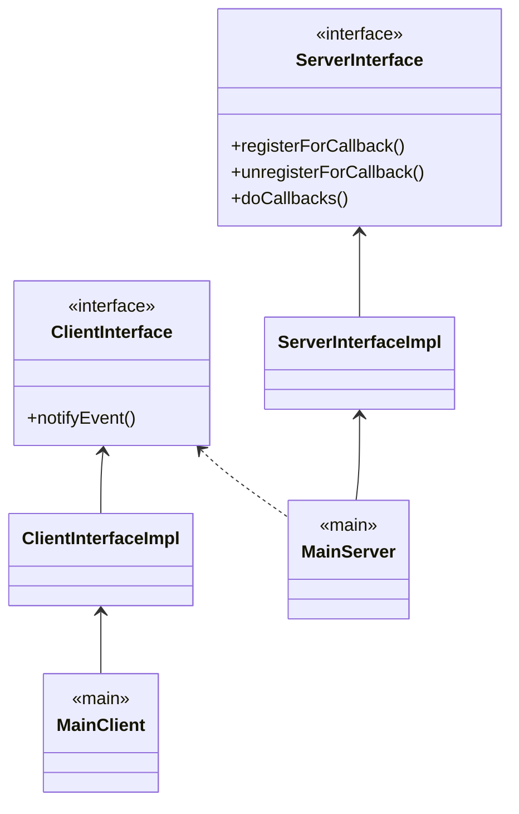

RETI LAB a.a. 2020/21 							Venturi Ludovico

---

**Indice**

[toc]

# RMI 

Remote Method Invocation

## RMI Callbacks



### Interfacce

```java
public interface ClientInterface extends Remote() {
	public void notifyEvent(..) throws RemoteException;
}	

public interface ServerInterface extends Remote() {
    public void registerForCallback(ClientInterface cli) throws RemoteException;
    
   	public void unregisterForCallback(ClientInterface cli) throws RemoteException;
    
    public void doCallbacks(..);
}
```

### Classi

```java
public class ClientInterfaceImpl extends UnicastRemoteObject implements ClientInterface {
    public ClientInterfaceImpl() { super(); }
    
    public void notifyEvent(..) throws RemoteException {
        // do something
        // System.out.println("new value")
    }
}

public class ServerInterfaceImpl extends UnicastRemoteObject implements ServerInterface {
    private List<ClientInterface> clients;
    
    public synchronized void registerForCallback(ClienteInterface cli) throws RemoteException {
        if(!clients.contains(cli))
            clients.add(cli);
        else
            // error
    }
    
    public synchronized void unregisterForCallback(ClienteInterface cli) throws RemoteException {
        if(clients.remove(cli))
            // ok
        else
            // error
    }
    
    public void doCallbacks(..) throws RemoteException  {
        Iterator i = clients.iterator();
        
        while(i.hasNext()) {
            ClientInterface cli = (ClientInterface) i.next();
            cli.notifyEvent(..);
            // notifica inviata ad 1 client
        }
        // notificati tutti i client
    }
}
```

_**OSS 1:**_ le classi possono estendere `UnicastRemoteObject` oppure `RemoteObject`.
Se si sceglie il primo metodo, al momento dell'instanziamento si otterrà direttamente uno *stub* per l'oggetto remote in sè mentre estendendo `RemoteObject` per ottenere lo stub si dovrà usare: `UnicastRemoteObject.exportObject([remoteObject], PORT)`

_**OSS 2**_: come parametri delle funzioni relative alle notifiche i `..` indicano i parametri che si vogliono passare, dipendo dal caso d'uso

### Main

```java
public class MainServer {
    public static void main(String args[]) {
        // 1) creazione del servizio di registrazione per le notifiche, ottengo lo stub
        ServerInterfaceImpl server = new ServerInterfaceImpl();
        
        // 2) inserisco lo stub nel registro
        LocateRegistry.createRegistry(REGISTRY_PORT); // es. REGISTRY_PORT = 5000;
        Registry r = LocateRegistry.getRegistry(REGISTRY_PORT);
        r.bind(SERVICE_NAME, server); // es. SERVICE_NAME = "serverTime"
        
        // 3) callbacks vere e proorie
        server.doCallbacks(); 
    }
}

public class MainClient {
    public static void main(String args[]) {
        // 1) ricerca del servizio di registrazione alle notifiche
        Registry r = LocateRegistry.getRegistry(REGISTRY_PORT);
        ServerInterface server_stub = r.lookup(SERVICE_NAME);
        
        // 2) registrazione alle notifiche
        ClientInterfaceImpl client = new ClientInterfaceImpl();
        server_stub.registerForCallback(client);
        
        // 3) attesa notifiche
        // Thread.sleep(5000);
    }
}
```


## Analisi RMI

### Concorrenza 

1. *? poiché esiste un solo oggetto remoto, i metodi di quell'oggetto possono
   essere invocati in modo concorrente da client diversi o da thread diversi
   dello stesso client ?*

2. *? in caso affermativo, viene creato un thread per ogni richiesta? Per ogni
   client?*
3. *? cosa accade se non sincronizzo opportunamente gli accessi sull'oggetto
   remoto?*

>“A method dispatched by the RMI runtime to a remote object implementation
>**may or may not** execute in a separate thread. 
>The RMI runtime makes no guarantees with respect to mapping invocations to threads. 
>Since remote method invocation on the same remote object **may execute concurrently**, a remote object implementation needs to make sure its implementation is **thread-safe**”

| Invocazione concorrenti da | vengono (tendenzialmente) gestite da |
| :------------------------: | ------------------------------------ |
|       JVM differenti       | thread diversi                       |
|       stesso client        | stesso thread \|\| thread diversi    |

Nel primo caso l'obiettivo è ottimizzare le performance e **non bloccare** i client.

Server-side il **multithreading** è implementato **automaticamente** dal servizio RMI, non si deve scrivere codice.

Server-side ci si deve assicurare che l'accesso all'oggetto remoto sia correttamente **sincronizzato** (metodi synchronized, locks....).


### Under The Hood

Ci sono diversi modelli di esecuzione delle richieste provenienti dai client per l'esecuzione di metodi dell'oggetto remoto:
	• prelevare le richieste da una coda e servirle sequenzialmente
	• un thread per ogni richiesta. Il thread invoca i metodi dell'oggetto remoto

*? Come vengono trattate le richieste provenienti da uno stesso client ?*
Se il client è sequenziale, ci può essere al massimo una richiesta pendente o in esecuzione per volta. Se il client attiva più threads, questi possono eseguire in parallelo richieste di esecuzione di metodi sull'oggetto remoto.

*? Le richieste vengono eseguite in sequenza o in maniera concorrente se il client ha più threads?*
Possono venire eseguite in maniera concorrente:

```java
// CLIENT: fa partire 2 thread, i quali invocano l'esecuzione di remota di 2 metodi diversi ma che compiono la stessa cosa: ogni 0.5s stampano Method ONE/TWO executing e ripetono per 25 volte

Registry r = LocateRegistry.getRegistry(SERVICE_PORT);
ThreadsInt c = (ThreadsInt) r.lookup(SERVICE_NAME);
OneThread t1 = new OneThread(c); // Method ONE
t1.start();
TwoThread t2 = new TwoThread(c); // Method TWO
t2.start();

// Metodi chiamati sull'oggetto remoto
long TimeOne = System.currentTimeMillis();

for(int index=0;index<25;index++) {
    System.out.println("Method ONE executing"); // nel Method TWO avrò "Method Two executing"
    do{ } while ((TimeOne+500)>System.currentTimeMillis());
    TimeOne = System.currentTimeMillis();
}
```

```java
// output
Method ONE executing
Method TWO executing
Method ONE executing
Method TWO executing
Method ONE executing
Method TWO executing
Method ONE executing
Method TWO executing
Method ONE executing
Method TWO executing
...
```

Da questo esempio si può concludere che **i metodi vengono invocati concorrentemente, anche se le richieste vengono dallo stesso client** (thread diversi).


### Passaggio di Parametri

I tipi di entità che possono essere passate tra il client ed il server (e come valori di ritorno) sono:

- tipi di dati **primitivi**, passati per *valore*
- oggetti remoti, passati tramite *stub* (riferimento)
- oggetti locali **serializzabili**, per valore utilizzando la *serializzazione*

**Un oggetto remoto non ha bisogno di essere serializzato per essere passato come parametro.**
Se un oggetto contiene al suo interno un altro oggetto, quest'ultimo dovrà implementare `Remote` o `Serializable`.


